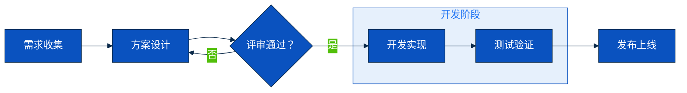
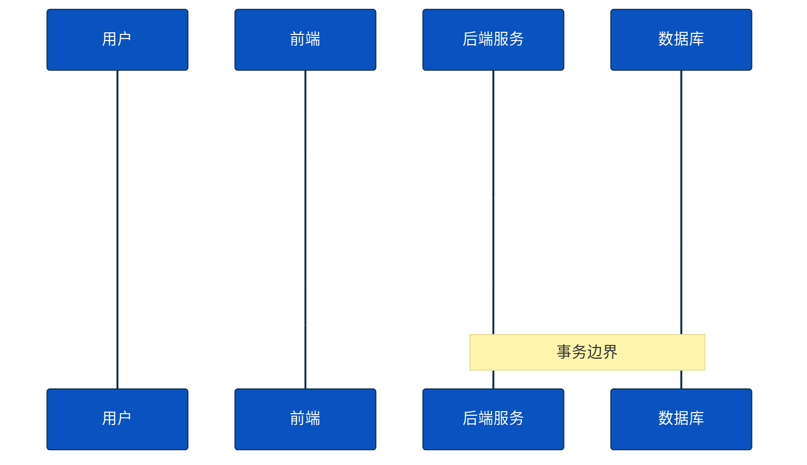
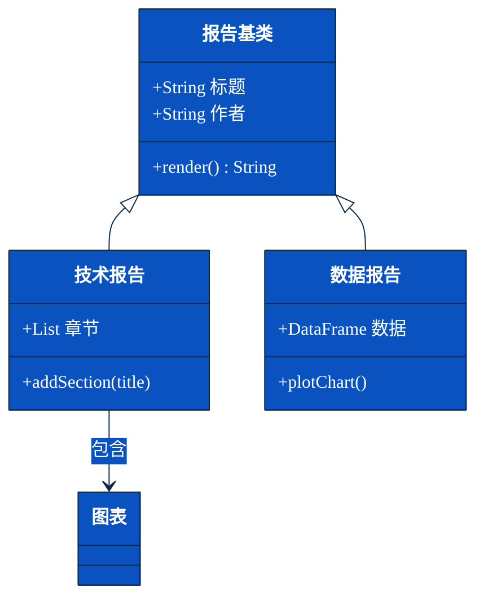
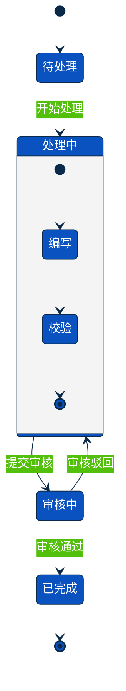

# mermaid.md — Mermaid 图表工作流

> 适用场景：简单线性流程（≤ 10 节点）、sequence 图、class 图、状态机。
> 超过 10 节点或需精确配色 → 切 draw.io（见 [[diagram]] SKILL.md）。

---

## 1. 安装

### 方式 A：Homebrew（推荐 macOS）

```bash
brew install mermaid-cli
which mmdc   # 验证：应输出 /opt/homebrew/bin/mmdc
```

### 方式 B：npm 全局安装

```bash
npm install -g @mermaid-js/mermaid-cli
mmdc --version
```

### puppeteer 配置（解决无头渲染权限）

新建 `puppeteer-config.json`：

```json
{
  "args": ["--no-sandbox", "--font-render-hinting=medium"]
}
```

---

## 2. mmdc CLI 用法

```bash
# 基本渲染（PNG 输出，适合嵌 PPT）
mmdc -i diag.mmd -o diag.png -w 2400 -H 1800 -b transparent

# 带 puppeteer 配置（避免沙箱权限报错）
mmdc -i diag.mmd -o diag.png -w 2400 -H 1800 \
     -b white -p puppeteer-config.json
```

| 参数 | 说明 | 推荐值 |
|---|---|---|
| `-i` | 输入 .mmd 文件 | — |
| `-o` | 输出 PNG / SVG | .png（LibreOffice SVG 渲染不稳定） |
| `-w` | 输出宽度（px） | 2400（嵌 PPT 不糊） |
| `-H` | 输出高度（px） | 1800 |
| `-b` | 背景色 | `white` 或 `transparent` |
| `-p` | puppeteer 配置 | 见上方 json |
| `-s` | scale 倍数 | 2（与 -w 二选一） |

---

## 3. themeVariables 配色（避免棕色翻车）

Mermaid 默认 subgraph 背景是棕色——**必须**在文件头部注入 themeVariables 覆盖：

```mermaid
%%{init: {'theme': 'base', 'themeVariables': {
  'primaryColor': '#0A52BF',
  'primaryTextColor': '#FFFFFF',
  'primaryBorderColor': '#0B2A4A',
  'lineColor': '#0B2A4A',
  'secondaryColor': '#E6F0FC',
  'clusterBkg': '#E6F0FC',
  'clusterBorder': '#0A52BF',
  'fontFamily': 'Microsoft YaHei, sans-serif',
  'fontSize': '16px'
}}}%%
```

与 [[pptx]] design-system.md Tech Blue 色板对应：

| themeVariables 字段 | 对应 design-system 色 | 值 |
|---|---|---|
| `primaryColor` | BRAND_PRIMARY | `#0A52BF` |
| `primaryBorderColor` | BRAND_DARK | `#0B2A4A` |
| `secondaryColor` / `clusterBkg` | BRAND_TINT | `#E6F0FC` |
| `lineColor` | BRAND_DARK | `#0B2A4A` |
| `fontFamily` | FONT_CN | Microsoft YaHei |

---

## 4. 四种图模板

### 4.1 flowchart（流程图）

适合：线性流程、决策分支（≤ 10 节点）。



方向：`LR`（左右）、`TB`（上下）、`RL`、`BT`。

节点形状：

| 语法 | 形状 |
|---|---|
| `[文本]` | 矩形 |
| `(文本)` | 圆角矩形 |
| `{文本}` | 菱形（判断） |
| `((文本))` | 圆形 |
| `>文本]` | 旗形 |

### 4.2 sequence（时序图）

适合：系统间调用、消息流、API 交互。



| 箭头类型 | 语法 | 含义 |
|---|---|---|
| 实线箭头 | `->>` | 同步调用 |
| 虚线箭头 | `-->>` | 异步返回 |
| 无头实线 | `->` | 单向消息 |
| `activate` | `activate B` / `deactivate B` | 生命周期激活框 |

### 4.3 class（类图）

适合：数据模型、继承关系、接口定义。



### 4.4 state（状态机）

适合：工作流状态、订单流转、任务生命周期。



---

## 5. Mermaid 局限（实测）

| 限制 | 描述 | 解决方案 |
|---|---|---|
| subgraph 嵌套 ≥ 2 层 | 布局不稳定，节点溢出容器 | 切 draw.io（支持任意嵌套） |
| 节点形状有限 | 无三角形 / 精确多边形 | draw.io 支持 10 + shape |
| 多节点精确对齐 | 自动布局，无法手动指定坐标 | draw.io mxGeometry 精确控制 |
| 配色细粒度 | 单节点颜色靠 classDef，写起来繁琐 | draw.io style 属性直接写 |
| 长字符串折行位置 | 自动折，折点不可控 | draw.io `whiteSpace=wrap` |

**结论**：节点 > 10 / 需要精确视觉控制 → 切 draw.io。

---

## 6. 与 LibreOffice 兼容渲染

**始终用 PNG 输出，不用 SVG**：

- LibreOffice 导入 SVG 时字体 fallback 行为不稳定，可能丢中文
- PNG 是位图，无字体依赖问题
- mmdc 默认输出 SVG，必须显式指定 `-o diag.png`

---

## 7. 嵌入 PPT

PNG 产出后，调 [[pptx]] `helpers.py:embed_picture`：

```python
from pptx.util import Inches

H.embed_picture(slide, "flow.png", Inches(0.55), Inches(1.9), height=Inches(5.0))
```

mmdc 输出用 `-w 2400`，确保嵌入 PPT 后不模糊（2400px / 等比缩放到 5" ≈ 200 DPI 等效）。

---

## 8. 何时切换到 draw.io

| 情形 | 原因 |
|---|---|
| 节点 > 10 | 自动布局拥挤，可读性下降 |
| 需要精确配色（单节点不同色） | draw.io style 逐节点设置更直接 |
| 嵌套 subgraph ≥ 2 层 | Mermaid 嵌套布局不稳 |
| 矩阵图 / 角色边界 | Mermaid 形状库不支持 |
| 决策树（多分支菱形） | Mermaid 菱形 hover 尺寸不稳 |
| 多图视觉一致性要求高 | draw.io XML 可 sed 批量替换配色 |
