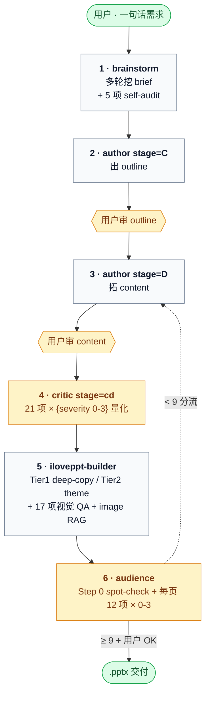

# iLovePPT

> Claude Code 多 agent 流水线,把一句话需求变成 BCG 咨询稿质感的 `.pptx`。

[](https://github.com/pcliangx/iLovePPT/releases/latest)
[](https://github.com/pcliangx/iLovePPT/stargazers)
[](https://github.com/pcliangx/iLovePPT/commits/main)
[](#)
[](https://www.python.org/)
[](LICENSE)

[](https://claude.com/claude-code)
[](https://en.wikipedia.org/wiki/Pyramid_principle)
[-FBCFE8)](library/visual-patterns/README.md)

让 LLM 一次性出完整 .pptx 通常是"看着像但读起来空、视觉糙、论据弱"。**iLovePPT 把"写 PPT"拆成 7 步 agent 流水线 + 4 道质量 gate**:brainstorm 收 brief(自带 5 项 self-audit)→ author 出 outline → author 拓 content → critic stage=cd 合审(21 项量化 rubric)→ iloveppt-builder 构建 + 主动加视觉 → audience 量化评分(每页 12 项 × 0-3 分 · 9 分硬阈值)。**所有评审与检索都是量化的、可回归的**:critic 21 项 + audience 12 项 × N 页 全是结构化打分;RAG 走 7 模板 / 15 visual-pattern 双知识库 + 5 个受控词典 SSOT(layout_variants 139 / slot_ids 1115 / categories 12 / personas 7 / keywords_bank 327) + 4 种检索模式(text / hybrid / image / preferred-template);14 项 self-check 拦下 enum 漂移 / shape_id 失效 / sha drift 全部静默 bug。**Tier1 模板复用**:模板提供 `placeholder_map.yaml` 时 builder cross-pptx deep-copy 原 slide 保 100% 视觉签名,fallback 到 tier2 Python theme(`themes/<name>.yaml` 数据驱动)。

---

## Quick Start

```bash
# 1. clone + 装依赖
git clone https://github.com/pcliangx/iLovePPT.git
cd iLovePPT
pip install -e ".[diagram,dev]"

# 2. 检查外部依赖(LibreOffice / poppler / Microsoft YaHei)
bash .claude/skills/pptx/scripts/check_deps.sh

# 3.(推荐)启用 .githooks · pre-commit 扫敏感数据 / 防误提
bash scripts/install-hooks.sh

# 4.(可选)跑 demo 验证安装
python3 .claude/skills/pptx-deck/build.py .claude/skills/pptx-deck/examples/demo_plan.json

# 5. 在仓库根目录打开 Claude Code,跟主线程说一句话:
#    "帮我做个 Claude Code 培训的 PPT,15 分钟,技术受众"
#    主线程自动派 6 agent 接力(brainstorm → author×2 → critic cd → builder → audience),
#    产出在 decks/<slug>/builder/deck_v1.pptx
```

依赖:`python-pptx` / `lxml` / `rapidfuzz` / `pypinyin` / LibreOffice / poppler / Microsoft YaHei(macOS 需手动装,Linux 通常自带)。

---

## Architecture Overview

### 7-step pipeline · 4 quality gates



- **6 主流水线 agent**(全 opus):`iloveppt-brainstorm` / `iloveppt-author` / `iloveppt-critic` / `iloveppt-builder` / `iloveppt-audience` / `iloveppt-template-extractor`(旁路 · 用户给模板时触发)
- **2 helper agent**(Haiku 省 token):`iloveppt-self-check` / `iloveppt-yaml-fixer`
- **User checkpoint**:3 道(brief / outline / content) + 收口 1 道(pptx OK)
- **Hot-reload rework**:`chapter_hashes` 增量重算,只跑 changed chapter,不全 deck 重跑

### 3-skill 分层

```
pptx-deck   ── 编排者 · brief.md → outline.md → content.md → deck_plan.json → 完整 .pptx
   ├── 调用 → pptx     (helpers.py / layout plugin / office 脚本 / render 流水线)
   └── 调用 → diagram  (draw.io / mermaid / matplotlib → PNG)
pptx        ── 底层 .pptx 读写 · 17 layout plugin auto-discover · 也可独立使用
diagram     ── 图表生成 · draw.io 首选 · 也可独立使用
```

### 5 vocabulary SSOT(`library/vocabularies/`)

| SSOT | 容量 | 用途 |
|---|---|---|
| `layout_variants.yaml` | 139 enum | layout 变体(`cards-3-icon` / `timeline-h-5` / ...) · 7 模板 212 页 100% backfill |
| `slot_ids.yaml` | 1115 enum | 通用槽位词汇 · extractor 强制 enum 选 · self_check #13 |
| `categories.yaml` | 12 enum | 模板分类(4 → 12) · enterprise-finance / enterprise-strategy / enterprise-product / ... |
| `audience_personas.yaml` | 7 persona | brief 受众 multi-select · audience 评分时按 persona 加权 |
| `keywords_bank.yaml` | 13 桶 / 327 词 | 按 category 分桶 · LLM 从桶里选 · 不允许自由发明 |

5 个 SSOT 都是 yaml-loaded,改 yaml 立即生效。extractor / author / RAG 全引用,**自由字符串 hard_stop**。

### Library:双 RAG 知识库

```
library/
├── pptx-templates/items/<name>/    ← 7 模板 · 用户预置 .pptx 拆出每页
│   ├── meta.yaml + preview.png
│   └── pages/<NN-slug>/{meta.yaml, preview.png}
├── visual-patterns/items/<id>/     ← 15 跨模板视觉模式 (timeline / pdca / funnel / pyramid / swot / ...)
├── deck-skeletons/<name>/          ← 6 deck 类型骨架 (quarterly_finance_report / project_postmortem / ...)
├── vocabularies/*.yaml             ← 5 受控词典 SSOT
└── _rag/                           ← qwen-vl embedding · SQLite WAL · bench / query_log
    ├── db.sqlite (WAL · 并发不锁)
    ├── bench.py / bench_queries.yaml
    └── query_log.jsonl (脱敏后落盘)
```

**唯一检索入口** `library/search.sh`(hosted multimodal embedding · 阿里云 tongyi-embedding-vision-plus · dim 1152):

```bash
# 文本查模板
library/search.sh --kb pptx-templates --type template --query "<主题>" --top-k 5

# Hybrid(text+image)· 视觉风格强时用 · default 权重 0.8/0.2(ablation-driven · P2-9)
library/search.sh --query "<视觉描述>" --mode hybrid --text-weight 0.4 --image-weight 0.6

# 图反查相似页
library/search.sh --query-image mockup.png --type page --top-k 5

# 模板内选页(author Stage C / D 用)
library/search.sh --query "<本页意图>" --preferred-template <name> --type page
```

`items/<id>/{meta.yaml, preview.png}` 入 git;`_rag/{db.sqlite, .venv, .env}` / `_source/*.pptx` 不入。

详细架构 + 派发 / handoff / gate 协议见 [`.claude/pipeline-protocol.md`](.claude/pipeline-protocol.md) 与 [`docs/agent-internals.zh.md`](docs/agent-internals.zh.md)。

---

## User Workflows

### A. 标准 deck —— 一句话起 deck

最简单的用法:在仓库根目录跟 Claude Code 主线程说一句话,7 步流水线自动跑完。

```
用户:做 PPT,主题是 "Claude Code 培训",15 分钟,技术受众
主线程:好的,我先派 brainstorm 跟你确认需求...
   → brainstorm 多轮挖 brief
   → 用户审 brief.md ✓
   → author Stage C 出 outline.md
   → 用户审 outline.md ✓
   → author Stage D 拓 content.md
   → 用户审 content.md ✓
   → critic 量化评审 21 项 → pass
   → builder 构建 .pptx + 加视觉 + 17 项 QA
   → audience 模拟受众读 → overall_score 9.2 ≥ 9
   → 交付 decks/claude-code-training/builder/deck_v1.pptx
```

### B. Skeleton —— 用预置骨架起 deck

6 类常见 deck 已预置 brief + outline 模板,不必从零开始。

```bash
# 列出可用 skeleton
ls library/deck-skeletons/

# 用 quarterly_finance_report 起新 deck
scripts/new_deck.py 2026-q2-report --skeleton quarterly_finance_report
# → decks/2026-q2-report/{brief.md, brainstorm/, author/outline.md.tmpl}

# 然后跟主线程说"基于 decks/2026-q2-report 的 skeleton 做 PPT",
# brainstorm 跳过空白对话,直接基于 skeleton 进入填字段阶段
```

可用 skeleton:`quarterly_finance_report` / `annual_strategy_review` / `product_launch` / `team_okr_kickoff` / `project_postmortem` / `customer_pitch`。详见 [`library/deck-skeletons/README.md`](library/deck-skeletons/README.md)。

### C. 跨 deck 复用章节

deck A 写得好的某一章想搬到 deck B,不必手动 copy-paste:

```bash
# 把 deck A 的第 5 章 append 到 deck B 末尾 · layout/pattern 注释 + 引用图片自动 cp
scripts/clip_chapter.py decks/A/author/deck_v1_content.md --chapter 5 \
                        --target decks/B/author/deck_v1_content.md
```

详见 `scripts/clip_chapter.py --help`。

### D. 模板入库 —— 用户给 .pptx 触发 extractor

用户在对话里给一个参考 .pptx,主线程派 `iloveppt-template-extractor`:

```
用户:这是我们的品牌模板,以后所有 PPT 都按它做 → /path/to/brand_master.pptx
主线程:好的,我派 extractor 解析...
   → extractor 复制 .pptx 到 library/pptx-templates/_source/
   → render_pages.py 每页转 PNG
   → 起草 meta.yaml.draft + pages/*/meta.yaml.draft
   → Step 3.3 self-check 14 项 · 拦 enum 错 / shape_id 失效 / sha drift
   → user_review_drafts gate
   → 用户审 ✓
   → 主线程跑 embed_text / embed_image,纳入 RAG
```

完整 ingest workflow 见 [`library/pptx-templates/ingest_workflow.md`](library/pptx-templates/ingest_workflow.md)。

### E. 跨 deck dashboard

跑过几个 deck 想看整体数据:

```bash
# token cost / rework rate / audience 失败 layout / ...
scripts/dashboard.py
```

详见 dashboard 设计。

---

## Capabilities

### 4 RAG modes

| Mode | 用途 | 关键参数 |
|---|---|---|
| **text** | 默认 · 语义查模板 / pattern | `--query "<主题>"` |
| **hybrid** | 视觉风格强时 · text + image 加权 | `--mode hybrid --text-weight 0.4 --image-weight 0.6`(default `0.8/0.2`) |
| **image** | 给参考图反查 | `--query-image mockup.png` |
| **preferred-template** | author 锁定一个模板内选页 | `--preferred-template <name>` |

完整参数表 `library/search.sh --help`。

### 6 deck skeletons

`quarterly_finance_report` · `annual_strategy_review` · `product_launch` · `team_okr_kickoff` · `project_postmortem` · `customer_pitch`

每个含 `skeleton.yaml`(brief 字段建议) + `outline.md.tmpl`(章节骨架)。详见 [`library/deck-skeletons/README.md`](library/deck-skeletons/README.md)。

### 14 self_check 项(extractor)

| # | 检查项 | 触发 |
|---|---|---|
| 1-8 | meta / placeholder_map 基础字段、enum、ref 等 | 入库前 |
| 9 | `tree_path` 在 .pptx 内可 resolve(draft 范围) | 入库前 |
| 10 | list-of-string 字段元素必须是 `str`(keywords / content_intent / ...) | 入库前 |
| 11 | `shape_id` 在 .pptx 内可 resolve(approved + draft 全范围) | 入库前 + 每次 build |
| 12 | `variant` 必须 ∈ `layout_variants.yaml` enum · variant↔layout_type 对账 | 入库前 |
| 13 | `slots[].id` 必须 ∈ `slot_ids.yaml` enum | 入库前 |
| 14 | `source_pptx_sha256` drift detect(模板版本管理) | 每次 build |

任一项 fail → `SCHEMA_VALIDATION_FAILED` hard_stop。完整逻辑见 [`library/pptx-templates/scripts/extractor_self_check.py`](library/pptx-templates/scripts/extractor_self_check.py)。

### 工程能力一览

| 能力 | 说明 |
|---|---|
| **Per-deck cost budget** | brief 设上限 · 50% / 80% / 100% stderr warn · 超额暂停问用户 · [`docs/cost-budget.md`](docs/cost-budget.md) |
| **chapter_hashes hot-reload** | rework 只重算 changed chapter · 不全 deck 重跑(rework 时间 -60%) |
| **API key rotation** | secrets manager · key 轮换不重 ingest · [`docs/security/api-key-rotation.md`](docs/security/api-key-rotation.md) |
| **pre-commit hook 扫敏感** | `_assets/raw` 误提强警告 · `bash scripts/install-hooks.sh` 启用 · [`docs/security/secrets-protection.md`](docs/security/secrets-protection.md) |
| **query log redact** | RAG query log 自动脱敏邮箱 / 手机 / 钱数 |
| **模板水印 detect** | extractor 检测第三方水印 + 版权 LOGO · 强警告 |
| **embed batch + 并行** | text=8 / image=4 batch · text/image 两进程并行 · 7 模板 ingest ~5min → ~3.5min |
| **SQLite WAL** | DB 升级 · 并发查询不锁 |
| **RAG feedback loop** | `feedback.jsonl` · score < 7 的 pattern 自动降权 |
| **Theme yaml 化** | `themes/<name>.yaml` 数据驱动 · Python 只剩 dispatcher · [`docs/writing-custom-themes.md`](docs/writing-custom-themes.md) |
| **Layout plugin auto-discover** | `helpers/<layout>.py` 自动发现 · 不动 `__init__.py` · [`docs/adding-new-layout.md`](docs/adding-new-layout.md) |
| **brief.theme 多 schema** | `str / list / dict` 4 种 · ThemeSpec.resolve_for_page 跨模板组合 deck |
| **中英文混排渲染** | `mixed_lang_text(runs)` + `tokenize_mixed` · 解 EA / latin 字段冲突 |
| **scripts/dashboard.py** | 跨 deck 聚合 token / rework / audience / layout failure rate |
| **scripts/deck_diff.py** | 跨 deck content.md 语义 diff |
| **scripts/clip_chapter.py** | 跨 deck 章节复制 |
| **scripts/gitignore_lint.py** | 3 份 `.gitignore` 一致性自动校 |
| **scripts/derive_plan.py** | `content.md` 单源 · `deck_plan.json` auto-derive |

---

## Documentation Map

| 文档 | 给谁看 |
|---|---|
| [docs/agent-internals.zh.md](docs/agent-internals.zh.md) | **改造者** — 流水线架构 + agent 职责 + 协作机制 + 设计决策 |
| [docs/cost-budget.md](docs/cost-budget.md) | per-deck cost / budget 上限 / 超额处理 |
| [docs/writing-custom-themes.md](docs/writing-custom-themes.md) | 写自定义 theme(Tier 2 复刻模板) |
| [docs/adding-new-layout.md](docs/adding-new-layout.md) | 加 layout plugin(`helpers/<name>.py`) |
| [docs/security/secrets-protection.md](docs/security/secrets-protection.md) | pre-commit hook / 敏感数据防护 |
| [docs/security/api-key-rotation.md](docs/security/api-key-rotation.md) | API key 轮换 |
| [.claude/pipeline-protocol.md](.claude/pipeline-protocol.md) | **Claude Code 主线程 AI** — 派发 / handoff / gate 权威活协议 |
| [CLAUDE.md](CLAUDE.md) | **Claude Code** — 仓库导航 + 不变量 + 约定 |
| [library/pptx-templates/README.md](library/pptx-templates/README.md) | PPTX Templates 知识库(7 模板) |
| [library/visual-patterns/README.md](library/visual-patterns/README.md) | Visual Patterns 知识库(15 跨模板 pattern) |
| [library/deck-skeletons/README.md](library/deck-skeletons/README.md) | Deck Skeletons SSOT(6 类型骨架) |

---

## Development

改造者 / 贡献者命令(`pyproject.toml` 已配 `pythonpath`,无需 `sys.path` hack):

```bash
# 跑全部测试
python3 -m pytest tests/ -q                              # 应 160 passed, 5 skipped

# 跑单测
python3 -m pytest tests/pptx/test_helpers.py::test_set_font_writes_ea_typeface -v

# 启用 .githooks(pre-commit 扫敏感 / 防误提)
bash scripts/install-hooks.sh

# RAG 回归 bench(7 query golden set · 看 #1 命中 / gap / 跨 sprint diff)
library/_rag/.venv/bin/python library/_rag/bench.py --label my-experiment

# 跨 deck dashboard(token / rework / audience / layout failure rate)
python3 scripts/dashboard.py

# `.gitignore` 一致性 lint
python3 scripts/gitignore_lint.py

# skill 独立烟测(不走 agent)
python3 .claude/skills/pptx/examples/minimal_deck.py     # → /tmp/iloveppt_minimal.pptx
bash .claude/skills/diagram/examples/render.sh           # → diagram examples/minimal.png

# 渲染 .pptx 视觉验证
soffice --headless --convert-to pdf <file>.pptx --outdir /tmp/
pdftoppm -jpeg -r 120 /tmp/<file>.pdf /tmp/slide

# 检查外部依赖
bash .claude/skills/pptx/scripts/check_deps.sh

# 端到端绕过 agent(已有 deck_plan.json 时)
python3 .claude/skills/pptx-deck/build.py <path> [--no-render]
```

无 build 步骤、无 linter 配置(`gitignore_lint.py` 例外)。

---

## FAQ / Troubleshooting

**Q: 怎么测 RAG 命中率?**
A: `library/_rag/.venv/bin/python library/_rag/bench.py --label <name>` 跑 7 query golden set,自动算 #1 命中数 / 平均分 / gap / low-gap 数,落到 `library/_rag/bench_results/<date>-<label>.{json,md}`。当前 baseline:7/7 命中 · avg gap 0.128。

**Q: 怎么自定义 theme?**
A: 写 `.claude/skills/pptx-deck/themes/<your_name>.yaml`(数据驱动 tokens · 色 / 字 / 装饰) + 可选 `<your_name>.py`(只放无法 yaml 描述的特殊 layout 逻辑)。完整流程见 [`docs/writing-custom-themes.md`](docs/writing-custom-themes.md)。

**Q: 怎么加新 layout?**
A: 写 `.claude/skills/pptx/helpers/<layout>.py` — 一个文件,自动 discover,不动 `__init__.py` / `build.py` / `themes/`。完整模板见 [`docs/adding-new-layout.md`](docs/adding-new-layout.md)。

**Q: deck 跑多少钱?**
A: 每个 deck 的 `state.json` 自动记 `cost.tokens_by_agent` + `cost.cost_usd`。brief 阶段可设 `cost_budget_usd`(默认 10),跨 50% / 80% / 100% stderr warn,超额暂停。详见 [`docs/cost-budget.md`](docs/cost-budget.md)。

**Q: 用户给的模板怎么入库?**
A: 在对话里直接给 .pptx 路径,主线程派 `iloveppt-template-extractor`,Step 3.3 self-check(14 项 hard_stop)→ `user_review_drafts` gate → 用户审 → 主线程 embed。完整 workflow 见 [`library/pptx-templates/ingest_workflow.md`](library/pptx-templates/ingest_workflow.md)。

**Q: rework 一章会重跑整 deck 吗?**
A: 不会。`chapter_hashes` 增量重算,只跑 changed chapter,rework 时间 ~ -60%。

**Q: critic / audience 评分稳定吗?**
A: critic 21 项 × {evidence, severity 0-3, suggestion} 结构化 schema · audience 每页 12 项 × 0-3 分 weighted sum,跑 3 次方差 < 0.5。详见 `.claude/agents/critic-rubric.yaml`。

**Q: 跑出来字渲染破?**
A: macOS / Linux 需手动装 Microsoft YaHei(项目默认中文字体)。`bash .claude/skills/pptx/scripts/check_deps.sh` 自动检测。设计决策 + EA / latin 字段处理见 [`CLAUDE.md`](CLAUDE.md) "关键不变量"。

---

## License

[MIT](LICENSE) · © 2026 pcliangx
