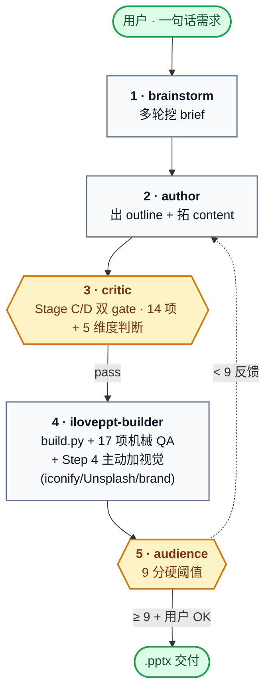

# iLovePPT

> Claude Code 多 agent 流水线,把一句话需求变成 BCG 咨询稿质感的 `.pptx`。

[](https://github.com/pcliangx/iLovePPT/releases/latest)
[](https://github.com/pcliangx/iLovePPT/stargazers)
[](https://github.com/pcliangx/iLovePPT/commits/main)
[](#)
[](https://www.python.org/)
[](LICENSE)

[](https://claude.com/claude-code)
[](https://en.wikipedia.org/wiki/Pyramid_principle)
[-FBCFE8)](library/visual-patterns/README.md)

让 LLM 一次性出完整 .pptx,通常是"看着像但读起来空、视觉糙、论据弱"。**iLovePPT 把"写 PPT"拆成 5 专业 agent(critic 内部 3 stage:B brief audit / C outline / D content)+ 1 旁路接力流水线**:brainstorm 收需求 → **critic B brief audit** → author 出稿 → critic C/D → iloveppt-builder 构建 + 加视觉 → 主线程 spot-check → audience 评分,**6 道质量 gate**(critic B / C / D + spot-check + audience 9 分硬阈值 + 用户 OK),内容遵循麦肯锡金字塔原理,视觉对标 BCG/McKinsey。**Tier1 渲染路径**:模板预置 `placeholder_map.yaml` 时 builder 直接 deep-copy 原 slide 保 100% 视觉签名,fallback 到 tier2 Python theme 重画。

---

## Quick Start

```bash
# 1. clone + 装依赖
git clone https://github.com/pcliangx/iLovePPT.git
cd iLovePPT
pip install -e ".[diagram,dev]"

# 2. 检查外部依赖(LibreOffice / poppler / Microsoft YaHei)
bash .claude/skills/pptx/scripts/check_deps.sh

# 3. (可选)跑一遍 demo 验证安装
python3 .claude/skills/pptx-deck/build.py .claude/skills/pptx-deck/examples/demo_plan.json

# 4. 在仓库根目录打开 Claude Code,跟主线程说一句话:
#    "帮我做个 Claude Code 培训的 PPT,15 分钟,技术受众"
#    主线程会自动派 5 agent 接力(brainstorm → critic B brief audit → author Stage C/D → critic C/D → builder → spot-check → audience),
#    产出在 decks/<slug>/builder/deck_v1.pptx
```

依赖:`python-pptx` / `lxml` / LibreOffice / poppler / Microsoft YaHei(macOS 需手动装,Linux 通常自带)。

## 流水线一览

在仓库根目录跟 Claude Code 说一句话(如"帮我做个 Claude Code 培训的 PPT,15 分钟,技术受众"),主线程自动派 5 agent + 1 旁路接力:



详细操作手册见 [docs/MANUAL.zh.md](docs/MANUAL.zh.md)。

## 文档地图

| 文档 | 给谁看 |
|---|---|
| [docs/MANUAL.zh.md](docs/MANUAL.zh.md) | **用户** — 怎么对话、审稿、收稿 |
| [docs/agent-internals.zh.md](docs/agent-internals.zh.md) | **改造者** — 流水线架构(Hybrid:1 brainstorm team + 5 subagent · 含旁路 extractor)+ agent 职责 + 4 协作机制 + 6 设计决策 |
| [docs/agent-team-evaluation-checklist.zh.md](docs/agent-team-evaluation-checklist.zh.md) | **评审者** — 8 维度(A-H)审计框架 + L1-L3 母法则,适用任何 multi-agent system |
| [.claude/pipeline-protocol.md](.claude/pipeline-protocol.md) | **Claude Code 主线程 AI** — 派发顺序 / handoff / gate 权威活协议 |
| [CLAUDE.md](CLAUDE.md) | **Claude Code** — 仓库导航 + 不变式 + 约定 |
| [library/visual-patterns/README.md](library/visual-patterns/README.md) | Visual Patterns 知识库(跨模板视觉模式) |
| [library/pptx-templates/README.md](library/pptx-templates/README.md) | PPTX Templates 知识库(用户预置模板 + 拆出的每页 · `load_theme()` 读 `_source/`) |

## Development

改造者 / 贡献者命令(`pyproject.toml` 已配 `pythonpath`,无需 `sys.path` hack):

```bash
# 跑全部测试
python3 -m pytest tests/ -q                              # 应 75 passed, 4 skipped

# 跑单测
python3 -m pytest tests/pptx/test_helpers.py::test_set_font_writes_ea_typeface -v

# skill 独立烟测(不走 agent)
python3 .claude/skills/pptx/examples/minimal_deck.py     # → /tmp/iloveppt_minimal.pptx
bash .claude/skills/diagram/examples/render.sh           # → diagram examples/minimal.png

# 渲染 .pptx 视觉验证
soffice --headless --convert-to pdf <file>.pptx --outdir /tmp/
pdftoppm -jpeg -r 120 /tmp/<file>.pdf /tmp/slide

# 检查外部依赖
bash .claude/skills/pptx/scripts/check_deps.sh

# 端到端绕过 agent(已有 deck_plan.json 时)
python3 .claude/skills/pptx-deck/build.py <path> [--no-render]
```

无 build 步骤、无 linter 配置。

## License

[MIT](LICENSE) · © 2026 pcliangx
