# iLovePPT Agent 工作原理

> 这份文档讲清楚 iLovePPT **怎么工作的** —— 架构 + 能力库存 + 6 个主 agent + 2 个 Haiku helper 细节 + 关键设计决策。适合想理解或改造系统的人。
>
> **当前版本 v0.13.0(P0+P1+P2+P3 phase 1/2/3 全完成)**
>
> **运行时活协议(权威)**:[`${CLAUDE_PROJECT_DIR}/.claude/pipeline-protocol.md`](${CLAUDE_PROJECT_DIR}/.claude/pipeline-protocol.md)

---

## 目录

- [§ 1. 架构总览](#-1-架构总览) — *15 min 读完*
- [§ 2. 能力库存](#-2-能力库存) — *知识库 / 记忆 / 路由 / 仲裁*
- [§ 3. 6 agent 详解](#-3-6-agent-详解) — *能力卡片 + 流程 + 2 Haiku helper*
- [§ 4. 架构决策](#-4-架构决策) — *why · 11 条决策*
- [§ 5. 速查参考](#-5-速查参考)

---

## § 1. 架构总览

*15 min 读完 · 不需要先读其他文档*

### 1.1 6 主流水线 + 1 旁路 + 2 Haiku helper 一行简介

**v0.13.0 后**:主流水线 6 agent(全 opus) + 1 旁路 extractor(opus) + 2 新 Haiku helper(self-check / yaml-fixer · 路由 · 错误恢复路径专用,主流水线不直接派)。

| agent | 一行简介 | 调用方式 | model |
|---|---|---|---|
| `iloveppt-brainstorm` | Stage A-B:多轮对话收 brief + 素材 + **Step 3.6 brief self-audit**(原 critic Stage B 5 项已并入) + skeleton 检测 + inspirations 持久化(sha256) + cost_budget 收集 + 多模板组合 deck 4 schema | **TeamCreate**(team,持续窗口) | opus |
| `iloveppt-author` | Stage C 出 outline.md + 自走 Stage D 拓 content.md(**无中间 critic gate**) + resolve_theme 3 schema 解析 + chapter-aware preferred-template | **Task**(subagent) | opus |
| `iloveppt-critic` | **stage=cd 合审单次**(C+D merged) + 21 项量化(A 7 + B 9 + J 5 · severity 0-3 + evidence ≥ 10 字 + suggestion) + verdict 自动算公式 + critic-rubric.yaml SSOT + Step 0.5 hot-reload chapter_hashes carry over | **Task**(subagent) | opus |
| `iloveppt-builder` | Stage E:Step 0.3 hot-reload + Step 0.5 SSOT verify(content.md vs deck_plan.json sha256) + Step 1.0 多模板 brief.theme 解析 + 跨模板 tier1 deep-copy 保 primary theme 字体 + Step 4.3.5 视觉一致性反查(image RAG) + Step 4.5 query_cache + 4 路降级(brand / iconify / Unsplash / RAG patterns) | **Task**(subagent) | opus |
| `iloveppt-audience` | **Step 0.0 spot-check**(原主线程 spot-check 已并入) + Step 0.4 hot-reload + **每页 12 项 × 0-3 量化** + multi-persona strict-eval(取最低分) + Step 3.5.2 image RAG 反查 alternative + **Step 3.6 feedback writeback**(opt-in)| **Task**(subagent) | opus |
| `iloveppt-template-extractor` | 旁路 Stage T:复制 _source + render_pages.py 渲染每页 + Step 2.5 declared/rendered 对账 advisory + Step 2.6 watermark detect + Step 3.1 LLM 起草双层 meta.yaml.draft(17 layout enum + other 兜底) + Step 3.3 **14 项 self_check**(#14 SOURCE_PPTX_SHA_DRIFT)→ user_review_drafts gate → 主线程 embed | **Task**(subagent) | opus |
| `iloveppt-self-check` | 错误恢复 helper:跑 `red_line_check.py` / `extractor_self_check.py` 解析 stdout,归一化 yaml 报告。**主流水线不直接派**,只在主线程错误恢复路径上 dispatch | **Task**(subagent) | **haiku-4-5** |
| `iloveppt-yaml-fixer` | 错误恢复 helper:修 LLM(其他 agent)写错的 YAML(quote / indent / enum 字面)。**只调字面不动语义**,主流水线不直接派 | **Task**(subagent) | **haiku-4-5** |

**模型分层 rationale**:
- 主流水线 6 agent 全 opus —— 团队复杂度高,横跨多轮对话 / 深度判断 / 视觉认知 / 模板摄入,任一环掉链传下游;cost 较分层方案高 ~3-4x 可接受
- 2 Haiku helper —— 路由优化:跑校验脚本 + 修 yaml 字面是窄任务(无创造性推理),用 Opus 单价 19x Haiku 浪费;主线程错误恢复路径专用,**严禁 subagent 起 subagent**(详 §4 决策 9)

### 1.2 Hybrid 二段论

*Phase A team(brainstorm)/ Phase B subagent(其余 5 agent)*

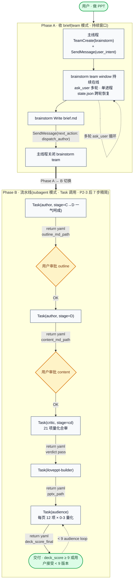

**为什么 brainstorm 留 team,其他转 subagent**:

| 维度 | brainstorm(team) | 其他 5 agent(subagent) |
|---|---|---|
| 用户交互模式 | 多轮 ask_user(收 6 必填字段)| 单次执行 + return yaml |
| 进程开销 | 单进程持续(token 省、延迟低)| 每次 Task 新进程(冷启动 ~3s)|
| 协议复杂度 | idle / SendMessage / 窗口生命周期 | 简单 Task return |
| 状态恢复 | state.json(brainstorm 跨 ask_user 轮)| state.json 仅 author 用(其他无状态)|

详细 rationale 见 §4.6。

### 1.3 流水线全图

*含 cherry-pick gate + 三类反馈分流 · 9→7 步精简*

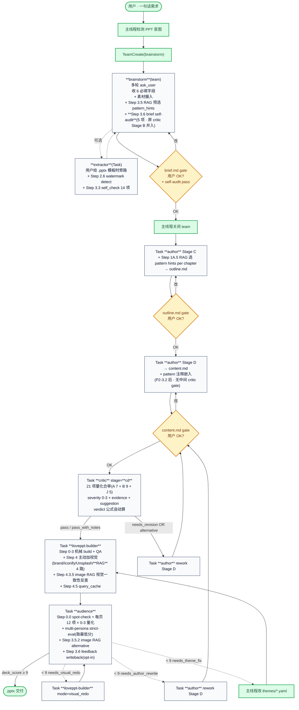

**精简点(9→7 步)**:
- 原 step 3 critic stage=B(brief audit)→ 并入 brainstorm Step 3.6 self-audit
- 原 step 5 critic stage=C + step 7 critic stage=D → 合并为 stage=cd 单次合审
- 原主线程 spot-check(builder return 后)→ 并入 audience Step 0.0
- **User checkpoint 5 → 3**:brief gate + outline gate + content gate(critic / audience 不再 gate user)

### 1.4 关键不变量

*5 条系统级硬约束 · 任何改造必须满足*

5 条不变量贯穿整个系统,任何改造**必须满足**:

1. **author 是唯一写者** —— outline.md / content.md / pattern 注释只有 author 改。其他 agent(critic / iloveppt-builder / audience)即使发现问题,只能在 yaml return 给 `suggested_*` advisory,**禁止改 .md**
2. **主线程是仲裁人** —— 任何 advisory 必须展示给用户 cherry-pick,**主线程不替用户决定**(MAST FM-1.3 step repetition 防线)
3. **state 在文件,不在 context** —— agent context 是无状态的(每次 Task 调用都是新 context),**所有跨 turn 记忆必须落盘**(state.json / brief.md / outline.md / content.md)
4. **机械与判断严格分离** —— build.py 只做机械(无 LLM 调用);content 拓写 / 视觉 QA / 判断性评审是 Claude 行为(看 prompt 文档,不看 Python)
5. **质量门是硬 gate** —— critic verdict 必须 ∈ {pass, pass_with_notes};audience overall_score 必须 ≥ 9 或用户主动接受;**不允许"软通过"**

---

## § 2. 能力库存

*知识库(RAG · 双 kb · 4 mode 检索) · 受控词典(5 SSOT) · 记忆(state / 产物链) · 路由(next_action) · 仲裁(cherry-pick gate) · 可观测性(dashboard / cost / query log)*

这一节是 v2 重写的核心。系统的能力跨多个 agent 共享,统一在此交代。每个能力含:**用途 / 谁调 / 何时调 / 数据流 / 降级 / 反例**。

### 2.1 知识库 #1 · `library/visual-patterns`

*hosted multimodal RAG · 跨 5 agent 共享检索入口*

**用途**:Visual Patterns 库是输出**高质量 PPT** 的关键知识库 —— **15 个**跨模板视觉模式(ingest:timeline-h-5 / timeline-v-4 / pdca-4-cycle / funnel-4-tier / cards-flag-4 / comparison-tier-3 / venn-3-circle / radial-5-spoke / pyramid-3-layer / pyramid-maslow-5 / process-arrow-5 / 2x2-priority-matrix / swot-quadrant / bullet-5-numbered / single-focus-kpi),每个 pattern 含 `meta.yaml`(元数据 + fallback_rendering) + `preview.png`(预览图)。

**底层实现**:阿里云 tongyi-embedding-vision-plus(dim 1152,text + image 同 API) + sqlite **WAL mode + busy_timeout 10s**(并发不锁)。`library/_rag/db.sqlite` gitignored。**唯一检索入口** `library/search.sh` 跨双 kb 统一 router。

**4 mode 检索** —— `library/search.sh` 统一入口:
- **text**(默认):`--query "<关键词>"` 跨双 kb 搜
- **hybrid**:`--hybrid-weights 0.8,0.2` text + bm25 加权(default ablation-driven)
- **image RAG**:`--query-image <png>` 图片相似度查模板/页
- **preferred-template**:`--preferred-template <theme> --type page` 模板优先 fallback vp
- **feedback-aware**(opt-in):`--feedback` 对 avg<7.0 且 count≥3 的 pattern × 0.9 软降权

完整参数见 `library/search.sh --help`。

返回 JSON:`[{id, row_type, category_or_layout, parent_id, score, distance, preview_path, meta_path, doc_preview, source}]`,其中 `source ∈ {"preferred-template", "visual-patterns"}`;`row_type ∈ {vp_items, tpl_templates, tpl_pages}`。

**4 mode 调用矩阵**:

| mode | brainstorm | author | critic | builder | audience |
|---|---|---|---|---|---|
| text / hybrid | ✓ Stage A 列模板 + Step 3.5 预选 | ✓ Stage C Step 1A.5 + Stage D Step 1C | ✓ 维度 5 反查 | ✓ Step 2 解析注释 | ✓ Step 3.5 找 alternative |
| image RAG | ✓ Step 1 inspiration 反查模板 | — | — | ✓ Step 4.3.5 视觉一致性反查 | ✓ Step 3.5.2 needs_visual_redo 页反查 alternative |
| preferred-template | ✓ Stage A 模板候选 | ✓ Stage D 拓写 | — | — | — |
| feedback-aware | ✗ 默认关 | ✗ 默认关 | ✗ 默认关 | 可选(用户开)| — |

**性能优化**:
- **embedding batch API**:text=8 / image=4 batch · 7 模板 ingest 时间 ~5min → ~215s(parallel)
- **WAL mode**:并发读写不锁,busy_timeout 10s
- **query cache**:iconify / Unsplash query 沉淀到 `library/_rag/external_query_cache.jsonl`,fuzzy match 复用

**5 agent 调用矩阵**:

| agent | 调用时机 | query 来源 | 用结果做什么 | advisory / 决策 |
|---|---|---|---|---|
| **brainstorm** | Stage A 列模板 + Step 3.5(dispatch_author 之前) | 主题 / top_recommendation + SCQA 关键词 | Stage A:`--kb pptx-templates --type template --query <主题>` 按主题排候选给用户挑;Step 3.5:跨 kb 取 top-5 category(去重)→ Edit brief.md frontmatter + dispatch_author yaml `pattern_hints_for_author` | 决策(category 列表,给 author 参考)|
| **author Stage C** | Step 1A.5(写完 outline 之后,返回之前)| 每章 action title + intent | 从 top-5 选 1-2 个,Edit outline.md per-chapter `pattern_hints.selected/alternatives` | **决策**(author 唯一写者) |
| **author Stage D** | Step 1C(已有,继承自 v1 设计) | 章节 content intent | `--preferred-template <brief.theme> --type page` 模板优先 fallback vp;Read meta.yaml 看 fallback_rendering;**强制**嵌入 content.md `<!-- pattern: vp:<id> -->` 或 `<!-- pattern: tpl:<theme>__<NN-slug> -->` 注释(必须带 `vp:`/`tpl:` 前缀)| **决策** |
| **critic Stage C/D** | 维度 5 | 验 author selected 不匹配时,重跑章节 intent | yaml `suggested_alternative_patterns` 数组 | **advisory**(不改 .md,主线程 cherry-pick) |
| **iloveppt-builder** | Step 4.2.5(三路降级 + 该页 visual_qa 低分时) + Step 2 渲染时读 `<!-- pattern: vp:/tpl: -->` 注释 | 该页 章节 intent / pattern 注释 id | 解析注释 id 前缀(`vp:` 查 visual-patterns,`tpl:` 查 pptx-templates DB)→ Read meta.yaml 渲染;Step 4.2.5 拿 preview.png 作 hero 或 reference_only。**无前缀 id → 拒绝渲染** | 决策(嵌 preview)|
| **audience** | Step 3.5(triage 后) | 每个 needs_visual_redo 页的 issue 关键词 | yaml `needs_visual_redo_pages[N].suggested_alternative_pattern` | **advisory**(主线程 cherry-pick → 若用户接受,Task author rework) |

**降级路径**(所有 agent 共享):search.sh 失败(库不存在 / sqlite 未初始化 / venv 缺失)→ 该 agent 字段为空/null + 标 `source: search_failed`,**不阻塞流水线**继续。

**cherry-pick gate 触发**:critic / iloveppt-builder / audience 任一 yaml 含 `suggested_alternative_pattern(s)` → 主线程**必须**展示给用户决定 → 用户答"改" → Task author rework + `user_response: {accept_alternative_pattern: {page, suggest}}` → author 改 outline/content + pattern 注释。完整流程见 §2.5。

**反例**:
- author Stage C 不查 RAG,直接选 layout=cards → content.md 嵌 layout=cards 注释 → iloveppt-builder 渲染出"4 张同质 cards" → audience 评 visual_appeal 4/10 needs_visual_redo。**正确**做法:Stage C 先 RAG 选 pattern_hints,可能匹配到 matrix-2x2 更准 → 跳过 4 张同质 trap
- critic 验 author selected = cards-flag-4 但章节是因果矩阵 → 不报 alternative → iloveppt-builder 按 cards 渲染 → audience 才发现。**正确**:critic 维度 5 reverse-search RAG top-5 → 报 alternative matrix-2x2
- author Stage D 写 `<!-- pattern: arrow-chain -->`(没 `vp:`/`tpl:` 前缀)→ iloveppt-builder 拒绝渲染 hard_stop。**正确**:必须 `<!-- pattern: vp:arrow-chain -->` 或 `<!-- pattern: tpl:<theme>__03-process -->`

### 2.2 知识库 #2 · `library/pptx-templates` 模板库

**用途**:存第三方 .pptx 模板(企业自带 brand template),让 iLovePPT 输出贴合**视觉风格**(不是默认 tech_blue)。**与 visual-patterns 共用 `library/_rag/db.sqlite`** 一张 DB,通过 `library/search.sh` 统一路由。

**当前状态**(2026-05-27):
- **7 模板**(已 ingest 入库):`business_geometric / creative_aurora / enterprise_skyline / finance_arrow / modern_stripes / product_lineart / training_team`
- **196 tpl_pages 入 DB**(已清 16 张工具页污染)
- **placeholder_map 含 shape_id**:212/212 全 backfilled
- **历史第三方模板引用清理**:90 文件清空(meta/placeholder_map/vocab/docs/scripts) · v0.13.0 后无外部供应商引用残留

**当前结构**(`library/pptx-templates/`):
- `_source/<name>.pptx`(模板源 · gitignored)
- `items/<name>/meta.yaml`(模板级 metadata · 入 git · 含 `provenance.source_pptx_sha256` 用于 drift 检测)
- `items/<name>/pages/<NN-slug>/{meta.yaml, preview.png, placeholder_map.yaml}`(每页拆出来的资产 · 入 git;`__` 开头页跳过 ingest,如 `__cover` / `__divider`)
- `{README.md, INDEX.md, ingest_workflow.md}`

**4 级 token 定义**(extractor 抽取 · v2 实际跑法):
- L1 媒体:`extract_template.py` 解压 .pptx 媒体 → cover_hero.png / icon_*.png 等。**可选 · 当前默认跳过**(visual_tokens 由 L4 LLM 直接看 PNG 写出来)
- L2 扩展 token:`extract_template.py` 抽 accent / dk / lt / 字号 / 背景。**可选 · 当前默认跳过**(同上)
- L3 每页渲染(`library/_rag/render_pages.py <name> --dpi 120` · soffice → pdftoppm)→ `items/<name>/pages/NN-page/preview.png`(占位名,L4 后 rename)
- L4 视觉分析 + 起草 + self-check(extractor LLM 必跑):
  - **Step 2.5**:declared(unzip sldId 数)vs rendered(ls preview.png 数)如实记 advisory,**不许**用"hidden/master"幻觉解释 discrepancy
  - **Step 3.0**:TodoWrite N+1 项强制(缓解 [#47936](https://github.com/anthropics/claude-code/issues/47936) async subagent 提前 return bug)
  - **Step 3.1**:逐页 Read PNG → 从 17 layout enum 选 + `other` 兜底(`needs_manual_review:true` + `layout_hint`) + confidence 严格 0.0-1.0 数字
  - **Step 3.2**:写模板级 meta(必填 `provenance.{schema_version, embedding_model, embedding_dim, ingested_at, source_pptx_sha256}` + `extraction.{declared_pages, rendered_pages, discrepancy, discrepancy_resolution}`)
  - **Step 2.6**:**watermark + 第三方品牌 LOGO detect**(`library/_rag/scripts/detect_watermark.py`):扫描 _source/*.pptx + 渲染 PNG · 命中已知品牌词 / 半透明大图层 → 强警告 + needs_manual_review 标记
  - **Step 3.3 self-check 14 项**(进 Step 4 前 hard gate · `library/pptx-templates/scripts/extractor_self_check.py`):覆盖必填字段 / enum 合法 / id 格式 + 唯一 / confidence 数值域 / embedding dim / extraction 数学一致 / 模板名 / placeholder shape_id 可解析 / variant + slot_id ∈ SSOT / **SOURCE_PPTX_SHA_DRIFT**。任一项不通过 → `status: error` + `code` hard_stop;完整 14 项见 [`ingest_workflow.md`](../library/pptx-templates/ingest_workflow.md)。错误恢复路径可派 `iloveppt-self-check` / `iloveppt-yaml-fixer` Haiku helper

**调用矩阵**:

| agent | 调用时机 | 干什么 | 写还是读 |
|---|---|---|---|
| **brainstorm** | Stage A 问 theme 时 | 用户选"用模板":`library/search.sh --kb pptx-templates --type template --query <主题>` 按主题相关性排候选 → 用户挑;用户给新 .pptx 路径 → dispatch_template_extractor 走完整 ingest | 读 |
| **template-extractor**(旁路) | Stage T(用户给模板时) | 复制 .pptx → `library/pptx-templates/_source/<name>.pptx` → 跑 `library/_rag/render_pages.py` 渲染每页 → Step 2.5 advisory 对账 → Step 3.0 TodoWrite + Step 3.1 逐页 LLM(17 enum + confidence)→ Step 3.2 模板级 meta + extraction summary → Step 3.3 self-check → 起草 `items/<name>/{meta.yaml, pages/.../meta.yaml}.draft` 让用户审 → 主线程跑 embed 入库 | **写** |
| **author Stage D** | Step 1C(若 theme ≠ tech_blue)| Read `library/pptx-templates/items/<theme>/meta.yaml`(visual_signature / visual_tokens)指导拓写 + 调 `library/search.sh --preferred-template <theme> --type page` 选页 → content.md 嵌 `<!-- pattern: tpl:<theme>__<NN-slug> -->` | 读 |
| **iloveppt-builder** | Step 2 build 时(through build.py:_repo_templates_dir)| 解析 theme 字段:tech_blue → 内置主题;短名 → 两路查 `<plan_dir>/templates/<name>.pptx`(deck 本地)→ `<repo>/library/pptx-templates/_source/<name>.pptx`(全局)作 base PPT | 读 |
| critic / audience | **不用** | — | — |

**触发条件**:**仅当用户在 brainstorm 阶段选 "用模板"**(非默认 tech_blue)才走全链路。默认 tech_blue 模式不触发 templates / extractor。

**完整链路**(用户给新模板的极端 case):

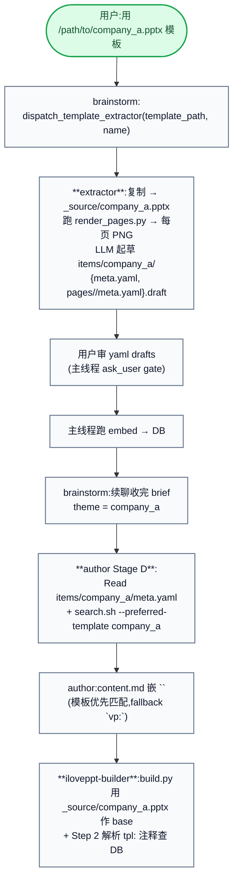

**反例**:
- 用户给 .pptx 模板但 brainstorm 直接 dispatch_author(跳过 extractor)→ author 拿不到 visual_observations → 拓写时按 tech_blue 假设字号 → iloveppt-builder build 用模板 base 但字号溢出。**正确**:brainstorm 检测到 template_path 入参 → 必须先 dispatch_template_extractor → extractor return `user_review_drafts` + draft yaml → 用户审 → 主线程跑 embed → 主线程 SendMessage(brainstorm, extractor_summary) 续聊
- extractor 起草 yaml 直接入库不让用户审 → 视觉观察脏数据进 DB 污染所有后续模板检索。**正确**:必须走 ask_user gate,只有用户审过的 draft 才入 embed

### 2.2.5 受控词典 5 SSOT · `library/vocabularies/`

*P1 最大杠杆 · 解决跨 agent 术语不一致根因*

**用途**:让 LLM 从权威桶里**选词**(extractor / author / audience / critic 不允许自由发明字符串),消除"variant=cards-3 vs cards-3-icon"这种近义字段碎片。

| 词典 | 用途 | 谁用 | 强制方式 |
|---|---|---|---|
| `layout_variants.yaml` | 139 enum · cards-3-icon / cards-4-photo / timeline-h-N / process-arrow-N / process-funnel-N / comparison-2col / comparison-tier-3 / quadrant-swot 等 | extractor 写 page meta.yaml.variant | self_check #12 hard_stop |
| `slot_ids.yaml` | 1115 expanded enum · 通用槽位词汇 | extractor 写 placeholder_map slots[].id | self_check #13 hard_stop |
| `categories.yaml` | 12 enum(4→12 retrofit) · enterprise-product / enterprise-strategy / creative-aurora / finance-arrow 等 | extractor / brainstorm RAG category filter | embed.py 强制 |
| `audience_personas.yaml` | 7 persona(cfo / engineer / sales / hr / investor / academic / general_public · 含 concerns / decision_criteria / word_preference)| brainstorm collect brief.audience(list) + audience 评分时按 persona 切换权重 | brainstorm B.2 self-audit + audience Step 1.0 multi-persona |
| `keywords_bank.yaml` | 13 桶 / 327 关键词 · 按 category 分桶 · LLM 从桶里选不许自由发明 · `expansion_hints.yaml` 是其 derived view| extractor / author keyword | yaml-loaded EXPANSION_HINTS |

**反例**:
- author 在 outline.md 写 `pattern_hints.selected: ["cards-3"]`(`layout_variants.yaml` 里只有 `cards-3-icon` / `cards-3-photo`)→ self_check #12 + RAG 检索匹配率下降
- audience 评分时把 brief.audience 当 str 处理("CFO and engineer" 整段)→ 不查 persona SSOT → 权重错 → 评分偏。**正确**:brief.audience 必须是 list,evaluate per persona,strict-eval 取 min

### 2.3 记忆 #1 · `state.json`

*per-agent 跨派发恢复 · 仅 brainstorm + author 有 state*

**用途**:subagent 是无状态执行 —— 每次 Task 调用都是新 context。**state.json 是 agent 跨派发的唯一记忆来源**。

**谁有 state file**:

| agent | state file 路径 | 用途 | lifecycle |
|---|---|---|---|
| **brainstorm** | `decks/<slug>/brainstorm/state.json` | 跨 ask_user 轮恢复 collected / round / asset_inventory / brief_md_path / brief_approved | Phase A 全程在线;dispatch_author 后主线程关闭 team(state 留存便于事后审计)|
| **author** | `decks/<slug>/author/state.json` | stage / approvals / iteration | 跨多次 Task 派发(Stage C → Stage D → rework)|
| critic | — | **无 state file** | 每次派发独立(所有产出在 critic_report_*_r{N}.md)|
| iloveppt-builder | — | **无 state file** | 单次派发跑完 Step 0-5(状态在 visual_report_r{N}.md + deck_plan_edits)|
| audience | — | **无 state file** | 每轮派发独立(状态在 audience_review_r{N}.md)|
| extractor | — | **无 state file** | 一次性任务(状态在 `library/pptx-templates/items/<name>/{meta.yaml, pages/<NN-slug>/meta.yaml}` draft 草稿)|

**brainstorm state.json schema**:

```yaml
round: 4                                # 派发轮数(每次 +1)
collected:                              # 已收的 6 必填字段
  audience: ["cfo", "engineer"]         # P2-13:list[persona key](7 enum SSOT)· 单 str 老 brief 自动 wrap
  duration_min: 15
  top_recommendation: "..."
  theme: tech_blue                      # P3-9:可能是 str / list / dict(多模板组合 4 schema)
  output: "<abs path>"
  presentation_mode: speaker
  cost_budget_usd: 10                   # P3-17:per-deck cost budget(默认 10 USD)
pending: []                             # 待问字段(全收齐时空)
asset_inventory:                        # 用户给的素材清单
  - {type: csv, path: ..., desc: ..., summary: ...}
  - {type: image, path: ..., desc: ...}
history:                                # 每轮 ask/answer 留底
  - {round: 1, asked: [top_recommendation, audience], answered: {...}}
brief_md_path: "<abs path to brief.md>" # null 直到 Write brief.md
brief_approved: true | false            # 用户 OK brief 后置 true

# === P2-8 inspiration 图持久化 ===
inspirations:
  - path: brainstorm/inspirations/<sha256-short>.png   # 相对 working_dir
    sha256_short: <12-char hex>
    pasted_at: 2026-05-27T...
    used_in_image_rag: true | false      # 已用 image RAG 反查模板时置 true

# === P3-8 skeleton(可选 · scripts/new_deck.py --skeleton 起新 deck 时写入) ===
skeleton:                                # 不存在 → null;存在则原样存档便于回查
  name: "Quarterly Finance Report"       # 6 个内置:annual_strategy_review / customer_pitch / product_launch / project_postmortem / quarterly_finance_report / team_okr_kickoff
  id: quarterly_finance_report
  path: brainstorm/skeleton_used.yaml
  suggested_audience: [cfo, investor]
  suggested_theme: finance_arrow
  user_confirmed_defaults: true | false
  discarded_by_user: false               # 用户答"全弃用"时置 true
```

**author state.json schema**:

```yaml
stage: C | D                            # 当前在哪个 stage
iteration: 1                            # 主版本号(大改时 +1,新建 deck_v{N+1}_*)
approvals:
  outline: true | false                 # outline.md 用户审批状态
  content: true | false                 # content.md 用户审批状态
critic_cd_passed: true | false          # P2-3.2 后:stage=cd 是否过 critic(原 critic_c_passed / critic_d_passed 合并)
status: dispatched_critic | dispatched_audience | ...

# === P2-4 hot-reload for rework ===
# 章节级 SHA-256 hash · 用于 critic/builder/audience 跨轮跳过未变章节
# 由 library/_rag/scripts/compute_chapter_hashes.py 写入
chapter_hashes:
  "1": "sha256:abc123..."               # 章节 1 的 content.md 段(`## 1.` 到下一 `## ` 之前)
  "2": "sha256:def456..."
  "3": "sha256:..."
last_hash_update: "2026-05-27T..."      # ISO 时间戳 · 每次跑 compute_chapter_hashes.py 时更新
prev_critic_cd_report_path: "<abs>"     # 上一轮 critic stage=cd 报告路径(hot-reload 时复用 verdict)
prev_audience_report_path: "<abs>"      # 上一轮 audience 报告路径(hot-reload 时复用 per_page_scores)

# === P2-4 chapter_*_carryovers · hot-reload 缓存(可选)===
chapter_critic_cd_carryovers:           # 上轮 critic stage=cd 各 chapter 的 21 项 carry over
  - {chapter: 1, items: [{id: A1, passed: true, evidence: "...", severity: 0, suggestion: ""}, ...]}
  - {chapter: 2, items: [...]}
chapter_audience_carryovers:            # 上轮 audience 各 chapter 的 per_page_scores carry over
  - {chapter: 1, pages: [{page: 1, scores_12: {...}}, ...]}
```

**chapter_hashes 用途**:author rework 单章后,critic / builder / audience 可读 state.json 对比当前 content.md 各章 hash 跟上次:**没变的章节** carry over 上次 verdict / 评分(从 prev report 或 chapter_*_carryovers 里读);**hash 变了** 才重做。极大减少 rework 时间(~30min → ~5min)。

**向后兼容**:旧 deck 的 state.json 没 chapter_hashes 字段也 OK(fallback 全重算);新 deck 派发前主线程跑 `compute_chapter_hashes.py` 写字段。

**cost block · 任何 state.json 都可挂**:

```json
{
  "cost": {
    "tokens_by_agent": {
      "brainstorm":  {"input": 0, "output": 0},
      "author":      {"input": 0, "output": 0},
      "critic":      {"input": 0, "output": 0},
      "builder":     {"input": 0, "output": 0},
      "audience":    {"input": 0, "output": 0},
      "extractor":   {"input": 0, "output": 0},
      "self_check":  {"input": 0, "output": 0},
      "yaml_fixer":  {"input": 0, "output": 0}
    },
    "totals": {"input": 0, "output": 0},
    "cost_usd": 0.0,
    "cost_usd_breakdown_by_agent": {
      "brainstorm": 0.0, "author": 0.0, "critic": 0.0,
      "builder": 0.0, "audience": 0.0, "extractor": 0.0,
      "self_check": 0.0, "yaml_fixer": 0.0
    },
    "model": "opus",                              # 主流水线档(self_check / yaml_fixer 用 haiku-4-5)
    "budget_usd": 10.0,                           # P3-17:per-deck cost budget · 来自 brief.cost_budget_usd
    "warned_at_pct": [50, 80, 100],               # P3-17:已 warn 的百分比节点(超额暂停 + 问用户)
    "warnings": [                                 # P3-17:warn 历史
      {"pct": 50, "at": "2026-05-27T...", "usd": 5.0, "msg": "已用 50% budget"}
    ],
    "last_updated": "2026-05-27T..."
  }
}
```

**字段说明**:
- `tokens_by_agent[agent].{input, output}` — agent 每次 yaml return 带 `tokens_used: {input, output}`,主线程或 hook 调 `track_cost.py update` 累加
- `model` — 当前价格档(默认 `opus`;**Haiku 路由后** self_check / yaml_fixer 按 haiku-4-5 单独计价)
- `cost_usd` — 由 `track_cost.py` 自动算,\$/1M-token 用 `PRICES` 常量(Opus 4.7:input \$15 / output \$75 per 1M;Haiku 4.5:input \$1 / output \$5 per 1M)
- **`budget_usd`** — 用户在 brainstorm 收 brief 时定的 `cost_budget_usd`(默认 10),超额暂停 + 问用户继续 / 终止
- **`warned_at_pct[]` + `warnings[]`** — 50/80/100% 节点 warn 一次,避免 spam
- `last_updated` — 每次 `update` / `show` / `reset` 时刷

**维护工具**:`library/_rag/scripts/track_cost.py`(update / show / reset / status 子命令)。schema 由该脚本自动 ensure_cost_block 兜底,旧 state 自动 upgrade。

**lifecycle 关键节点**:

1. **初始化**:agent 首次派发时,Read state.json(若不存在则 mkdir + init)
2. **每轮 +1**:`round` / `iteration` 字段每次派发开头自增(除初次)
3. **返回前 Write**:agent 在 yaml return 前**必须** Write state.json(否则下次派发拿不到更新)
4. **跨 session 恢复**:state.json 在磁盘,Claude Code 重启也能恢复;用户说"继续 deck <slug>" → 主线程 Read brainstorm/state.json 决定下一步派谁

**反例**:
- brainstorm 处理用户答完没 Write state.json → 下次派发拿到旧 collected → 重复问同样问题(Phase 4 hybrid 实测真实出现过)
- author 改了 outline 没更新 `state.iteration` → critic 找不到最新版本

**hybrid 协议 finding(F2)**:实测发现 brainstorm 偶有 SendMessage 内容跟 state.json 不一致(重发旧 ask_user)。**修复**:主线程 SOP 加 fallback:收到 brainstorm SendMessage 时同时 Read state.json 交叉验证,以 state 为准。

### 2.4 记忆 #2 · markdown 产物链

*brief → outline → content → deck_plan → .pptx → render PNG · SSOT 规则*

**用途**:跨 agent 的"硬记忆"用 markdown / JSON 文件传递,**不通过 context 传**(避免 token 污染 + agent 解耦)。

**主链**(brief → outline → content → deck_plan → .pptx → render PNG):

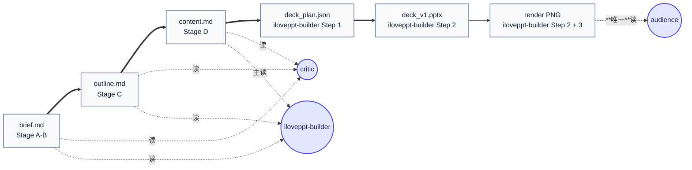

**关键边界**:audience **只读 render PNG**,**不读** `.md` / `deck_plan.json` / `.pptx`(它是模拟终端用户,用户也看不到这些)。

**附加产物**(报告 / state file / 知识库):

| 产物 | 写者 | 读者 |
|---|---|---|
| `critic/critic_report_{C|D}_r{N}.md` | critic | iloveppt-builder(Step 0 必读 gate) + 主线程展示用户 |
| `builder/visual_report_r{N}.md` | iloveppt-builder | 主线程展示用户 |
| `audience/audience_review_r{N}.md` | audience | 主线程展示用户;author rework 时 Read 取改进建议 |
| `brainstorm/state.json` | brainstorm | 仅 brainstorm 自读自写 |
| `author/state.json` | author | 仅 author 自读自写(iloveppt-builder Step 0.1 唯一例外,见 §4.4) |
| `library/pptx-templates/items/<name>/{meta.yaml, pages/<NN-slug>/meta.yaml}` | extractor(draft 唯一写) + 用户审后入 DB | author / iloveppt-builder / brainstorm 读(见 §2.2) |
| `library/visual-patterns/items/<id>/meta.yaml` | (库存,人工 ingest) | author / iloveppt-builder / critic / audience 读(RAG 检索后) |
| `library/visual-patterns/items/<id>/preview.png` | (库存,人工 ingest) | iloveppt-builder 读(可能嵌 hero) + audience 读(triage 找 alternative) |
| `library/_rag/db.sqlite` | `library/_rag/embed_*.py`(主线程在 extractor return + user-approved draft 时跑) | `library/search.sh`(所有 agent RAG 入口) |

**SSOT 规则**:

| 产物 | 唯一写者 | 读者(允许的所有) |
|---|---|---|
| `brief.md` | brainstorm | author / critic / iloveppt-builder(只 transitive)|
| `outline.md` | author(任何 stage) | critic / iloveppt-builder |
| `content.md` | author(任何 stage) | critic / iloveppt-builder(主读)/ audience(不读 .md 源,只读 render)|
| `pattern_hints` 字段(outline 内) | author | critic 验 / iloveppt-builder 渲染 / audience 评估 |
| `<!-- pattern: vp:<id> -->` / `<!-- pattern: tpl:<theme>__<NN-slug> -->` 注释 | author | iloveppt-builder 看到则解析前缀查对应 kb DB 渲染(**无前缀 id → 拒渲染**)|
| `deck_plan.json` | iloveppt-builder | (无人读,build.py 消费) |
| `library/pptx-templates/items/<name>/{meta.yaml, pages/.../meta.yaml}` draft | extractor | 用户审 → 主线程 embed → brainstorm / author / iloveppt-builder 读 |
| `critic_report_*_r{N}.md` | critic | iloveppt-builder(必读,Step 0 gate) + 主线程展示用户 |
| `audience_review_r{N}.md` | audience | 主线程展示用户;author(rework 时 Read 取改进建议)|
| `visual_report_r{N}.md` | iloveppt-builder | 主线程展示用户(iloveppt-builder 下轮 mode=visual_redo 读 prev)|
| `state.json`(per agent) | 该 agent 自己 | **只该 agent 读写**(iloveppt-builder Read author/state.json 是唯一例外,见 §4.4 视觉 QA 三方分工 rationale)|

**iteration 版本管理**:

- 小改:就地 Edit,iteration 不动(`deck_v1_outline.md` 覆盖)
- 大改(顶端论点变 / 章节增删 / > 3 page 连锁 / 用户说"重做"):iteration += 1,新建 `deck_v2_outline.md`(v1 保留)
- 谁判断:author Step 1B / 1D(收到改动指令后),问用户 "v{N} Edit / v{N+1} 平行" 二选一

**反向 diff 校验**(iloveppt-builder Step 1 md→JSON 时):

- iloveppt-builder 把 content.md 转 deck_plan.json,转完做反向 check
- 若反向 diff > 5%(content 内容跟 deck_plan 不能 round-trip 重建)→ **hard stop**(防 iloveppt-builder 偷偷"创意拓写")
- iloveppt-builder 不允许引入 content.md 没有的新论点

**反例**:
- audience 试图 Read content.md → 违反 "audience 是模拟终端用户" 设定(用户看不到 .md 源)→ 评分偏离真实读者感受
- iloveppt-builder Step 4 改了 content.md → 违反 "author 唯一写者" → critic 下轮重评时找不到 author 改的依据
- critic 写 outline.md → 严重违反职责边界

### 2.5 cherry-pick gate

*主线程仲裁*

**用途**:5-agent RAG 扩展后,critic / iloveppt-builder / audience 三个 agent 都可能给 pattern alternative 建议。如果主线程自动采纳,会导致 MAST FM-1.3 step repetition(author 反复改)。cherry-pick gate **强制用户决策**,把改动权收归用户 + author。

**触发条件**:任一 Phase B subagent 的 yaml return 含以下任一字段:

- `suggested_alternative_patterns: [...]`(critic Stage C/D)
- `needs_visual_redo_pages[N].suggested_alternative_pattern: {...}`(audience)
- iloveppt-builder 的 `visual_step4.rag_fallback_used` 含 hero 嵌入选择(主线程展示但不必让用户改)

**主线程仲裁流程**:

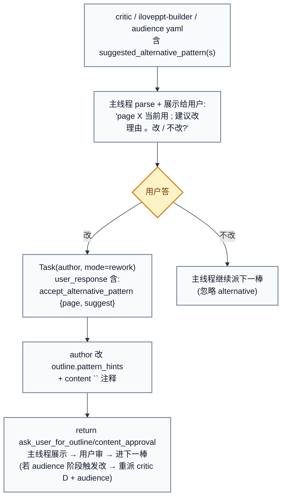

**特殊路径:audience 阶段触发改**:audience 给的 alternative 用户接受 → deck 已 build → author rework content → 必须**重派 critic Stage D + audience**(确保新 pattern 不破坏 critic 维度 5 + 不引入新 audience 问题)。

**只 advisory 不 must_fix**:critic 维度 5 + audience triage RAG 建议**不计入 verdict**(critic 即使有 alternative 也可 pass;audience overall_score 不因 alternative 数变)。**alternative 是质量提升机会,不是阻塞 issue**。

**反例**:
- 主线程拿到 critic suggested_alternative_patterns 不展示给用户,直接 Task author rework → 用户没批准的改动被强加 → 违反"用户决策"
- audience 给 needs_visual_redo + suggested_alternative_pattern,主线程同时 Task iloveppt-builder mode=visual_redo + Task author rework → 两路并发改 outline/content/deck_plan → 冲突
- author 收到 user_response accept_alternative_pattern 后只改 outline 没改 content `<!-- pattern -->` 注释 → iloveppt-builder 渲染时仍按旧 pattern → 用户改动失效

### 2.6 `next_action` 路由协议

*主线程的状态机 · 零业务逻辑*

**用途**:所有 agent 的 yaml return 含 `next_action` 字段,**主线程的派发逻辑零业务**,纯按 next_action 路由。

**所有 next_action 枚举**(按 agent 分组):

| agent | next_action | 主线程动作 |
|---|---|---|
| brainstorm | `ask_user` | 转发 message_to_user + questions 原文给用户 |
| brainstorm | `dispatch_template_extractor` | Task(extractor),return 后 SendMessage 回 brainstorm team |
| brainstorm | `dispatch_author` | **关闭 brainstorm team**,Task(author, stage=C) |
| brainstorm | `terminate` | extractor 兜底分支用户选了"终止":关闭 brainstorm team,告知用户任务终止 |
| extractor | `user_review_drafts` | 展示 draft yaml 路径给用户审 → 用户批准 → 主线程跑 `library/_rag/embed_*.py` 入 DB → SendMessage(brainstorm, extractor 摘要) |
| extractor | `dispatch_brainstorm` | SendMessage 给仍在线的 brainstorm team(传 extractor 摘要 / 失败原因);若 team 已关 → TeamCreate 重启 |
| author | `ask_user_for_outline_approval` | 给 outline.md 路径,等用户 OK |
| author | `ask_user_for_content_approval` | 给 content.md 路径,等用户 OK |
| author | `ask_user` | 内部询问(大改 vs 小改)|
| author | `dispatch_critic` | Task(critic, args 含 **stage=cd**(合并) + outline_md_path + content_md_path)|
| critic | `pass` | 转下一棒;stage=cd 完 → Task(iloveppt-builder) |
| critic | `pass_with_notes` | 展示 notes 给用户做 cherry-pick,然后转下一棒 |
| critic | `needs_revision` | Task(author rework) 带 critic 报告路径 |
| iloveppt-builder | `dispatch_audience` | Task(audience) |
| iloveppt-builder | `hard_stop` | 展示 errors 给用户三选一(按 suggestion 改 / 终止 / 自己指令);可派 `iloveppt-self-check` Haiku helper 跑校验脚本 + `iloveppt-yaml-fixer` 修字面 |
| audience | `delivered` | deck_score_final ≥ 9,交付 .pptx 给用户做最终确认 |
| audience | `needs_author_rewrite` | Task(author rework)|
| audience | `needs_visual_redo` | Task(iloveppt-builder, mode=visual_redo) |
| audience | `needs_theme_fix` | 主线程改 themes/*.yaml(yaml 化后)|
| **self-check (Haiku)** | `pass` | 返回 normalized yaml 报告,主线程决定下一步(派 yaml-fixer / 回 extractor / 继续) |
| **self-check (Haiku)** | `fail` | 返回 fail 项 yaml,主线程派 yaml-fixer 或回原 agent rework |
| **yaml-fixer (Haiku)** | `ok` | 修完字面问题,返回修改清单 yaml,主线程重跑 self-check 验证 |

**主线程伪代码**:

```
loop:
  ret = dispatch(current_agent, current_args)
  yaml = parse_last_yaml_block(ret.text)

  # Phase A 特殊:brainstorm via SendMessage 而非 Task return
  if current_agent == brainstorm (team):
    yaml = parse_from_sendmessage(brainstorm)

  switch yaml.next_action:
    case "ask_user" | "ask_user_for_*_approval":
      show(yaml.message_to_user + yaml.questions)
      current_args.user_response = wait_for_user()
    case "dispatch_*":
      current_agent = derived_from_next_action
      current_args = derived_from_yaml
    case "pass" | "pass_with_notes":
      if has(yaml.suggested_alternative_patterns):
        # cherry-pick gate
        show(alternative) → wait_for_user_decision
        if user_accepts → Task(author rework, accept_alternative_pattern)
        else → 继续派下一棒
      else:
        派下一棒(critic C pass → author D;critic D pass → iloveppt-builder)
    case "needs_revision":
      展示 report → 用户 cherry-pick → Task(author rework)
    case "delivered":
      展示给用户做最终确认 → 交付
    case "needs_*"(audience):
      路由到对应处理(详见 cherry-pick gate §2.5)
    case "hard_stop":
      展示 errors → 用户三选一
```

主线程**零业务逻辑** —— 只是状态机的转发者 + 仲裁人。

**反例**:每个 agent 自己定义返回格式 → 主线程要写 9 套解析逻辑 → 加新 agent 要改主线程。统一 next_action schema 让主线程跟具体 agent 解耦。

### 2.7 可观测性 · query log + feedback loop + dashboard + bench

*数据基础层*

**用途**:RAG 决策、agent token 成本、layout failure rate、deck 间趋势全部可观测,优化不再瞎拍。

| 工具 | 用途 | 维护方 | 关键路径 |
|---|---|---|---|
| `library/_rag/query_log.jsonl` | 所有 RAG query 留底(query / hits / scores / chosen / ts) · **redact 默认开**(邮箱 / 手机号 / 金额 redact) | search.sh 自动写 | gitignored |
| `library/_rag/bench.py` | 7 golden query SSOT(bench_queries.yaml) + baseline snapshot,RAG 改动前后跑对比 | 手动跑 + sprint 末跑 | `library/_rag/bench_results/<label>.json` |
| `library/_rag/feedback.jsonl` | audience 评分后 append `(chosen_pattern_id, audience_score, page, deck)`(opt-in)| audience Step 3.6 append | gitignored;**全仓库共享**,不在 deck 工作目录 |
| `scripts/dashboard.py` | 跨 deck 聚合:token / rework / audience / layout failure rate | 手动跑 | stdout report |
| `library/_rag/scripts/track_cost.py` | per-deck cost log + budget warn | agent return 后 hook 调 | state.json `cost` block |
| `library/_rag/scripts/feedback_stats.py` | feedback.jsonl 聚合(哪些 pattern 低分 + count) | dashboard 调 | stdout |
| `library/_rag/scripts/redact.py` | query / brief 脱敏 helper | query log + brief 写盘前调 | inline |
| `library/_rag/scripts/rotate_api_key.py` | API key rotation 工具 | 手动跑 | `.env` rewrite |
| `library/_rag/scripts/ablation_hybrid_weights.py` | hybrid 权重 ablation(用于定 0.8/0.2 default) | sprint 末跑 | bench_results |

**feedback loop opt-in**:
- audience 评分完 append `(chosen_pattern_id, audience_score, page, deck)` 到 `library/_rag/feedback.jsonl`(append-only · 不读不删)
- search.sh `--feedback` flag 开启时,历史 avg<7.0 + count>=3 的 pattern 会被 soft-penalty(score × 0.9)
- **默认关 rationale**:冷启动时单 deck 评分波动大,过早降权可能压低本来合理的 pattern → 等积累 >= 50 条 feedback 再让用户 opt-in 启用

**反例**:
- 主线程接入 dashboard 前先打开 feedback loop → 冷启动数据稀疏 → 错误降权 → RAG 命中率下降
- skip query log → 后续 RAG 改动全瞎拍(强制前置)

---

## § 3. 6 agent 详解

*每个 agent 含能力卡片 + 流程 + Return yaml + 反例 · 末尾附 2 Haiku helper*

每个 agent 含:**能力卡片**(2D 表) + **职责说明** + **执行流程**(mermaid) + **return yaml schema**(简版) + **反例**。

主流水线 6 agent(brainstorm / author / critic / builder / audience / extractor)在 §3.1-3.6;新增 2 个 Haiku helper(self-check / yaml-fixer)在 §3.7。

### 3.1 `iloveppt-brainstorm`

#### 能力卡片

| 维度 | iloveppt-brainstorm |
|---|---|
| **调用方式** | TeamCreate(team · Phase A 持续窗口) |
| **模型** | opus |
| **Tools** | Bash / Read / Write / Edit / Glob / Grep / WebSearch / Skill / SendMessage |
| **state file** | `decks/<slug>/brainstorm/state.json`(详见 §2.3 · 含 inspirations / skeleton / cost_budget_usd 新字段) |
| **读哪些 markdown** | brief.md(已写后续轮读)/ user-provided 素材文件 / `library/pptx-templates/items/<name>/meta.yaml`(若用户选用已 ingest 模板)/ `library/deck-skeletons/<id>/` skeleton.yaml(scripts/new_deck.py 起新 deck 时写入 brainstorm/skeleton_used.yaml)/ `library/vocabularies/audience_personas.yaml`(audience list 校验)|
| **写哪些 markdown** | `brainstorm/brief.md`(唯一写者)/ `brainstorm/state.json` / `brainstorm/inspirations/<sha256-short>.png`(用户 paste 图持久化)|
| **调 RAG**(`library/search.sh`) | ✓ Stage A 列模板:`--kb pptx-templates --type template --query <主题>`;✓ Step 3.5 跨 kb 取 top-5 category;✓ Step 1 用户给 inspiration 图 → `--query-image <path>` 反查模板(image RAG) |
| **调 templates 库** | ✓ Stage A 通过 search.sh 列模板候选;用户给新 .pptx 路径 → `dispatch_template_extractor` |
| **advisory 来源** | extractor(`[system] template_extractor_failed` 前缀 / extractor 摘要)|
| **是否唯一写者** | **brief.md 唯一写者** |
| **跨 agent handoff 出口** | `dispatch_author`(brief 批准 + Step 3.6 self-audit pass 后)/ `dispatch_template_extractor`(用户给模板路径时) |

#### 职责

跟用户多轮对话挖需求 + 收素材清单 → 写 brief.md → **跑 Step 3.6 brief self-audit(5 项 · 原 critic Stage B 已并入)** → 等用户确认 → 派 author。

**必收齐 6 字段**:`audience`(list[persona])/ `duration_min` / `top_recommendation` / `theme`(str/list/dict · 4 schema)/ `output` / `presentation_mode` / `cost_budget_usd`(默认 10)。

**brief.md gate**(收齐后串行 3 步):
1. `Write brief.md`(落盘成功)
2. **Step 3.6 self-audit 5 项**(B.1 SCQA 完整 / B.2 audience persona list 合法 / B.3 theme schema 合法 + multi-template advisory / B.4 red_line_words fuzzy + 拼音 + 内文不冲突 / B.5 cost_budget 合理) · verdict ∈ {pass, pass_with_notes, needs_revision}
3. 返回 `ask_user` 给用户做最终确认(self-audit notes 同时展示)

用户回 OK + self-audit pass 才 `dispatch_author`。理由:author 是流水线第一个昂贵动作(出图 + 大段拓写),brief 错了在这里改代价最低 + 并入 critic Stage B 避免冗余派发。

**其他能力**(实现细节见 agent 文件):
- **多模板组合**:`theme` 支持单模板 / inspiration 图 RAG / 多模板 3 子 schema(list 按章循环 · `{default, overrides}` · 全 mapping)· 用户没说"哪章用哪个"**必须追问**
- **skeleton 检测**:`new_deck.py --skeleton` 写的 `skeleton_used.yaml` → 用 `suggested_*` 填**缺失**字段(不覆盖用户已答)· 6 内置 skeleton
- **inspiration 持久化**:paste 图 cp 到 `inspirations/<sha256>.png` → 后续 image RAG 反查
- **cost_budget**:收 `cost_budget_usd`(默认 10)→ builder/audience 跑时 50/80/100% warn 超额暂停

**[system] 前缀响应**(主线程在特殊场景注入):
- `[system] template_extractor_failed` → 跟用户对话三选一(装依赖重试 / 降级 tech_blue / 终止)
- `[system] critic_blocked` → critic stage=cd 5 轮卡死,跟用户对话调 brief(常见:top_recommendation 措辞、audience 选错、theme 选了"空"模板、red_line_words 漏字段)

**软上限**:`round >= 10` 时主线程附"叫停 / 继续"选项给用户,可用 `force_dispatch: true` 强制 brainstorm 用默认值兜底。

#### 流程

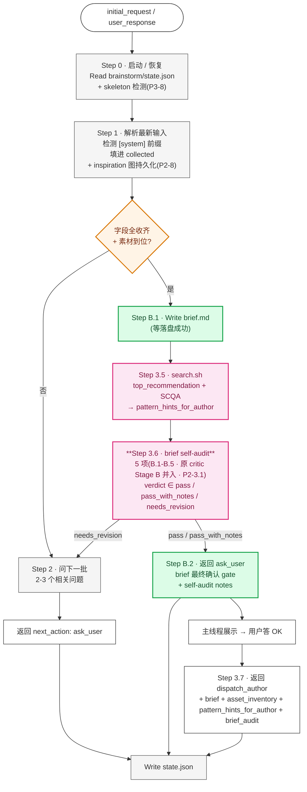

> **Return yaml**:完整 schema 见本文 §5.3 全表与 [pipeline-protocol §4](../.claude/pipeline-protocol.md)。

#### 反例

- 一次性问完 6 字段(用户回答又乱又长)→ 解析错 → author 跑偏。**正确**:每轮问 2-3 个相关问题,collected 持续累积
- brief.md gate 跳过(字段齐就直接 dispatch_author)→ 用户没机会看 brief 总体感 → author 才发现论点不对
- Step 3.5 RAG 失败时不降级(直接报错)→ 流水线阻塞。**正确**:search.sh fail → 空数组 + 标 source 不阻塞

**详细 agent 文件**:[`${CLAUDE_PROJECT_DIR}/.claude/agents/iloveppt-brainstorm.md`](${CLAUDE_PROJECT_DIR}/.claude/agents/iloveppt-brainstorm.md)

### 3.2 `iloveppt-author`

#### 能力卡片

| 维度 | iloveppt-author |
|---|---|
| **调用方式** | Task(subagent · Phase B · Stage C → Stage D 一次性走完无中间 critic gate)/ rework 独立 Task |
| **模型** | opus |
| **Tools** | Bash / Read / Write / Edit / Glob / Grep / WebSearch / Skill |
| **state file** | `decks/<slug>/author/state.json`(详见 §2.3 · 含 chapter_hashes / chapter_*_carryovers 新字段) |
| **读哪些 markdown** | brief.md / outline.md(Stage D)/ content.md(rework)/ content-writing.md / diagram skill docs / `library/pptx-templates/items/<theme>/meta.yaml`(若 ≠ tech_blue · 含 multi-template 时多个)/ `library/visual-patterns/items/<id>/meta.yaml`(search.sh 返回 meta_path 后 Read)/ `library/vocabularies/keywords_bank.yaml`(keyword 桶)|
| **写哪些 markdown** | `author/deck_v{N}_outline.md`(Stage C 唯一写者)/ `author/deck_v{N}_content.md`(Stage D 唯一写者)/ `author/state.json` / `author/charts/*.png`(配图 · 必有 `.py/.drawio/.mmd` 源同目录同名前缀)|
| **调 RAG** | ✓ Step 1A.5(Stage C per chapter top-5 + **chapter-aware preferred-template** · 若 brief.theme list/dict 多模板 → 按 chapter_index 解析对应 theme) + Step 1C(Stage D 拓写,`--preferred-template <chapter_theme> --type page` 模板优先 fallback vp)|
| **调 templates 库** | ✓ Stage D Step 1C 若 theme ≠ tech_blue → Read 每个 chapter resolved theme 对应的 `library/pptx-templates/items/<theme>/meta.yaml` + search.sh `--preferred-template` |
| **advisory 来源** | critic suggested_alternative_patterns + audience needs_visual_redo_pages[N].suggested_alternative_pattern(rework 时 user_response 含 accept_alternative_pattern → 接受改)|
| **是否唯一写者** | **outline.md / content.md / pattern_hints / `<!-- pattern: vp:/tpl: -->` 注释 唯一写者** |
| **跨 agent handoff 出口** | `ask_user_for_outline_approval`(Stage C 完)/ `ask_user_for_content_approval`(Stage D 完)/ `dispatch_critic`(用户审批 content.md 后 · **stage=cd** 合并合审)|

#### 职责

基于 brief + 素材清单,按金字塔原理 出 outline.md(Stage C) + 拓写 content.md(Stage D)。** Stage C → D 一次走完,中间无 critic gate**;rework 走独立 Task。

**金字塔原理 5 件套**(author 写时遵循;critic Section A 7 项判定):
- ① 单一顶端论点
- ② SCQA 开场
- ③ 答案在前(BLUF)
- ④ 横向 MECE 3-5
- ⑤ 纵向疑问链

**multi-template resolve_theme**(Stage C/D 拿到 chapter_index 后查对应 theme):
- brief.theme 是 `str` → 全 deck 同一 theme(`resolve(any) = <str>`)
- brief.theme 是 `list[str]` → 按章节顺序循环(`resolve(i) = theme_list[i % len]`)
- brief.theme 是 `dict {default, overrides}` → `resolve(i) = overrides.get(i+1, default)`
- brief.theme 是 `dict {1: ..., 2: ...}` → `resolve(i) = theme_map[i+1]`(纯 mapping)
- **chapter-aware preferred-template**:Step 1A.5 / Step 1C 调 search.sh 时,query 带当前 chapter 的 resolved theme · 跨模板组合 deck 时**每章独立查**自己的 theme 模板页

**rework 路径**(Stage C 或 Stage D 任何 stage 派发都可改 pattern):

```
user_response 含 accept_alternative_pattern: {page: N, suggest: <new-id>}
   ↓
1. Read outline.md / content.md 拿当前 pattern_hints
2. 找到 page=N 对应章节
3. 同步更新两处:
   - outline.md pattern_hints.selected = <new-id>(原 selected 挪 alternatives)
   - content.md `<!-- pattern: vp:<old-id> -->` / `<!-- pattern: tpl:<old> -->` 替换 `vp:<new-id>` / `tpl:<new>`(Stage D only;**前缀必须带**)
4. yaml return: ask_user_for_outline_approval / ask_user_for_content_approval(回审批节点)
```

#### 流程(Stage C 简化)

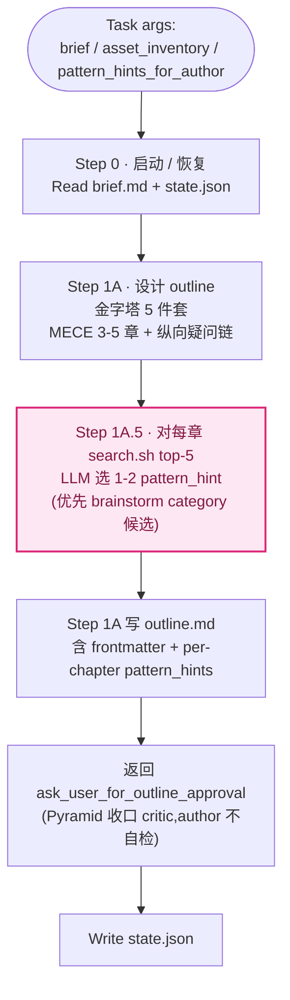

Stage D 流程同 Stage C(略),关键差异:
- Read outline.md(继承 pattern_hints)
- 调 `library/search.sh --preferred-template <brief.theme> --type page`(theme=tech_blue 时 `--preferred-template` 缺省,纯 visual-patterns 检索)
- 拓写时按 layout + pattern 嵌入 `<!-- pattern: vp:<id> -->` 或 `<!-- pattern: tpl:<theme>__<NN-slug> -->` 注释(**强制前缀**)
- 配图阶段调 diagram skill(draw.io / matplotlib)
- 若 theme ≠ tech_blue → Read `library/pptx-templates/items/<theme>/meta.yaml`

> **Return yaml**:完整 schema 见本文 §5.3 全表与 [pipeline-protocol §4](../.claude/pipeline-protocol.md)。

#### 反例

- author 自跑 Pyramid 7 项 → 不要;critic Section A 是唯一判定,author 按 Pyramid **设计**就够
- Step 1A.5 跳过 RAG(继续手选 layout)→ 失去 visual-patterns 库的预选能力 → audience 评分 visual_appeal 下降
- rework 收到 accept_alternative_pattern 只改 outline 没改 content `<!-- pattern: vp:/tpl: -->` → iloveppt-builder 渲染时按旧 pattern
- 写 `<!-- pattern: arrow-chain -->`(没前缀)→ iloveppt-builder Step 2 拒渲染 hard_stop。**前缀强制**:`vp:` for visual-patterns,`tpl:` for pptx-templates

**详细 agent 文件**:[`${CLAUDE_PROJECT_DIR}/.claude/agents/iloveppt-author.md`](${CLAUDE_PROJECT_DIR}/.claude/agents/iloveppt-author.md)

### 3.3 `iloveppt-critic`

#### 能力卡片

| 维度 | iloveppt-critic |
|---|---|
| **调用方式** | Task(subagent · Phase B · **stage=cd 合审单次**)|
| **模型** | **opus**(深度推理 + 5 维度判断性评审)|
| **Tools** | Read / Grep / Glob / Write / WebSearch / Bash(**无 Edit** · read-only agent · Bash 仅用于 compute_chapter_hashes.py)|
| **state file** | **无**(每次派发独立,产出全在 critic_report_*.md · 读 author/state.json 取 chapter_hashes hot-reload)|
| **读哪些 markdown** | brief.md / outline.md / content.md / content-writing.md / `library/visual-patterns/items/<id>/meta.yaml` 或 `library/pptx-templates/items/<name>/pages/<NN-slug>/meta.yaml`(J5 反查)/ **`.claude/agents/critic-rubric.yaml`**(量化 SSOT)/ author/state.json + prev critic_cd report(Step 0.5 hot-reload)|
| **写哪些 markdown** | `critic/deck_v{N}_critic_cd.r{R}.md`(唯一写者)|
| **调 RAG** | ✓ J5 维度(pattern 适配性):Read author selected meta.yaml 验匹配 → 不符则重跑 search.sh top-5 选 1 alternative |
| **调 templates 库** | **不用** |
| **advisory 来源** | 无(critic 是评者,不接 advisory)|
| **是否唯一写者** | **critic_report 唯一写者**;.md 源文件**只读不改** |
| **跨 agent handoff 出口** | `pass` / `pass_with_notes` / `needs_revision`(主线程根据 verdict 路由 · verdict 由公式自动算)|

#### 职责

**partner 评审员而非合规检查员**。** stage=cd 合审一次**(原 Stage C + Stage D 合并),C+D 合并为单次评审看 outline + content + 5 维度判断。**每项强制量化 schema**,verdict 由公式自动算,LLM 不主观判。

**SSOT**:21 项的权威定义在 [`${CLAUDE_PROJECT_DIR}/.claude/agents/critic-rubric.yaml`](${CLAUDE_PROJECT_DIR}/.claude/agents/critic-rubric.yaml) — 每项的 `evidence_requirement` + `severity_examples` 是评分校准基准。

**21 项量化评审**(A 7 + B 9 + J 5):

| Section | 项数 | 检查什么 |
|---|---|---|
| **A · 金字塔结构** | 7(A1-A7) | A1 单一顶端论点 / A2 SCQA 开场 / A3 答案在前 / A4 MECE 3-5 / A5 纵向疑问链 / A6 章节摘要 / A7 结尾收口 |
| **B · brief 对齐 + 工程兜底** | 9(B1-B9) | B1-B5 brief 对齐 / B6 字数规则 / B7 red_line_words / **B8 validate_layout_in_theme**(hard gate · tier2/tier1 路径存在性)/ **B9 theme_tier 一致性** |
| **J · 判断性评审** | 5(J1-J5) | J1 论据强度 / J2 节奏感 / J3 措辞质感 / J4 整体平衡 / **J5 pattern 适配性**(advisory) |

**每项 schema(强制量化)**:`{id, name, passed, evidence ≥ 10 字, severity 0-3 整数, suggestion}` —— 严禁 "low/med/high" 等口语词;severity 必须 0(ok)/1(nit)/2(warn)/3(block)整数。

**verdict 自动算公式**(LLM 不主观判):
```
if any(severity == 3):                       verdict = "needs_revision"
elif count(severity == 2) > 5:               verdict = "needs_revision"  # warn 累积亦 block
elif count(severity == 2) >= 1 or count(severity == 1) >= 1:
                                              verdict = "pass_with_notes"
else:                                         verdict = "pass"
```

**Step 0.5 hot-reload(可选)**:
- 触发条件:`author/deck_v{N}_state.json` 存在 + 含 `chapter_hashes` 字段 + 含 `prev_critic_cd_report_path`(rework 第 2 + 轮)
- 流程:Bash 跑 `compute_chapter_hashes.py` 算当前 hash → 对比 state.chapter_hashes → 未变章节 carry over 上轮 `{id, passed, evidence, severity, suggestion}` 5 字段 → 变了的章节重跑
- 重跑后 verdict **必须**按公式重算(不可 carry over 旧 verdict)
- fallback:state.json 缺字段 / 全章 hash 都变了 → 跳过 Step 0.5 走完整评审

**5 轮 cap**:stage=cd 计数,第 5 轮仍 needs_revision → 主线程问用户四选一(继续改 / 接受当前 / 终止 / 回 brainstorm 改 brief)。

#### 流程

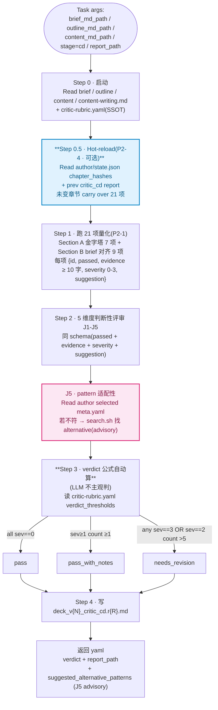

> **Return yaml**:完整 schema 见本文 §5.3 全表与 [pipeline-protocol §4](../.claude/pipeline-protocol.md)。

#### 反例

- 凭"这种 layout 通常没问题"跳过某项 checklist → 违反 evidence-based
- 改 outline.md / content.md → 违反 read-only(改是 author 经用户 cherry-pick 的事)
- 维度 5 alternative 计入 must_fix → 阻塞流水线(正确做法:advisory,主线程展示给用户决定)
- 5 轮 cap 自己判断"接受当前版本" → 越权(决定权在用户)

**详细 agent 文件**:[`${CLAUDE_PROJECT_DIR}/.claude/agents/iloveppt-critic.md`](${CLAUDE_PROJECT_DIR}/.claude/agents/iloveppt-critic.md)

### 3.4 `iloveppt-builder`

*build + 视觉 · Step 0-5 一气呵成*

#### 能力卡片

| 维度 | iloveppt-builder |
|---|---|
| **调用方式** | Task(subagent · Phase B · 单次跑完 Step 0-5 · 支持 mode=full / visual_redo)|
| **模型** | **opus**(多职责:Step 0 critic gate + Step 1 strict md→JSON + Step 2 build + Step 3 视觉 QA + Step 4 主动加视觉 + image RAG 反查 + query_cache)|
| **Tools** | Bash / Read / Write / Edit / Glob / Grep / Skill(**无 WebSearch**)|
| **state file** | **无**(单次派发跑完,状态全在 visual_report_r{N}.md + deck_plan_edits;读 author/state.json Step 0.3 hot-reload)|
| **读哪些 markdown** | deck_v{N}_critic_cd.r{R}.md(Step 0 必读 gate)/ content.md / content-writing.md / visual-qa.md / `library/pptx-templates/items/<name>/meta.yaml`(若 theme ≠ tech_blue · multi-template 时每个 chapter 各自 resolved theme)/ `library/{visual-patterns,pptx-templates}/items/<id>/meta.yaml`(读 `<!-- pattern: vp:/tpl: -->` 注释时按前缀查对应 kb)/ `themes/<name>.yaml`(yaml 化后 · _schema.yaml 验证)|
| **写哪些 markdown** | `builder/deck_v{N}.pptx`(通过 build.py · 现拆为 `builder/{base,tier1,tier2,tier3}.py`)/ `builder/deck_v{N}_plan.json`(Step 3 的字数/视觉修复全落在这里 · 含 `derived_from_sha256`)/ `builder/deck_v{N}_visual_qa.r{R}.md` / `builder/rag/<page_id>.source.yaml`(每张 RAG 嵌入的 source 追溯 · 图片资产 reproducibility)|
| **调 RAG** | ✓ Step 2 解析 `<!-- pattern: vp:/tpl: -->` 注释 → 查对应 kb DB;✓ **Step 4.3.5 image RAG 视觉一致性反查**(rendered PNG → top-5 模板页相似度);✓ Step 4.2.5 第 4 路 fallback;✓ **Step 4.5 query_cache**(iconify/Unsplash fuzzy match 复用) |
| **调 templates 库** | ✓ Step 1.0 多模板 brief.theme 解析 → builder/base.py `parse_theme()` → `ThemeSpec`(per-chapter resolved theme + cross-pptx tier1 deep-copy);✓ build.py 解析 theme 字段 + 跨模板 tier1 复用保 primary theme 字体/色板 |
| **advisory 来源** | 无 |
| **是否唯一写者** | **deck_plan.json / .pptx / visual_report 唯一写者**;**author/content.md 全程不可变**(无 postbuild 副本)|
| **跨 agent handoff 出口** | `dispatch_audience`(成功)/ `hard_stop`(critic_d_missing / critic_d_not_passed / **ssot_verify_failed** / missing_layout_directive / qa_3_rounds_exhausted)|

#### 职责

**Stage E:5 步一气呵成**:Step 0 critic gate → Step 0.3 hot-reload→ **Step 0.5 SSOT verify**→ Step 1 strict md→JSON + **Step 1.0 多模板 brief.theme 解析** → Step 2 build.py 出 .pptx + render PNG → Step 3 17 项机械视觉 QA(≤ 3 轮)→ Step 4 主动加视觉(4 路降级 + **Step 4.3.5 image RAG 反查** + **Step 4.5 query_cache**)。

**Step 0 critic gate**:必须先 Read critic_cd_report_path(主线程传 _r{R} 路径)→ verdict ∈ {pass, pass_with_notes} 才进 Step 1;needs_revision 或 missing → `hard_stop`。**iloveppt-builder 不跑 Pyramid 自检**,信任 critic stage=cd 那道 gate。

**Step 0.5 SSOT verify**:
- 触发:输入 `deck_plan.json` 含 `derived_from_sha256` 字段(走 derive_plan.py 派生流程时填)
- 流程:Read 当前 deck_plan.json `derived_from_sha256` → Bash 算当前 content.md sha256 → 对比
- 不匹配 → `hard_stop: ssot_verify_failed`,主线程必须先跑 `scripts/derive_plan.py` 同步,再派 builder
- 防止 author rework 后 deck_plan 跟 content.md 不同步导致 builder 用旧 plan

**Step 1.0 多模板 brief.theme 解析**(per-chapter 路由):
- Read brief.theme(可能 3 形态:str / list / dict)
- 调 `builder/base.py:parse_theme()` 解析成 `ThemeSpec`(代码层 API · Agent A 提供)
- 每个 slide 必须含 `chapter_index` + `effective_theme`,后者由 `parse_theme().resolve(chapter_index)` 算
- **跨模板 tier1 deep-copy**:`theme_spec.mode != "single"` 时,从 source 模板拷贝 slide XML + 媒体到 deck,**保 primary theme 字体/色板**(避免多模板字体混搭),仅按 placeholder_map 填字
- deck_plan.json 顶层加 `theme_spec` 字段(完整透传 brief.theme 原 schema 不展开)

**Step 4 视觉资产 4 路降级**:

| 路 | 来源 | 触发条件 |
|---|---|---|
| 1 · brand_assets(优先级最高) | `<working_dir>/_assets/brand/*` | 用户自带 brand |
| 2 · iconify | api.iconify.design(免费)| 需 cairosvg |
| 3 · Unsplash | api.unsplash.com | 需 UNSPLASH_KEY |
| 4 · RAG patterns | library/visual-patterns/items/<id>/preview.png | 上 3 路全 disable + 该页 visual_qa.passed < 14/17 + library 可用 |

**Step 4.3.5 视觉一致性反查(image RAG)**:
- 触发:Step 4.3 rebuild 完产出新 render PNG + `brief.theme != tech_blue`(模板模式才有意义)
- 流程:对每张 rendered jpg 调 `search.sh --query-image <rendered.jpg> --preferred-template <theme>` → 取 top-5 模板页相似度
- 若 top-1 score < 0.6 → `visual_drift_pages` 标记 + advisory(audience 阶段 Step 3.5.2 也会反查同样源)
- fallback:search.sh 调用失败 / brief.theme == tech_blue / image RAG 不可用 → `visual_consistency_check.enabled: false`,跳过不阻塞

**Step 4.5 query_cache**:
- iconify / Unsplash query 沉淀到 `library/_rag/external_query_cache.jsonl`
- 每次 Step 4 调用前 fuzzy match(rapidfuzz)历史 query → 贴合 → 复用 cache_hits +1;不贴合 → 走 API + write back
- fallback:`query_cache.py` 不可调 / rapidfuzz 缺失 → log warn + `query_cache.disabled: true`,不阻塞

**节制原则**:咨询稿是**文字驱动**,没合适资产就不加(BCG/McKinsey style)。

**反向 diff 校验**:Step 1 md→JSON 后做反向 check,若 > 5% → hard_stop(防"创意拓写")。

#### 流程

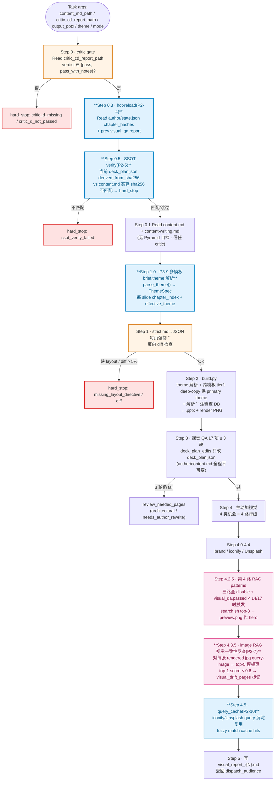

> **Return yaml**:完整 schema 见本文 §5.3 全表与 [pipeline-protocol §4](../.claude/pipeline-protocol.md)。

#### 反例

- 自跑 Pyramid 7 项重复 critic → 不要;只看 critic_cd_report.verdict
- Edit author/content.md 或写 .postbuild 副本 → 都禁;Step 3.4 只改 deck_plan.json
- Step 4 看到三路 disable 就 0 视觉(没用 RAG 第 4 路)→ 失去 visual-patterns 库的视觉提升机会
- 反向 diff 7% 还继续(以为"差不多")→ iloveppt-builder 偷偷加了 content.md 没有的论点
- 看到 `<!-- pattern: arrow-chain -->`(无前缀)就猜是 visual-patterns → 错查。**正确**:无前缀 id 直接 hard_stop,让 author 补前缀
- 看到 `## N. xxx` 没紧跟 `<!-- layout: X -->` 就猜 layout → 不要;直接 hard_stop missing_layout_directive 让 author 补

**详细 agent 文件**:[`${CLAUDE_PROJECT_DIR}/.claude/agents/iloveppt-builder.md`](${CLAUDE_PROJECT_DIR}/.claude/agents/iloveppt-builder.md)

### 3.5 `iloveppt-audience`

#### 能力卡片

| 维度 | iloveppt-audience |
|---|---|
| **调用方式** | Task(subagent · Phase B · 每轮新派发,无状态;支持 multi-persona list[str])|
| **模型** | opus |
| **Tools** | Read / Glob / Write / Bash(**无 Edit / WebSearch** · 评分阶段只读 PNG · Bash 仅用于 spot-check + image RAG + feedback writeback)|
| **state file** | **无**(每轮独立,产出在 audience_review_r{N}.md;读 author/state.json Step 0.4 hot-reload)|
| **读哪些 markdown** | content-writing.md / visual-qa.md / library/visual-patterns/INDEX.md / **render PNG 全 N 页**(唯一接触 .pptx 产物的方式)/ `library/vocabularies/audience_personas.yaml`(persona SSOT)/ `<working_dir>/builder/deck_v{N}_plan.json`(**仅 Step 0.0 spot-check + Step 3.6 feedback writeback,不影响评分**)/ `<working_dir>/brainstorm/brief.md`(Step 0.5 red_line 双语 fuzzy + 拼音检查)|
| **写哪些 markdown** | `audience/audience_review_r{N}.md`(唯一写者)/ `library/_rag/feedback.jsonl`(append-only · **全仓库共享 不写 deck 工作目录**)|
| **调 RAG** | ✓ Step 3.5 文本反查(text RAG top-3 选 alternative);✓ **Step 3.5.2 image RAG 反查**(rendered jpg → top-5 模板页相似度 → 找视觉一致性更高的 alternative)|
| **调 templates 库** | **不用** |
| **advisory 来源** | 无(audience 是评者,不接 advisory)|
| **是否唯一写者** | **audience_review + feedback.jsonl 唯一写者** |
| **跨 agent handoff 出口** | `delivered`(deck_score_final ≥ 9)/ `needs_author_rewrite` / `needs_visual_redo` / `needs_theme_fix` / `blocked_by_spot_check`(Step 0.0 失败) |

#### 职责

**模拟目标受众第一次读 deck**,从读者视角给评分 + 改进建议。

**Step 0.0 pre-scoring spot-check(原主线程 spot-check 已并入)**:
- 评分前先跑 placeholder grep / chart source / 5 + PNG breakage scan / red_line grep
- 任一硬阻塞 → `verdict: blocked_by_spot_check` + 中止评分(`overall_score: 0` 占位)→ 升回 builder rework
- 防 builder 自报 OK 后仍有 placeholder 残留 / 文字未替换 / 截断等严重 bug
- 各 spot-check 字段缺(deck_plan_path / builder_visual_edits / brief.md)→ 标 `skipped`,不阻塞整体

**每页 12 项 × 0-3 量化**(替代 legacy 4-dim × 10):
- 维度涵盖:理解 / 节奏 / 措辞专业 / 视觉吸引 / 逻辑连贯 / 信息密度 / 锚点 / 字体可读性 / 颜色对比 / icon 适配 / 装饰节制 / 跨页 narrative
- 每项 severity 0-3 整数 · weighted sum 按 persona-driven 权重(`audience_personas.yaml` 字段 `concerns / decision_criteria / word_preference`)
- 转 10 分制 → `deck_score`,9 分硬阈值

**multi-persona strict-eval**:
- brief.audience 是 `list[str]`(multi-select)→ 对每个 persona 独立跑一遍完整 Step 1-3.5
- `deck_score_final = min(per_persona_scores)`(strict-eval) · 任何一个 persona < 9 都算 deck 没过
- `blocking_persona` 字段标决定 verdict 的 persona;`per_persona_scores` breakdown 给用户看哪个 persona 卡住

**Step 0.4 hot-reload(可选)**:
- 同 critic Step 0.5:Read author/state.json chapter_hashes + prev audience report
- 未变章节 carry over per_page_scores;**spot-check 必须全 deck 跑**(不 carry over · 因为 builder 这轮可能引入新 placeholder)

**Step 3.5.2 image RAG 反查 alternative**:
- 对每个 needs_visual_redo 页,除文本 RAG(Step 3.5)外再跑 image RAG(rendered jpg → top-5 模板页)
- 找视觉一致性更高的 alternative · 标 `visual_query_match` 字段

**Step 3.6 feedback writeback**:
- 评分完 append `(chosen_pattern_id, audience_score, page, deck)` 到 `library/_rag/feedback.jsonl`(append-only)
- search.sh `--feedback` flag 据此对低分 pattern 软降权(score × 0.9 · avg<7.0 + count>=3 时触发)
- 失败不阻塞:deck_plan.json 不可读 / disk 写盘失败 → log warn + `feedback_writeback: skipped/write_failed`,**正常返回评分 yaml**

**三类反馈分流**(triage · 不变):

| triage | 改什么 | 派谁 |
|---|---|---|
| `needs_author_rewrite` | 文字 / 论点 / 结构问题 | Task author rework(后续必须重派 critic stage=cd) |
| `needs_visual_redo` | 视觉素材 / icon 选错 / 装饰过头 | Task iloveppt-builder mode=visual_redo |
| `needs_theme_fix` | theme 层视觉(yaml 缺字段) | 主线程改 themes/*.yaml(yaml 化后) |

**优先级**(多类同时存在时):author > theme > visual。

**5 轮 cap**:audience-author-iloveppt-builder 循环 5 轮仍 < 9 → 用户四选一(继续改 / 接受当前 / 终止 / 回 brainstorm 改 brief)。

#### 流程

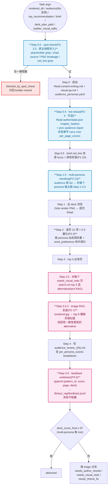

> **Return yaml**:完整 schema 见本文 §5.3 全表与 [pipeline-protocol §4](../.claude/pipeline-protocol.md)。

#### 反例

- 不代入 audience profile(executive 跟 technical 看同一页结论完全不同)→ 评审作废
- 给所有页都 8 分讨好 → deck 永远卡 7-8 区间循环 5 轮
- 试图改 .md / .pptx → 越权(只评不改)
- 评机械视觉(字号 / 对齐)→ 重复 iloveppt-builder Step 3 的活;正确做法翻译成认知感受("page 5 第 3 张卡 caption 化没存在感")

**详细 agent 文件**:[`${CLAUDE_PROJECT_DIR}/.claude/agents/iloveppt-audience.md`](${CLAUDE_PROJECT_DIR}/.claude/agents/iloveppt-audience.md)

### 3.6 `iloveppt-template-extractor`

*旁路 Stage T · 仅用户给 .pptx 模板时启动一次*

#### 能力卡片

| 维度 | iloveppt-template-extractor |
|---|---|
| **调用方式** | Task(subagent · 一次性任务)|
| **模型** | opus |
| **Tools** | Bash / Read / Write / Edit / Glob / Grep / Skill |
| **state file** | **无**(一次性任务,状态在 `library/pptx-templates/items/<name>/` draft 文件群)|
| **读哪些 markdown** | 用户给的 .pptx 模板源 / `library/_rag/render_pages.py` 渲染出的每页 PNG |
| **写哪些 markdown** | `library/pptx-templates/_source/<name>.pptx`(复制) + `items/<name>/meta.yaml.draft`(模板级) + `items/<name>/pages/<NN-slug>/meta.yaml.draft`(每页)**所有 draft 等用户审后由主线程跑 embed 入 DB**|
| **调 RAG** | **不用**(写入方,不是检索方) |
| **调 templates 库** | ✓ 写者(`library/pptx-templates/` 唯一 draft 写者) |
| **advisory 来源** | 无 |
| **是否唯一写者** | **`library/pptx-templates/items/<name>/{meta.yaml, pages/<NN-slug>/meta.yaml}` draft 唯一写者** |
| **跨 agent handoff 出口** | happy:return `user_review_drafts`(主线程展示草稿给用户审 → 跑 embed → SendMessage(brainstorm, extractor_summary)续聊);失败兜底:return `dispatch_brainstorm`(主线程直接 SendMessage 给 brainstorm 走兜底分支)|

#### 职责

**Stage T(旁路)**:用户提供 .pptx 模板时,让系统"真正看见"这个模板。**仅当 brainstorm 接收到 template_path 时才被派发**,默认 tech_blue 不触发。

**做的事**:
1. 复制用户提供的 .pptx → `library/pptx-templates/_source/<name>.pptx`(记 sha256 → meta.provenance.source_pptx_sha256)
2. 跑 `library/_rag/.venv/bin/python library/_rag/render_pages.py <name> --dpi 120` → 渲染每页 PNG 到 `items/<name>/pages/<NN-slug>/preview.png`(`__` 开头页跳过)
3. **Step 2.6 watermark + 第三方品牌 LOGO detect**(`library/_rag/scripts/detect_watermark.py`):扫源 .pptx 媒体 + 渲染 PNG · 命中已知品牌词 / 半透明大图层 → 标 `needs_manual_review: true` + 强警告 user_review_drafts 阶段提示
4. Step 2.5 declared(unzip sldId 数)vs rendered(ls preview.png 数)如实记 advisory
5. (可选)抽 L1 媒体 + L2 visual_tokens
6. Read 每页 PNG **视觉分析**(主色 / 字体 / cards 拥挤度 / icon 库 / section_divider 对比强烈度 / 整体氛围 / 潜在问题)
7. Write **draft yaml 双层**:
   - `items/<name>/meta.yaml.draft`(模板级 metadata + visual_signature + visual_tokens + recommended_usage + provenance.source_pptx_sha256)
   - `items/<name>/pages/<NN-slug>/meta.yaml.draft`(每页 layout_type + intent + 关键字 + visual_observations + **variant** 从 layout_variants.yaml 选 + **placeholder_map.yaml** slot_ids 从 slot_ids.yaml 选 + shape_id 含)
8. **Step 3.3 跑 14 项 self_check**(extractor_self_check.py · `iloveppt-self-check` Haiku helper 可代跑解析)→ 任一 fail hard_stop
9. 返回 `user_review_drafts`,**主线程展示 drafts 给用户审改**;用户 OK 后主线程跑 `library/_rag/embed_*.py` 入 DB,然后 SendMessage 回 brainstorm

**不做的事**:
- 不收 brief(brainstorm 的事)
- 不设计 outline / 拓 content(author 的事)
- 不写 `themes/<name>.py` 自定义 theme(Tier 2 人工 1-3 天)
- 不直接入 DB(必须经用户审 draft 这一道 gate)

**失败处理**:
- soffice 不在 PATH / render_pages.py 失败 → 返回 `template_ready: false` + reason
- 模板损坏 → 同上
- 失败时 summary 用 `[system] template_extractor_failed` 前缀,主线程整段 SendMessage 转给 brainstorm team → brainstorm 走兜底分支

#### 流程

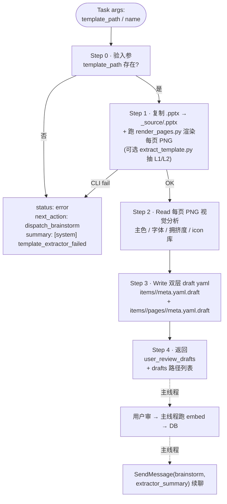

> **Return yaml**:完整 schema 见本文 §5.3 全表与 [pipeline-protocol §4](../.claude/pipeline-protocol.md)。

#### 反例

- 不真 Read PNG 就写 visual_observations("封面看起来现代简约" 凭猜) → 下游 author 按猜测语气拓写,跟实际模板不符
- 失败时不用 `[system]` 前缀 → brainstorm 当普通用户输入解析,卡死
- 试图写 themes/<name>.py 自定义 theme → 越权(Tier 2 人工范围)
- 跳过 `user_review_drafts` gate 自己改 `.yaml`(不带 .draft 后缀)入库 → 脏数据进 DB → 污染所有后续模板检索。**强制**:draft 必须等用户审过,主线程才跑 embed

**详细 agent 文件**:[`${CLAUDE_PROJECT_DIR}/.claude/agents/iloveppt-template-extractor.md`](${CLAUDE_PROJECT_DIR}/.claude/agents/iloveppt-template-extractor.md)

### 3.7 Haiku helper · `iloveppt-self-check` + `iloveppt-yaml-fixer`

*路由优化 · 错误恢复路径专用 · 主流水线不直接派*

**为什么单独一节**:两个 helper 不在主流水线 6 agent 中,只在**主线程错误恢复路径**上由主线程 dispatch(典型场景:extractor 写完 8 套 draft 批量跑 self_check / agent return yaml 偶尔 malformed)。**严禁 subagent 起 subagent**(详 §4 决策 9 · Haiku 路由限定)。

#### 3.7.1 `iloveppt-self-check`(校验脚本运行 + 解析)

| 维度 | iloveppt-self-check |
|---|---|
| **调用方式** | Task(subagent · 主线程错误恢复路径 dispatch · 不在主流水线) |
| **模型** | **haiku-4-5**(路由 · Opus 单价 19x Haiku 浪费) |
| **Tools** | Bash / Read / Glob(**无 Edit / Write** · 不修任何文件) |
| **state file** | **无**(纯函数式,跑脚本 + 解析 stdout) |
| **干什么** | 跑指定校验脚本(`library/pptx-templates/scripts/extractor_self_check.py` / `library/_rag/scripts/red_line_check.py`) + 解析 stdout / stderr / exit code → 归一化 yaml 报告 |
| **不干什么** | 不修 .draft(那是 yaml-fixer 的活)/ 不评 .pptx 视觉(audience 的活)/ 不做内容判断 / 不调 LLM 重写 |
| **典型触发** | extractor 写完 8 套 draft → 主线程批量跑 self_check → 聚合 fail 项 → 主线程决定派 yaml-fixer 还是回 extractor rework |

**入参契约**:
```yaml
working_dir: /abs/path
check_type: extractor_self_check | red_line | other
targets:
  - /abs/path/to/items/<name>           # extractor_self_check: items 目录
  - /abs/path/to/brief.md               # red_line: brief 路径
```

**Return yaml**:
```yaml
agent: iloveppt-self-check
status: ok
next_action: pass | fail
check_type: extractor_self_check
results:
  - {target: items/<name>, exit_code: 0, code: ALL_PASS, items_checked: 14, fails: []}
  - {target: items/<name2>, exit_code: 1, code: VARIANT_ENUM_FAILED, items_checked: 14, fails: [{check: 12, msg: "..."}]}
summary: |
  8 targets 跑完 · 6 pass / 2 fail
```

#### 3.7.2 `iloveppt-yaml-fixer`(LLM 写错的 YAML 字面修复)

| 维度 | iloveppt-yaml-fixer |
|---|---|
| **调用方式** | Task(subagent · 主线程错误恢复路径 dispatch · 不在主流水线) |
| **模型** | **haiku-4-5**(路由) |
| **Tools** | Bash / Read / Edit / Write |
| **state file** | **无** |
| **干什么** | 修 LLM(其他 agent / 主线程)写错的 YAML 字面问题:int / float 误识 str(去引号)/ colon 后特殊字符(加 quote)/ bool 大小写歧义(yes/No → true/false)/ 缩进 off-by-one / quote 不闭合 / trailing comma / 数组混合类型。**只调字面,不动语义** |
| **不干什么** | 不改字段值的语义(`confidence: 0.6` 不能改 0.8)/ 不加不删字段 / 不改 enum 值(那是 self_check 的活)/ 不重写整个文件 / 不评 schema 设计 |
| **典型触发** | extractor 写的 meta.yaml.draft 跑 self_check fail "confidence 0.6 被读成 str" → 派 yaml-fixer 去引号让 yaml.safe_load 识别成 float |

**Return yaml**:
```yaml
agent: iloveppt-yaml-fixer
status: ok
next_action: ok | err
fixed_files:
  - {path: <abs>, fixes: [{line: 12, type: unquote_number, before: '"0.6"', after: "0.6"}]}
summary: |
  修了 3 处字面问题 · 主线程可重跑 self_check 验证
```

#### 主流水线如何使用(主线程派发示例)

```
# 场景:extractor 批量 ingest 8 模板,主线程要批量校验
1. Task(extractor) × 8 并行(详 §4 决策 6 · 并行优先)
2. Task(iloveppt-self-check, targets=[items/*]) 一次性跑完 8 个 self_check
3. self-check return 2 fail 项 (VARIANT_ENUM_FAILED · YAML_SYNTAX_ERROR)
4. 主线程派 Task(iloveppt-yaml-fixer, files=[失败 yaml 路径]) 修字面
5. 主线程派 Task(iloveppt-self-check, ...) 重跑验证 → 全 pass
6. 主线程跑 embed_*.py 入库
```

**反例**:
- subagent(如 extractor)自己 dispatch self-check 或 yaml-fixer → **严禁**;subagent 起 subagent 反模式,Claude Code 平台不保证 nested Task 行为。必须由主线程协调。
- yaml-fixer 看到 `confidence: 0.6` 觉得低改成 0.8 → 越权;改语义是 extractor 的事
- self-check 解析完报告自己写 fix → 越权;写在 self-check 的 return 里,主线程决定下一步

**详细 agent 文件**:
- [`${CLAUDE_PROJECT_DIR}/.claude/agents/iloveppt-self-check.md`](${CLAUDE_PROJECT_DIR}/.claude/agents/iloveppt-self-check.md)
- [`${CLAUDE_PROJECT_DIR}/.claude/agents/iloveppt-yaml-fixer.md`](${CLAUDE_PROJECT_DIR}/.claude/agents/iloveppt-yaml-fixer.md)

---

## § 4. 架构决策

*why · 11 条贯穿系统的设计决定*

### 4.1 thin dispatcher 不持业务

**决策**:主线程只做"分解 / 转发 / 仲裁",**不写任何 PPT 业务逻辑**。

**为什么**:
- PPT 业务下沉到 6 个 agent 各自负责,主线程是状态机的转发者
- 加新 agent 不需要改主线程 prompt(只需更新 pipeline-protocol.md §1 派发表)
- 主线程 context 不被 PPT 业务污染,留给协调任务

**反模式**:主线程"为了快"自己重写 deck content / 自己跑 visual QA → 失去可移植性 + context 爆。

### 4.2 author 是唯一写者

*其他 agent 给 advisory · 用户 cherry-pick 才改*

**决策**:outline.md / content.md / pattern_hints / `<!-- pattern -->` 注释**只有 author 改**。其他 agent 即使发现问题,只能 yaml 给 `suggested_*` advisory。

**为什么**:
- 避免 MAST FM-1.3 step repetition(critic / iloveppt-builder / audience 都改 → 主线程反复试)
- 统一作者风格(author 一人写,文字风格 / 句式一致)
- 决策权清晰:用户拍板 → author 执行;用户不拍板 → 不改

**反模式**:critic 直接 Edit content.md "顺手改个 bullet" → audience 评分时看到的内容跟 author 写的不一致 → 反向追溯困难。

### 4.3 critic 是 partner 评审员

*不是合规检查员 · checklist 是底线 / 5 维度判断才值钱*

**决策**:critic 不是机械跑 checklist 给 pass/fail。critic 像 senior consultant 给 partner review:**checklist 是底线,真正值钱的是 beyond checklist 的 5 维度判断**。

**为什么**:
- 合规检查能 catch 字段缺失,catch 不了"合规但弱"
- 5 维度判断(论据 / 节奏 / 措辞 / 平衡 / pattern)正是把 deck 从 7 分推到 9 分的关键
- 三档 verdict(pass / pass_with_notes / needs_revision)让灰度问题(轻微 polish 项)不阻塞流水线

**反模式**:critic 只跑 14 项 checklist → 输出像 lint,deck 通过但读起来空 → audience 评分卡 6-7。

### 4.4 视觉 QA 三方严格分工

**决策**:视觉相关有 3 个 agent 各管一块,**职责不重叠**:

| agent | 评什么 | 不评什么 |
|---|---|---|
| iloveppt-builder Step 3 | 17 项**机械视觉**(字号 / 对齐 / 颜色 / 溢出 / footer) | 不评内容 / 论点 / 认知接收 |
| iloveppt-builder Step 4 | **主动加视觉资产**(iconify / Unsplash / brand / RAG) | 不改 content.md / 不评认知 |
| audience | **读者认知接收**(5 秒理解 / 信息密度 / 走神 / 记忆点) | 不评机械(字号 ≠ pt 数);把机械感受翻译成认知感受 |

**为什么**:
- 机械视觉是 Python 可验证的(字号 / 对齐数字)→ iloveppt-builder Step 3 做
- 主动加视觉是创造性任务 → iloveppt-builder Step 4 做
- 认知接收只能模拟读者 → audience 做(只读 render PNG,看不到 .md 源)

**反模式**:audience 评"字号 14pt 偏小"(机械活)→ 越界;**正确**:翻译成"第 3 张卡 caption 化没存在感"(认知感受)。

### 4.5 SSOT 双层

*代码 SSOT:helpers.py(字体/形状/token) · 文档 SSOT:content-writing.md(schema/字数规则/Pyramid)*

**决策**:
- **代码 SSOT**:`.claude/skills/pptx/helpers.py` 是字体 / 形状 / 表格原语 + 设计 token(BRAND_PRIMARY / FONT_CN / SLIDE_W/H 等)的**权威源**
- **文档 SSOT**:`.claude/skills/pptx-deck/content-writing.md` 是 outline.md / content.md schema + 13 layout 字数规则 + Pyramid 5 件套定义的**权威源**

**为什么**:
- helpers.py 是 Python,可 import,改色 = 一处生效
- content-writing.md 是 markdown,LLM 读,改字数规则 = author + critic + iloveppt-builder 都按新版执行
- 双 SSOT 让"机械约束(helpers.py)"和"创造性约束(content-writing.md)"分层

**反模式**:每个 theme 重新定义 BRAND_PRIMARY hex 值 → 改色要改 N 处 → 漏改 → 视觉不一致。

### 4.6 Hybrid 架构选择

*brainstorm 留 team,其余 5 agent 转 subagent*

**决策**:brainstorm 用 TeamCreate / SendMessage,其余 5 agent 用 Task。

**为什么 brainstorm 留 team**:
- 多轮 ask_user 对话:team 模式单进程持续,延迟低(~2s/轮)、token 省(prompt cache 命中)
- 跨 ask_user 轮的 collected 字段累积:team window 单进程天然记得
- 用户体验:brainstorm 是 "有性格的对话方",team 模式语义自然

**为什么其他 5 agent 转 subagent**:
- 单次执行 + return yaml(无多轮对话需求)
- Task 工具 return 主线程直接 parse,无 idle / SendMessage 协议负担
- subagent context 隔离更彻底(每次 Task 新 context)
- 协议复杂度 -45%(700→387 行)

**为什么不全 subagent**:brainstorm 每轮重启会多消耗 ~3-5k token + ~3s 延迟 / 轮,用户对话感受割裂(虽然功能上等价)。

**hybrid 协议 finding**(实测发现的真实问题):
- F1:brainstorm idle 时常缺正经 SendMessage,需主线程 ping
- F2:SendMessage 偶有内容跟 state.json 不一致
- F3:runtime.log hook env vars 未暴露(Claude Code 平台层 GAP)

### 4.7 7 步精简 · pipeline 重构

*critic B/C/D 合并 · spot-check 并入 audience · 减少 token + user checkpoint*

**决策**:从 9 步 pipeline → 7 步,具体并入:
- critic Stage B(brief audit)→ 并入 brainstorm Step 3.6 self-audit
- critic Stage C(outline audit) + Stage D(content audit)→ 合并为 stage=cd 单次合审
- 主线程 spot-check(builder return 后单独跑)→ 并入 audience Step 0.0

**为什么**:
- critic stage=B 实际只评 brief 字段对齐 + SCQA 完整性 + audience 合法,这 5 项可由 brainstorm 自审(brainstorm 是 brief 唯一写者,自审天然有 context)。少派 1 个 Task 节省 ~5-10k token + 1 轮 ask_user
- critic C/D 合审 → 同一 LLM 在同 context 看 outline + content 比分两轮评更整体(避免"Stage C pass 但 D fail 因为 author 中间改了 outline")
- spot-check 是机械 grep + PNG breakage scan,本来就跟 audience 都是"评 builder 产出",并到 audience Step 0.0 减少主线程业务逻辑
- **User checkpoint 5 → 3**:brief gate / outline gate / content gate 保留;critic 出报告但不 gate user(verdict 公式自动算 + cherry-pick gate 只当有 alternative 时触发)

**Trade-off**:critic stage=cd 单 Task context 比分两次大(读 brief + outline + content + content-writing.md + critic-rubric.yaml + author/state.json)→ 但 21 项量化已 cap LLM 主观判,context 大但输出稳。

**反模式**:为了"快"再合并 critic + audience → **不要**;critic 评 outline+content(只读 .md),audience 模拟读者(只读 PNG)— 视角完全不同,合并会丢评估维度。

### 4.8 Haiku 路由限定

*主流水线不用 Haiku · helper 不能由 subagent 派*

**决策**:
- 主流水线 6 agent 全 opus,**不准** brainstorm / author / critic / builder / audience / extractor 任一切 Haiku
- 2 新 Haiku helper(self-check / yaml-fixer)只在**主线程错误恢复路径**用,**严禁** subagent dispatch(防 subagent 起 subagent 反模式)

**为什么主流水线不用 Haiku**:
- brainstorm 多轮对话语境理解 / author 金字塔创造性写作 / critic 5 维度判断 / audience persona 切换 / builder 视觉 QA 都要深度推理,Haiku 4.5 跟不上(实测 critic 评 21 项 + verdict 公式 → Haiku 频繁漏 evidence 引用)
- cost 高 ~3-4x 是产品质量的可接受代价

**为什么 helper 不能 subagent 派**:
- Claude Code 平台不保证 nested Task 行为(subagent dispatch subagent)。即使技术上可跑,debug 困难 + context 泄漏风险
- 主线程是状态机,helper 是工具——状态机协调工具天然分层。subagent 当工具用 = 越权

**Haiku 适用范围**:
- self-check:跑 `extractor_self_check.py` / `red_line_check.py` + 解析 stdout → 无创造性推理 · Haiku 跟得上
- yaml-fixer:pre-defined 字面 transformation pattern(去引号 / 加 quote / 改 bool)→ 无语义改动 · Haiku 跟得上

**反模式**:
- extractor 想自己跑 self_check 自检 → **不**:跑脚本 OK,但**解析 + 修复**走主线程派 Haiku helper(职责分离)
- 主线程觉得"audience 评得太严"切 Haiku 让它松 → **错**:audience strict-eval 是设计意图,不是 cost 优化点

### 4.9 受控词典优先 · P1 最大杠杆

*5 个 vocabularies.yaml SSOT · 解决跨 agent 术语不一致根因*

**决策**:5 个 `library/vocabularies/*.yaml` 是 enum 唯一权威源:
- `layout_variants.yaml`(139 enum)→ extractor / author selected
- `slot_ids.yaml`(1115 enum)→ extractor placeholder_map
- `categories.yaml`(12 enum)→ extractor / brainstorm RAG filter
- `audience_personas.yaml`(7 persona)→ brainstorm collect / audience evaluate
- `keywords_bank.yaml`(13 桶 / 327 词)→ author / extractor 关键词桶(EXPANSION_HINTS 是其 derived view)

**LLM 不允许自由发明字符串**,从桶里**选**;违反 self_check #12/#13 hard_stop。

**为什么这是 P1 最大杠杆**:
- 实测 baseline RAG #1 命中数 5/7(71.4%) · gap < 0.05 的低区分度 query 4/7 → 根因是同义字段碎片("cards-3" vs "cards-3-icon" vs "cards3icon")让 embedding 无法精准聚类
- P1 上线后 #1 命中 7/7(100%) + gap 0.060 → 0.123(+105%) + "产品 SaaS" gap 0.04 → 0.15(+0.11 立竿见影)
- vocabulary 不仅让 RAG 准,也让 critic Section B + audience persona-driven weighting 有权威 schema 可读

**反模式**:
- 加新 variant 直接在 page meta.yaml.draft 写 "cards-3-style" → self_check #12 fail;**正确**:先改 `layout_variants.yaml` SSOT,再让 extractor / author 用新 enum
- audience persona 改成自由字符串("CFO 风格")→ persona SSOT 失同步;**正确**:`audience_personas.yaml` 加新 persona key,author 自动看见

### 4.10 跨模板组合保 primary theme

*多模板组合 deck 字体/色板不混搭*

**决策**:`brief.theme` 支持 list / dict 多模板组合(4 schema)时,builder Step 1.0 `parse_theme()` 解析成 `ThemeSpec`,每个 slide 含 `effective_theme`(by chapter_index)。但**字体/色板锁 primary theme**(`theme_spec.primary`),不按 chapter 切换。

**为什么**:
- 实测多模板组合时,跨模板字体切换(microsoft yahei → pingfang)在同一 deck 内一秒切回 + 色板不连续 → 用户感受"廉价合订本",违反职业 PPT 视觉一致性
- chapter 切换的是**视觉模式**(layout / pattern · 比如 ch3 用 finance_arrow 的 timeline-v 5-step)不是**视觉品牌**(字体 / 主色 · 通常公司只有 1 套 brand)
- primary theme = brief.theme list[0] 或 dict.default,locked

**实现**:
- `builder/base.py:ThemeSpec.primary` 字段持有 primary theme
- `builder/tier1.py:cross_pptx_deep_copy()` 拷贝 slide XML 时,**仅按 placeholder_map 填字**,不改 master slide 字体 reference / 主色变量
- helpers.py `set_font` 调 lxml 写 `<a:ea>` + `<a:cs>` 时永远用 primary theme 字体

**Trade-off**:
- 灵活性 < 让用户每章独立 brand。但 90% 真实场景是"我的财务部用 finance 模板的 timeline 视觉,但全 deck 用公司主字体" → primary theme 锁 brand 更对
- 极少数 cross-brand co-marketing 场景(A 公司 + B 公司联名 deck)用 dict_mapping 也能切 brand,但需用户显式指定

**反模式**:每章切完全独立 theme(字体 + 色板都按 chapter 变)→ 用户必投诉"为啥每章长得像不同公司做的"。

### 4.11 feedback loop opt-in

*默认关 · 冷启动错误信号风险*

**决策**:audience Step 3.6 写 `library/_rag/feedback.jsonl`(`(chosen_pattern_id, audience_score, page, deck)`)默认**永远开**(便宜的 append-only)。但 `search.sh --feedback` flag 读 feedback.jsonl 做 soft-penalty(avg<7.0 + count>=3 → score × 0.9)**默认关**,用户 opt-in 才打开。

**为什么默认关**:
- 冷启动数据稀疏:刚 ship 时 feedback.jsonl 只有 ~10 条 → 单个 deck 评分波动可能让本来合理的 pattern 被误降权 → RAG 命中率反而下降
- 错误信号风险:audience 偶尔评错 / 用户没接受 audience suggestion 但 pattern 仍 score 低 → 把错误信号写死进降权
- 等积累 >= 50 条 feedback 再让用户 opt-in 启用 — 这时统计意义稳定,降权才有正向收益

**为什么不直接 hard-penalty**:
- soft × 0.9 比 hard × 0(剔除)温和;feedback 错了也只是排到第 2 名,不至于全失败
- 用户可以随时关 `--feedback` flag 回到纯 RAG 排序(冷启动 fallback)

**反模式**:
- 主线程接入 dashboard 前先 enable feedback loop → 冷启动错误降权 + bench 跌 → bench 不知道是 RAG 改坏了还是 feedback 误判 → 拍脑袋
- audience 看到 feedback.jsonl 上有低分 pattern 自己写 "不要用 vp:X" 到 yaml → 越权(audience 是 append-only · 不读不算 penalty)

---

## § 5. 速查参考

### 5.1 一次典型调用 timeline

*fixture 01-exec-decision · hybrid + visual-patterns 5-agent 之后*

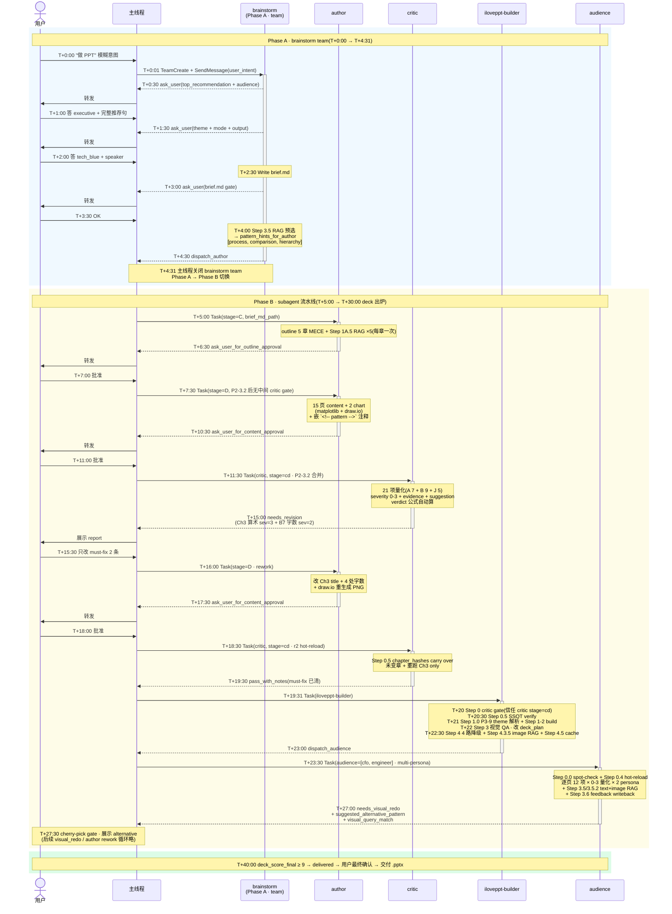

**关键观察(7 步精简后)**:
- Phase A 共 5 个 ask_user 来回(brainstorm 4 + brief gate 1) + Step 3.6 self-audit
- Phase B 共 3 个 ask_user(outline 1 + content 1 + audience cherry-pick N) + 4-5 个 subagent Task 调用(author / critic cd / builder / audience · multi-persona 时 1 Task 内多 persona 并行)
- 总 wall clock ~40 min(vs 重构前 ~45 min · 减少冗余 critic 派发 ~5 min)

### 5.2 主线程派发表

*从 pipeline-protocol.md §1 速查*

完整表见 `.claude/pipeline-protocol.md` §1。关键派发触发(7 步精简后):

| 触发 | 主线程动作 |
|---|---|
| "做 PPT" 意图 + brief 未生成 | TeamCreate(brainstorm) + SendMessage |
| brainstorm dispatch_author(brief 批准 + self-audit pass) | 关 team + Task(author, stage=C) |
| outline 用户批准 | Task(author, stage=D · **无中间 critic gate**) |
| content 用户批准 | Task(critic, **stage=cd 合并合审**) |
| critic stage=cd pass / pass_with_notes | Task(iloveppt-builder) |
| iloveppt-builder dispatch_audience | Task(audience · 支持 multi-persona list) |
| audience delivered | 交付 |
| 任一 advisory(suggested_alternative_*) | cherry-pick gate(§2.5) |
| critic needs_revision | Task(author rework Stage D · 后续重派 critic stage=cd · Step 0.5 hot-reload) |
| audience blocked_by_spot_check | Task(iloveppt-builder, mode=visual_redo · 修 placeholder/PNG 等) |
| **extractor 写完 draft → 主线程错误恢复** | Task(iloveppt-self-check, 批量 targets) → 如 fail → Task(iloveppt-yaml-fixer) → 重跑 self-check 验证|

### 5.3 agent yaml return schema 全表

*从 pipeline-protocol.md §4 速查*

所有 agent return 含通用字段:

```yaml
agent: <agent-name>
status: ok | error
next_action: <enum>
errors: []                # status=error 时填
artifacts: [{path, kind}]
```

各 agent 特有字段见 §3 各 agent 能力卡片 / Return yaml schema。

### 5.4 "哪个 agent 用什么"全矩阵

*8 agent(6 主流水线 + 1 旁路 + 2 Haiku helper)× 22 维度 · 2D 速查*

| | brainstorm | author | critic | builder | audience | extractor | self-check | yaml-fixer |
|---|---|---|---|---|---|---|---|---|
| **调用方式** | TeamCreate | Task | Task | Task | Task | Task | Task(主线程错误恢复) | Task(主线程错误恢复) |
| **模型** | opus | opus | opus | opus | opus | opus | **haiku-4-5** | **haiku-4-5** |
| **state.json** | ✓ 跨 ask_user | ✓ 跨 stage + chapter_hashes | — | — | — | — | — | — |
| **读 brief.md** | ✓(后续轮) | ✓ | ✓ | — | ✓ Step 0.5 red_line | — | — | — |
| **读 outline.md** | — | ✓ | ✓ | ✓ | — | — | — | — |
| **读 content.md** | — | ✓ | ✓ | ✓ | **✗**(只读 PNG) | — | — | — |
| **读 render PNG** | ✓ Step 1 inspiration → image RAG | — | — | ✓(Step 3 QA + Step 4.3.5 image RAG)| ✓ | ✓(probe 8 PNG) | — | — |
| **写 brief.md** | ✓ 唯一 | — | — | — | — | — | — | — |
| **写 outline.md** | — | ✓ 唯一 | — | — | — | — | — | — |
| **写 content.md** | — | ✓ 唯一 | — | — | — | — | — | — |
| **写 deck_plan.json** | — | — | — | ✓ 唯一 + derived_from_sha256| — | — | — | — |
| **写 .pptx** | — | — | — | ✓ 唯一 | — | — | — | — |
| **写 report .md** | — | — | critic_report cd ✓(合并) | visual_report ✓ | audience_review ✓ | — | normalized yaml report ✓ | fix log yaml ✓ |
| **写 `library/pptx-templates/items/<name>/...meta.yaml` draft** | — | — | — | — | — | ✓ 唯一(draft;用户审后入 DB)| — | — |
| **写 `library/_rag/feedback.jsonl`** | — | — | — | — | ✓ 唯一(append-only · opt-in 影响) | — | — | — |
| **调 RAG(`library/search.sh`)** | ✓ Stage A 列模板 + Step 3.5 + Step 1 image RAG | ✓ Stage C/D + chapter-aware preferred-template| ✓ J5 | ✓ Step 2 注释 + Step 4.2.5 + Step 4.3.5 image RAG | ✓ Step 3.5 + Step 3.5.2 image RAG| — | — | — |
| **读 `library/pptx-templates/items/<name>/meta.yaml`** | ✓ Stage A 候选 | ✓ Stage D(每 chapter resolved theme) | — | ✓ build.py + 跨模板 tier1 deep-copy | — | — | — | — |
| **读 `library/vocabularies/*.yaml`** | ✓ audience_personas / keywords_bank | ✓ keywords_bank / categories | ✓ critic-rubric.yaml | ✓ slot_ids / layout_variants(build.py) | ✓ audience_personas(persona-driven weight) | ✓ 所有 5(self_check #12/#13)| ✓ 验 self_check 用 | — |
| **提 advisory(suggested_*)** | — | — | ✓ critic(J5) | ✓ visual_step4 | ✓ audience | — | — | — |
| **接 advisory(rework)** | — | ✓ accept_alternative_pattern | — | mode=visual_redo | — | — | — | — |
| **是否被 cherry-pick gate 触发** | — | 接受方 | 触发源 | 触发源(rag_fallback / image RAG drift) | 触发源 | — | — | — |
| **跑 Bash 脚本** | ✓ search.sh / detect_watermark | ✓ search.sh / compute_chapter_hashes | ✓ compute_chapter_hashes(Step 0.5) | ✓ build.py / derive_plan / search.sh / query_cache | ✓ feedback.jsonl append / search.sh / compute_chapter_hashes | ✓ render_pages / extractor_self_check | ✓ 所有 校验脚本 | — |

### 5.5 速查 FAQ

*v0.13.0 工程师常问的"我怎么 X"*

| 问题 | 答案 |
|---|---|
| **我怎么测 RAG?** | `library/_rag/.venv/bin/python library/_rag/bench.py --label <name>` · 7 golden query baseline 对比 · 结果落 `library/_rag/bench_results/<name>.json` |
| **我怎么看 deck cost?** | `library/_rag/.venv/bin/python library/_rag/scripts/track_cost.py status --deck <wd>` · 输出 tokens_by_agent + cost_usd + budget 进度 |
| **我怎么 rotate API key?** | `library/_rag/.venv/bin/python library/_rag/scripts/rotate_api_key.py --new-key <KEY>` · 自动改 `.env` + 验证 |
| **我怎么找哪些 layout 最常 fail?** | `python scripts/dashboard.py layout-stats --all-rounds` · 跨 deck 跨轮聚合 audience triage 统计 |
| **模板更新了 placeholder_map 怎么办?** | extractor self_check #11 报 `SHAPE_ID_RESOLVE_FAILED` / #14 报 `SOURCE_PPTX_SHA_DRIFT` · 修 placeholder_map shape_id 字段或重 ingest source.pptx |
| **怎么加新 theme?** | 写 `themes/<name>.yaml`(参考 `themes/tech_blue.yaml` SSOT + `themes/_schema.yaml` 验证) · **不用** 写 Python · 详 [`docs/writing-custom-themes.md`](${CLAUDE_PROJECT_DIR}/docs/writing-custom-themes.md) |
| **怎么加新 layout?** | 写 `helpers/<name>.py` + `@register_layout` 装饰器自动 discover · 详 [`docs/adding-new-layout.md`](${CLAUDE_PROJECT_DIR}/docs/adding-new-layout.md) |
| **怎么从 deck A 拿 chapter 到 deck B?** | `python scripts/clip_chapter.py --from <deckA> --chapter <N> --to <deckB>` |
| **怎么对比 deck v1/v2?** | `python scripts/deck_diff.py <v1.pptx> <v2.pptx>` · 4 类语义 diff(layout / content / pattern / theme) |
| **怎么起新 deck 用 skeleton?** | `python scripts/new_deck.py --skeleton <id>` · 6 个内置:annual_strategy_review / customer_pitch / product_launch / project_postmortem / quarterly_finance_report / team_okr_kickoff |
| **feedback loop 怎么开?** | search.sh 加 `--feedback` flag(默认关 · 详 §4.11 决策 11 · 等 feedback.jsonl 积累 >= 50 条再开) |
| **怎么扫敏感数据?** | pre-commit hook 自动跑;手动:`library/_rag/scripts/redact.py --scan <file>` |
| **多模板组合 deck 怎么写 brief.theme?** | 4 schema 任选(详 §3.1 brainstorm 多模板组合) · list(按章循环)/ dict_default(default + overrides)/ dict_mapping(全 mapping)|
| **deck self-check fail 主线程怎么修?** | 派 `Task(iloveppt-self-check)` 跑 14 项 + 解析 → 派 `Task(iloveppt-yaml-fixer)` 修字面 → 重跑 self-check 验证(详 §3.7)|

---

## 附录:相关文档

| 文档 | 角色 |
|---|---|
| [`docs/writing-custom-themes.md`](writing-custom-themes.md) | **自定义 theme 指南**(yaml 化后)|
| [`docs/adding-new-layout.md`](adding-new-layout.md) | **加新 layout 指南**(plugin auto-discover) |
| [`.claude/pipeline-protocol.md`](../.claude/pipeline-protocol.md) | **运行时协议** — Claude Code 主线程读的派发 / handoff / gate 权威活协议 |
| [`.claude/agents/critic-rubric.yaml`](../.claude/agents/critic-rubric.yaml) | **critic 21 项量化 SSOT**(evidence_requirement + severity_examples 权威定义) |
| [`CLAUDE.md`](../CLAUDE.md) | **仓库导航** — 改造者第一站 |
| [`.claude/skills/pptx-deck/content-writing.md`](../.claude/skills/pptx-deck/content-writing.md) | **content schema 权威** — outline.md / content.md / 17 layout 字数规则 / Pyramid 5 件套 |
| [`library/vocabularies/`](../library/vocabularies/) | **5 个受控词典 SSOT**(P1 · layout_variants / slot_ids / categories / audience_personas / keywords_bank) |
| [`library/visual-patterns/README.md`](../library/visual-patterns/README.md) | **RAG 库 #1** — 15 跨模板视觉模式 + hosted multimodal RAG |
| [`library/pptx-templates/README.md`](../library/pptx-templates/README.md) | **RAG 库 #2** — 7 用户自带 .pptx 模板 ingest 入口 |
| [`library/deck-skeletons/README.md`](../library/deck-skeletons/README.md) | **6 个 deck skeleton** |
| [`library/search.sh`](../library/search.sh) | **顶层检索 router** — 跨双 kb + 4 mode(text / hybrid / image / preferred-template + opt-in feedback) |
