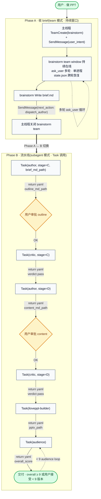
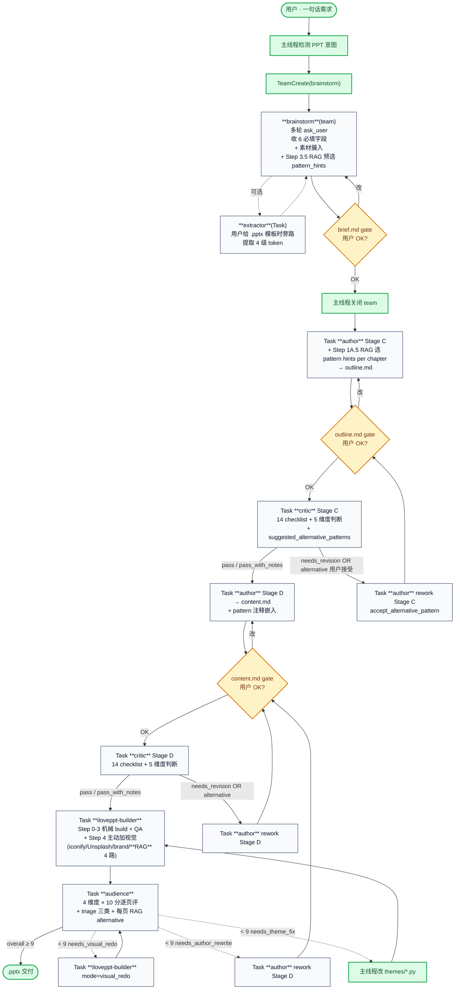
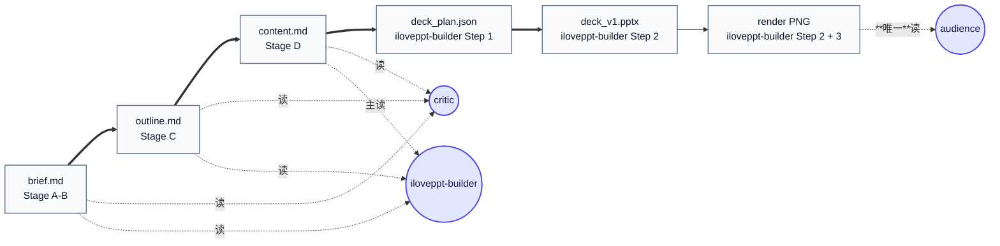
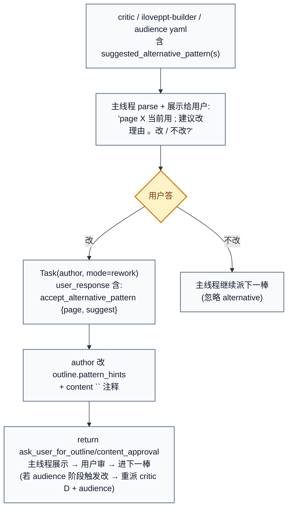
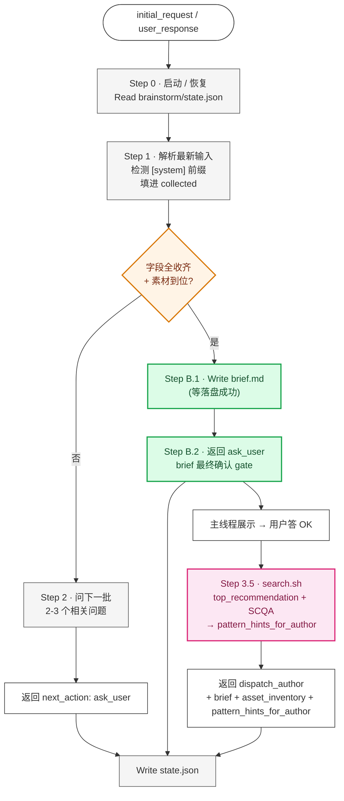
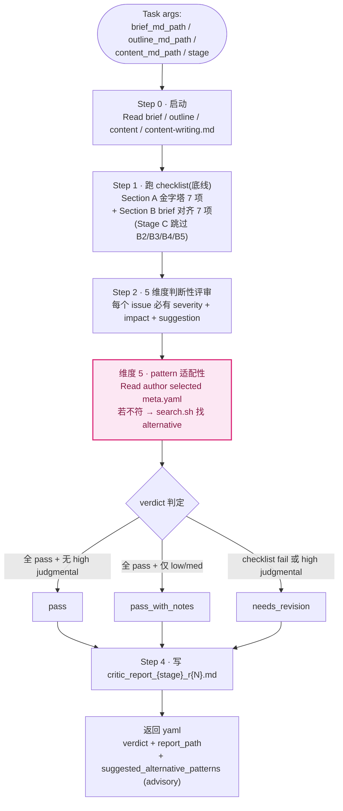
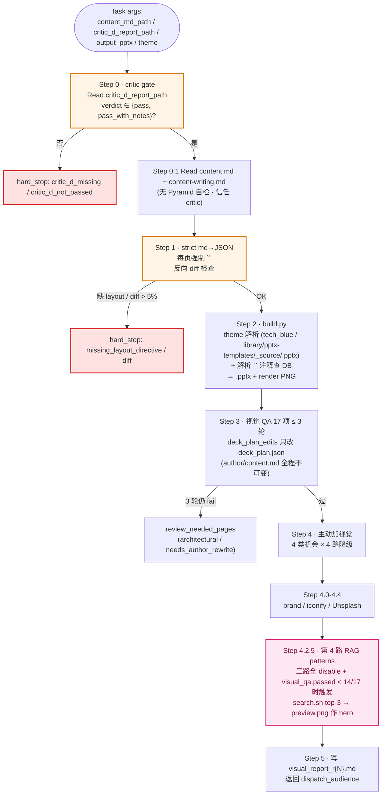
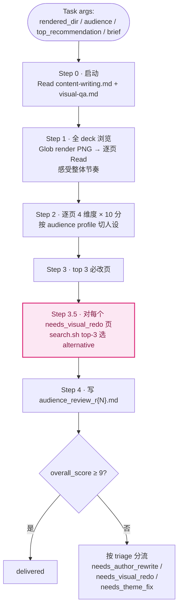
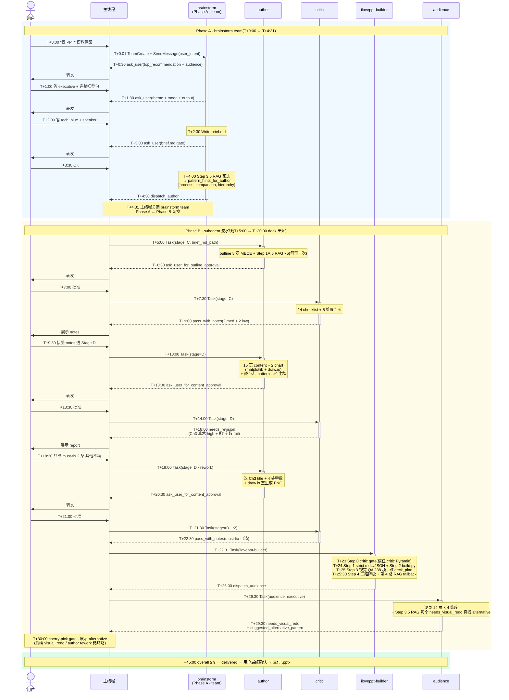

# iLovePPT Agent 工作原理

> 这份文档讲清楚 iLovePPT **怎么工作的** —— 架构 + 能力库存 + 6 个 agent 细节 + 关键设计决策。适合想理解或改造系统的人;不是用户操作手册(那个看 [`${CLAUDE_PROJECT_DIR}/docs/MANUAL.zh.md`](${CLAUDE_PROJECT_DIR}/docs/MANUAL.zh.md))。
>
> **运行时活协议(权威)**:[`${CLAUDE_PROJECT_DIR}/.claude/pipeline-protocol.md`](${CLAUDE_PROJECT_DIR}/.claude/pipeline-protocol.md)

---

## 目录

- [§ 1. 架构总览](#-1-架构总览) — *15 min 读完*
- [§ 2. 能力库存](#-2-能力库存) — *知识库 / 记忆 / 路由 / 仲裁*
- [§ 3. 6 agent 详解](#-3-6-agent-详解) — *能力卡片 + 流程*
- [§ 4. 架构决策](#-4-架构决策) — *why · 6 条决策*
- [§ 5. 速查参考](#-5-速查参考)

---

## § 1. 架构总览

*15 min 读完 · 不需要先读其他文档*

### 1.1 5 + 1 agent 一行简介

| agent | 一行简介 | 调用方式 | model |
|---|---|---|---|
| `iloveppt-brainstorm` | Stage A-B:多轮对话收 brief + 素材,写 brief.md 让用户确认 | **TeamCreate**(team,持续窗口) | opus |
| `iloveppt-author` | Stage C-D:出 outline.md + 拓写 content.md(两次独立 Task 调用,Stage C/D 硬隔离) | **Task**(subagent) | opus |
| `iloveppt-critic` | Stage C/D 各跑一次:14 项 checklist + 5 维度判断性评审 + 三档 verdict | **Task**(subagent) | opus |
| `iloveppt-builder` | Stage E:机械 build .pptx + Step 0-3 机械视觉 QA + Step 4 主动加视觉(iconify/Unsplash/brand/RAG 4 路降级) | **Task**(subagent) | opus |
| `iloveppt-audience` | 模拟目标受众读 deck(9 分硬阈值),三类反馈分流(needs_author_rewrite / needs_visual_redo / needs_theme_fix) | **Task**(subagent) | opus |
| `iloveppt-template-extractor` | 旁路 Stage T:用户提供 .pptx 模板时完整 ingest 到 `library/pptx-templates/items/<name>/`(复制 _source + render_pages.py 渲染每页 + Step 2.5 declared/rendered 对账 advisory + Step 3.1 LLM 起草双层 meta.yaml.draft(17 layout enum 严约束 + other 兜底 + confidence 数字 + 必填字段) + Step 3.3 self-check(YAML 语法 / 必填字段 / enum 合规 / id 唯一)→ user_review_drafts gate → 主线程 embed) | **Task**(subagent) | opus |

**模型统一 rationale**:团队复杂度高、6 agent 横跨多轮对话 / 深度判断 / 视觉认知 / 模板摄入,任一环掉链都会传到下游;为保 team 一致质量,全用 opus。**Trade-off**:每条流水线 cost 较分层方案高 ~3-4x,可接受。

### 1.2 Hybrid 二段论

*Phase A team(brainstorm)/ Phase B subagent(其余 5 agent)*



**为什么 brainstorm 留 team,其他转 subagent**:

| 维度 | brainstorm(team) | 其他 5 agent(subagent) |
|---|---|---|
| 用户交互模式 | 多轮 ask_user(收 6 必填字段)| 单次执行 + return yaml |
| 进程开销 | 单进程持续(token 省、延迟低)| 每次 Task 新进程(冷启动 ~3s)|
| 协议复杂度 | idle / SendMessage / 窗口生命周期 | 简单 Task return |
| 状态恢复 | state.json(brainstorm 跨 ask_user 轮)| state.json 仅 author 用(其他无状态)|

详细 rationale 见 §4.6。

### 1.3 流水线全图

*含 cherry-pick gate + 三类反馈分流*



### 1.4 关键不变量

*5 条系统级硬约束 · 任何改造必须满足*

5 条不变量贯穿整个系统,任何改造**必须满足**:

1. **author 是唯一写者** —— outline.md / content.md / pattern 注释只有 author 改。其他 agent(critic / iloveppt-builder / audience)即使发现问题,只能在 yaml return 给 `suggested_*` advisory,**禁止改 .md**
2. **主线程是仲裁人** —— 任何 advisory 必须展示给用户 cherry-pick,**主线程不替用户决定**(MAST FM-1.3 step repetition 防线)
3. **state 在文件,不在 context** —— agent context 是无状态的(每次 Task 调用都是新 context),**所有跨 turn 记忆必须落盘**(state.json / brief.md / outline.md / content.md)
4. **机械与判断严格分离** —— build.py 只做机械(无 LLM 调用);content 拓写 / 视觉 QA / 判断性评审是 Claude 行为(看 prompt 文档,不看 Python)
5. **质量门是硬 gate** —— critic verdict 必须 ∈ {pass, pass_with_notes};audience overall_score 必须 ≥ 9 或用户主动接受;**不允许"软通过"**

---

## § 2. 能力库存

*知识库(RAG / templates)· 记忆(state / 产物链)· 路由(next_action)· 仲裁(cherry-pick gate)*

这一节是 v2 重写的核心。系统的 6 大能力跨多个 agent 共享,统一在此交代。每个能力含:**用途 / 谁调 / 何时调 / 数据流 / 降级 / 反例**。

### 2.1 知识库 #1 · `library/visual-patterns`

*hosted multimodal RAG · 跨 5 agent 共享检索入口*

**用途**:Visual Patterns 库是输出**高质量 PPT** 的关键知识库 —— 21 个 BCG-style 模式(arrow-chain / cards-flag / matrix / process-step / cycle 等),每个 pattern 含 `meta.yaml`(元数据 + fallback_rendering)+ `preview.png`(预览图)。

**底层实现**:阿里云 tongyi-embedding-vision-plus(dim 1152,text + image 同 API)+ sqlite 索引(`library/_rag/db.sqlite`,gitignored)。**唯一检索入口** `library/search.sh` 跨双 kb 统一 router。

**统一调用 SOP**(5 agent 共享):

```bash
# 跨双 kb 默认搜
bash ${CLAUDE_PROJECT_DIR}/library/search.sh \
     --query "<intent 关键词>" \
     --top-k 5 \
     --format json

# 限单 kb / 单 row_type
bash ${CLAUDE_PROJECT_DIR}/library/search.sh \
     --query "..." --kb visual-patterns --type item --top-k 5

# author Stage D · 模板优先 fallback vp(brainstorm 选定模板 theme 时用)
bash ${CLAUDE_PROJECT_DIR}/library/search.sh \
     --query "..." --preferred-template <theme> --type page --top-k 5
```

返回 JSON:`[{id, row_type, category_or_layout, parent_id, score, distance, preview_path, meta_path, doc_preview, source}]`,其中 `source ∈ {"preferred-template", "visual-patterns"}`;`row_type ∈ {vp_items, tpl_templates, tpl_pages}`。

**5 agent 调用矩阵**:

| agent | 调用时机 | query 来源 | 用结果做什么 | advisory / 决策 |
|---|---|---|---|---|
| **brainstorm** | Stage A 列模板 + Step 3.5(dispatch_author 之前) | 主题 / top_recommendation + SCQA 关键词 | Stage A:`--kb pptx-templates --type template --query <主题>` 按主题排候选给用户挑;Step 3.5:跨 kb 取 top-5 category(去重)→ Edit brief.md frontmatter + dispatch_author yaml `pattern_hints_for_author` | 决策(category 列表,给 author 参考)|
| **author Stage C** | Step 1A.5(写完 outline 之后,返回之前)| 每章 action title + intent | 从 top-5 选 1-2 个,Edit outline.md per-chapter `pattern_hints.selected/alternatives` | **决策**(author 唯一写者) |
| **author Stage D** | Step 1C(已有,继承自 v1 设计) | 章节 content intent | `--preferred-template <brief.theme> --type page` 模板优先 fallback vp;Read meta.yaml 看 fallback_rendering;**强制**嵌入 content.md `<!-- pattern: vp:<id> -->` 或 `<!-- pattern: tpl:<theme>__<NN-slug> -->` 注释(必须带 `vp:`/`tpl:` 前缀)| **决策** |
| **critic Stage C/D** | 维度 5 | 验 author selected 不匹配时,重跑章节 intent | yaml `suggested_alternative_patterns` 数组 | **advisory**(不改 .md,主线程 cherry-pick) |
| **iloveppt-builder** | Step 4.2.5(三路降级 + 该页 visual_qa 低分时)+ Step 2 渲染时读 `<!-- pattern: vp:/tpl: -->` 注释 | 该页 章节 intent / pattern 注释 id | 解析注释 id 前缀(`vp:` 查 visual-patterns,`tpl:` 查 pptx-templates DB)→ Read meta.yaml 渲染;Step 4.2.5 拿 preview.png 作 hero 或 reference_only。**无前缀 id → 拒绝渲染** | 决策(嵌 preview)|
| **audience** | Step 3.5(triage 后) | 每个 needs_visual_redo 页的 issue 关键词 | yaml `needs_visual_redo_pages[N].suggested_alternative_pattern` | **advisory**(主线程 cherry-pick → 若用户接受,Task author rework) |

**降级路径**(所有 agent 共享):search.sh 失败(库不存在 / sqlite 未初始化 / venv 缺失)→ 该 agent 字段为空/null + 标 `source: search_failed`,**不阻塞流水线**继续。

**cherry-pick gate 触发**:critic / iloveppt-builder / audience 任一 yaml 含 `suggested_alternative_pattern(s)` → 主线程**必须**展示给用户决定 → 用户答"改" → Task author rework + `user_response: {accept_alternative_pattern: {page, suggest}}` → author 改 outline/content + pattern 注释。完整流程见 §2.5。

**反例**:
- author Stage C 不查 RAG,直接选 layout=cards → content.md 嵌 layout=cards 注释 → iloveppt-builder 渲染出"4 张同质 cards" → audience 评 visual_appeal 4/10 needs_visual_redo。**正确**做法:Stage C 先 RAG 选 pattern_hints,可能匹配到 matrix-2x2 更准 → 跳过 4 张同质 trap
- critic 验 author selected = cards-flag-4 但章节是因果矩阵 → 不报 alternative → iloveppt-builder 按 cards 渲染 → audience 才发现。**正确**:critic 维度 5 reverse-search RAG top-5 → 报 alternative matrix-2x2
- author Stage D 写 `<!-- pattern: arrow-chain -->`(没 `vp:`/`tpl:` 前缀)→ iloveppt-builder 拒绝渲染 hard_stop。**正确**:必须 `<!-- pattern: vp:arrow-chain -->` 或 `<!-- pattern: tpl:<theme>__03-process -->`

### 2.2 知识库 #2 · `library/pptx-templates` 模板库

**用途**:存第三方 .pptx 模板(企业自带 brand template),让 iLovePPT 输出贴合**视觉风格**(不是默认 tech_blue)。**与 visual-patterns 共用 `library/_rag/db.sqlite`** 一张 DB,通过 `library/search.sh` 统一路由。

**当前结构**(`library/pptx-templates/`):
- `_source/<name>.pptx`(模板源 · gitignored)
- `items/<name>/meta.yaml`(模板级 metadata · 入 git)
- `items/<name>/pages/<NN-slug>/{meta.yaml, preview.png}`(每页拆出来的资产 · 入 git;`__` 开头页跳过 ingest,如 `__cover` / `__divider`)
- `{README.md, INDEX.md, ingest_workflow.md}`

**4 级 token 定义**(extractor 抽取 · v2 实际跑法):
- L1 媒体:`extract_template.py` 解压 .pptx 媒体 → cover_hero.png / icon_*.png 等。**可选 · 当前默认跳过**(visual_tokens 由 L4 LLM 直接看 PNG 写出来)
- L2 扩展 token:`extract_template.py` 抽 accent / dk / lt / 字号 / 背景。**可选 · 当前默认跳过**(同上)
- L3 每页渲染(`library/_rag/render_pages.py <name> --dpi 120` · soffice → pdftoppm)→ `items/<name>/pages/NN-page/preview.png`(占位名,L4 后 rename)
- L4 视觉分析 + 起草 + self-check(extractor LLM 必跑):
  - **Step 2.5**:declared(unzip sldId 数)vs rendered(ls preview.png 数)如实记 advisory,**不许**用"hidden/master"幻觉解释 discrepancy
  - **Step 3.0**:TodoWrite N+1 项强制(缓解 [#47936](https://github.com/anthropics/claude-code/issues/47936) async subagent 提前 return bug)
  - **Step 3.1**:逐页 Read PNG → 从 17 layout enum 选 + `other` 兜底(`needs_manual_review:true` + `layout_hint`)+ confidence 严格 0.0-1.0 数字
  - **Step 3.2**:写模板级 meta(必填 `provenance.{schema_version, embedding_model, embedding_dim, ingested_at, source_pptx_sha256}` + `extraction.{declared_pages, rendered_pages, discrepancy, discrepancy_resolution}`)
  - **Step 3.3 self-check**(进 Step 4 前 hard gate):YAML 语法验证 + 必填字段 + enum 合规 + id 格式唯一性 + confidence 数字检查;任一项不通过 → `status: error` + `code: SCHEMA_VALIDATION_FAILED`

**调用矩阵**:

| agent | 调用时机 | 干什么 | 写还是读 |
|---|---|---|---|
| **brainstorm** | Stage A 问 theme 时 | 用户选"用模板":`library/search.sh --kb pptx-templates --type template --query <主题>` 按主题相关性排候选 → 用户挑;用户给新 .pptx 路径 → dispatch_template_extractor 走完整 ingest | 读 |
| **template-extractor**(旁路) | Stage T(用户给模板时) | 复制 .pptx → `library/pptx-templates/_source/<name>.pptx` → 跑 `library/_rag/render_pages.py` 渲染每页 → Step 2.5 advisory 对账 → Step 3.0 TodoWrite + Step 3.1 逐页 LLM(17 enum + confidence)→ Step 3.2 模板级 meta + extraction summary → Step 3.3 self-check → 起草 `items/<name>/{meta.yaml, pages/.../meta.yaml}.draft` 让用户审 → 主线程跑 embed 入库 | **写** |
| **author Stage D** | Step 1C(若 theme ≠ tech_blue)| Read `library/pptx-templates/items/<theme>/meta.yaml`(visual_signature / visual_tokens)指导拓写 + 调 `library/search.sh --preferred-template <theme> --type page` 选页 → content.md 嵌 `<!-- pattern: tpl:<theme>__<NN-slug> -->` | 读 |
| **iloveppt-builder** | Step 2 build 时(through build.py:_repo_templates_dir)| 解析 theme 字段:tech_blue → 内置主题;短名 → 两路查 `<plan_dir>/templates/<name>.pptx`(deck 本地)→ `<repo>/library/pptx-templates/_source/<name>.pptx`(全局)作 base PPT | 读 |
| critic / audience | **不用** | — | — |

**触发条件**:**仅当用户在 brainstorm 阶段选 "用模板"**(非默认 tech_blue)才走全链路。默认 tech_blue 模式不触发 templates / extractor。

**完整链路**(用户给新模板的极端 case):


**反例**:
- 用户给 .pptx 模板但 brainstorm 直接 dispatch_author(跳过 extractor)→ author 拿不到 visual_observations → 拓写时按 tech_blue 假设字号 → iloveppt-builder build 用模板 base 但字号溢出。**正确**:brainstorm 检测到 template_path 入参 → 必须先 dispatch_template_extractor → extractor return `user_review_drafts` + draft yaml → 用户审 → 主线程跑 embed → 主线程 SendMessage(brainstorm, extractor_summary) 续聊
- extractor 起草 yaml 直接入库不让用户审 → 视觉观察脏数据进 DB 污染所有后续模板检索。**正确**:必须走 ask_user gate,只有用户审过的 draft 才入 embed

### 2.3 记忆 #1 · `state.json`

*per-agent 跨派发恢复 · 仅 brainstorm + author 有 state*

**用途**:subagent 是无状态执行 —— 每次 Task 调用都是新 context。**state.json 是 agent 跨派发的唯一记忆来源**。

**谁有 state file**:

| agent | state file 路径 | 用途 | lifecycle |
|---|---|---|---|
| **brainstorm** | `decks/<slug>/brainstorm/state.json` | 跨 ask_user 轮恢复 collected / round / asset_inventory / brief_md_path / brief_approved | Phase A 全程在线;dispatch_author 后主线程关闭 team(state 留存便于事后审计)|
| **author** | `decks/<slug>/author/state.json` | stage / approvals / iteration | 跨多次 Task 派发(Stage C → Stage D → rework)|
| critic | — | **无 state file** | 每次派发独立(所有产出在 critic_report_*_r{N}.md)|
| iloveppt-builder | — | **无 state file** | 单次派发跑完 Step 0-5(状态在 visual_report_r{N}.md + deck_plan_edits)|
| audience | — | **无 state file** | 每轮派发独立(状态在 audience_review_r{N}.md)|
| extractor | — | **无 state file** | 一次性任务(状态在 `library/pptx-templates/items/<name>/{meta.yaml, pages/<NN-slug>/meta.yaml}` draft 草稿)|

**brainstorm state.json schema**:

```yaml
round: 4                                # 派发轮数(每次 +1)
collected:                              # 已收的 6 必填字段
  audience: executive
  duration_min: 15
  top_recommendation: "..."
  theme: tech_blue
  output: "<abs path>"
  presentation_mode: speaker
pending: []                             # 待问字段(全收齐时空)
asset_inventory:                        # 用户给的素材清单
  - {type: csv, path: ..., desc: ..., summary: ...}
  - {type: image, path: ..., desc: ...}
history:                                # 每轮 ask/answer 留底
  - {round: 1, asked: [top_recommendation, audience], answered: {...}}
brief_md_path: "<abs path to brief.md>" # null 直到 Write brief.md
brief_approved: true | false            # 用户 OK brief 后置 true
```

**author state.json schema**:

```yaml
stage: C | D                            # 当前在哪个 stage
iteration: 1                            # 主版本号(大改时 +1,新建 deck_v{N+1}_*)
approvals:
  outline: true | false                 # outline.md 用户审批状态
  content: true | false                 # content.md 用户审批状态
critic_c_passed: true | false           # Stage C 是否过 critic
status: dispatched_critic | dispatched_audience | ...
```

**cost block(P1-8)· 任何 state.json 都可挂)**:

```json
{
  "cost": {
    "tokens_by_agent": {
      "brainstorm": {"input": 0, "output": 0},
      "author":     {"input": 0, "output": 0},
      "critic":     {"input": 0, "output": 0},
      "builder":    {"input": 0, "output": 0},
      "audience":   {"input": 0, "output": 0},
      "extractor":  {"input": 0, "output": 0}
    },
    "totals": {"input": 0, "output": 0},
    "cost_usd": 0.0,
    "cost_usd_breakdown_by_agent": {
      "brainstorm": 0.0, "author": 0.0, "critic": 0.0,
      "builder": 0.0, "audience": 0.0, "extractor": 0.0
    },
    "model": "opus",
    "last_updated": "2026-05-27T..."
  }
}
```

**字段说明**:
- `tokens_by_agent[agent].{input, output}` — agent 每次 yaml return 带 `tokens_used: {input, output}`,主线程或 hook 调 `track_cost.py update` 累加
- `model` — 当前价格档(默认 `opus`,P3-7 Haiku 路由后会按 agent 细分)
- `cost_usd` — 由 `track_cost.py` 自动算,$/1M-token 用 `PRICES` 常量(Opus 4.7:input $15 / output $75 per 1M)
- `last_updated` — 每次 `update` / `show` / `reset` 时刷

**维护工具**:`library/_rag/scripts/track_cost.py`(update / show / reset 子命令)。schema 由该脚本自动 ensure_cost_block 兜底,旧 state 自动 upgrade。

**lifecycle 关键节点**:

1. **初始化**:agent 首次派发时,Read state.json(若不存在则 mkdir + init)
2. **每轮 +1**:`round` / `iteration` 字段每次派发开头自增(除初次)
3. **返回前 Write**:agent 在 yaml return 前**必须** Write state.json(否则下次派发拿不到更新)
4. **跨 session 恢复**:state.json 在磁盘,Claude Code 重启也能恢复;用户说"继续 deck <slug>" → 主线程 Read brainstorm/state.json 决定下一步派谁

**反例**:
- brainstorm 处理用户答完没 Write state.json → 下次派发拿到旧 collected → 重复问同样问题(Phase 4 hybrid 实测真实出现过)
- author 改了 outline 没更新 `state.iteration` → critic 找不到最新版本

**hybrid 协议 finding(F2)**:实测发现 brainstorm 偶有 SendMessage 内容跟 state.json 不一致(重发旧 ask_user)。**修复**:主线程 SOP 加 fallback:收到 brainstorm SendMessage 时同时 Read state.json 交叉验证,以 state 为准。

### 2.4 记忆 #2 · markdown 产物链

*brief → outline → content → deck_plan → .pptx → render PNG · SSOT 规则*

**用途**:跨 agent 的"硬记忆"用 markdown / JSON 文件传递,**不通过 context 传**(避免 token 污染 + agent 解耦)。

**主链**(brief → outline → content → deck_plan → .pptx → render PNG):



**关键边界**:audience **只读 render PNG**,**不读** `.md` / `deck_plan.json` / `.pptx`(它是模拟终端用户,用户也看不到这些)。

**附加产物**(报告 / state file / 知识库):

| 产物 | 写者 | 读者 |
|---|---|---|
| `critic/critic_report_{C|D}_r{N}.md` | critic | iloveppt-builder(Step 0 必读 gate)+ 主线程展示用户 |
| `builder/visual_report_r{N}.md` | iloveppt-builder | 主线程展示用户 |
| `audience/audience_review_r{N}.md` | audience | 主线程展示用户;author rework 时 Read 取改进建议 |
| `brainstorm/state.json` | brainstorm | 仅 brainstorm 自读自写 |
| `author/state.json` | author | 仅 author 自读自写(iloveppt-builder Step 0.1 唯一例外,见 §4.4) |
| `library/pptx-templates/items/<name>/{meta.yaml, pages/<NN-slug>/meta.yaml}` | extractor(draft 唯一写) + 用户审后入 DB | author / iloveppt-builder / brainstorm 读(见 §2.2) |
| `library/visual-patterns/items/<id>/meta.yaml` | (库存,人工 ingest) | author / iloveppt-builder / critic / audience 读(RAG 检索后) |
| `library/visual-patterns/items/<id>/preview.png` | (库存,人工 ingest) | iloveppt-builder 读(可能嵌 hero)+ audience 读(triage 找 alternative) |
| `library/_rag/db.sqlite` | `library/_rag/embed_*.py`(主线程在 extractor return + user-approved draft 时跑) | `library/search.sh`(所有 agent RAG 入口) |

**SSOT 规则**:

| 产物 | 唯一写者 | 读者(允许的所有) |
|---|---|---|
| `brief.md` | brainstorm | author / critic / iloveppt-builder(只 transitive)|
| `outline.md` | author(任何 stage) | critic / iloveppt-builder |
| `content.md` | author(任何 stage) | critic / iloveppt-builder(主读)/ audience(不读 .md 源,只读 render)|
| `pattern_hints` 字段(outline 内) | author | critic 验 / iloveppt-builder 渲染 / audience 评估 |
| `<!-- pattern: vp:<id> -->` / `<!-- pattern: tpl:<theme>__<NN-slug> -->` 注释 | author | iloveppt-builder 看到则解析前缀查对应 kb DB 渲染(**无前缀 id → 拒渲染**)|
| `deck_plan.json` | iloveppt-builder | (无人读,build.py 消费) |
| `library/pptx-templates/items/<name>/{meta.yaml, pages/.../meta.yaml}` draft | extractor | 用户审 → 主线程 embed → brainstorm / author / iloveppt-builder 读 |
| `critic_report_*_r{N}.md` | critic | iloveppt-builder(必读,Step 0 gate)+ 主线程展示用户 |
| `audience_review_r{N}.md` | audience | 主线程展示用户;author(rework 时 Read 取改进建议)|
| `visual_report_r{N}.md` | iloveppt-builder | 主线程展示用户(iloveppt-builder 下轮 mode=visual_redo 读 prev)|
| `state.json`(per agent) | 该 agent 自己 | **只该 agent 读写**(iloveppt-builder Read author/state.json 是唯一例外,见 §4.4 视觉 QA 三方分工 rationale)|

**iteration 版本管理**:

- 小改:就地 Edit,iteration 不动(`deck_v1_outline.md` 覆盖)
- 大改(顶端论点变 / 章节增删 / > 3 page 连锁 / 用户说"重做"):iteration += 1,新建 `deck_v2_outline.md`(v1 保留)
- 谁判断:author Step 1B / 1D(收到改动指令后),问用户 "v{N} Edit / v{N+1} 平行" 二选一

**反向 diff 校验**(iloveppt-builder Step 1 md→JSON 时):

- iloveppt-builder 把 content.md 转 deck_plan.json,转完做反向 check
- 若反向 diff > 5%(content 内容跟 deck_plan 不能 round-trip 重建)→ **hard stop**(防 iloveppt-builder 偷偷"创意拓写")
- iloveppt-builder 不允许引入 content.md 没有的新论点

**反例**:
- audience 试图 Read content.md → 违反 "audience 是模拟终端用户" 设定(用户看不到 .md 源)→ 评分偏离真实读者感受
- iloveppt-builder Step 4 改了 content.md → 违反 "author 唯一写者" → critic 下轮重评时找不到 author 改的依据
- critic 写 outline.md → 严重违反职责边界

### 2.5 cherry-pick gate

*主线程仲裁*

**用途**:5-agent RAG 扩展后,critic / iloveppt-builder / audience 三个 agent 都可能给 pattern alternative 建议。如果主线程自动采纳,会导致 MAST FM-1.3 step repetition(author 反复改)。cherry-pick gate **强制用户决策**,把改动权收归用户 + author。

**触发条件**:任一 Phase B subagent 的 yaml return 含以下任一字段:

- `suggested_alternative_patterns: [...]`(critic Stage C/D)
- `needs_visual_redo_pages[N].suggested_alternative_pattern: {...}`(audience)
- iloveppt-builder 的 `visual_step4.rag_fallback_used` 含 hero 嵌入选择(主线程展示但不必让用户改)

**主线程仲裁流程**:



**特殊路径:audience 阶段触发改**:audience 给的 alternative 用户接受 → deck 已 build → author rework content → 必须**重派 critic Stage D + audience**(确保新 pattern 不破坏 critic 维度 5 + 不引入新 audience 问题)。

**只 advisory 不 must_fix**:critic 维度 5 + audience triage RAG 建议**不计入 verdict**(critic 即使有 alternative 也可 pass;audience overall_score 不因 alternative 数变)。**alternative 是质量提升机会,不是阻塞 issue**。

**反例**:
- 主线程拿到 critic suggested_alternative_patterns 不展示给用户,直接 Task author rework → 用户没批准的改动被强加 → 违反"用户决策"
- audience 给 needs_visual_redo + suggested_alternative_pattern,主线程同时 Task iloveppt-builder mode=visual_redo + Task author rework → 两路并发改 outline/content/deck_plan → 冲突
- author 收到 user_response accept_alternative_pattern 后只改 outline 没改 content `<!-- pattern -->` 注释 → iloveppt-builder 渲染时仍按旧 pattern → 用户改动失效

### 2.6 `next_action` 路由协议

*主线程的状态机 · 零业务逻辑*

**用途**:所有 agent 的 yaml return 含 `next_action` 字段,**主线程的派发逻辑零业务**,纯按 next_action 路由。

**所有 next_action 枚举**(按 agent 分组):

| agent | next_action | 主线程动作 |
|---|---|---|
| brainstorm | `ask_user` | 转发 message_to_user + questions 原文给用户 |
| brainstorm | `dispatch_template_extractor` | Task(extractor),return 后 SendMessage 回 brainstorm team |
| brainstorm | `dispatch_author` | **关闭 brainstorm team**,Task(author, stage=C) |
| brainstorm | `terminate` | extractor 兜底分支用户选了"终止":关闭 brainstorm team,告知用户任务终止 |
| extractor | `user_review_drafts` | 展示 draft yaml 路径给用户审 → 用户批准 → 主线程跑 `library/_rag/embed_*.py` 入 DB → SendMessage(brainstorm, extractor 摘要) |
| extractor | `dispatch_brainstorm` | SendMessage 给仍在线的 brainstorm team(传 extractor 摘要 / 失败原因);若 team 已关 → TeamCreate 重启 |
| author | `ask_user_for_outline_approval` | 给 outline.md 路径,等用户 OK |
| author | `ask_user_for_content_approval` | 给 content.md 路径,等用户 OK |
| author | `ask_user` | 内部询问(大改 vs 小改)|
| author | `dispatch_critic` | Task(critic, args 含 stage=C/D + outline/content_md_path) |
| critic | `pass` | 转下一棒;Stage C 完 → Task(author, stage=D);Stage D 完 → Task(iloveppt-builder) |
| critic | `pass_with_notes` | 展示 notes 给用户做 cherry-pick,然后转下一棒 |
| critic | `needs_revision` | Task(author rework) 带 critic 报告路径 |
| iloveppt-builder | `dispatch_audience` | Task(audience) |
| iloveppt-builder | `hard_stop` | 展示 errors 给用户三选一(按 suggestion 改 / 终止 / 自己指令) |
| audience | `delivered` | overall ≥ 9,交付 .pptx 给用户做最终确认 |
| audience | `needs_author_rewrite` | Task(author rework)|
| audience | `needs_visual_redo` | Task(iloveppt-builder, mode=visual_redo) |
| audience | `needs_theme_fix` | 主线程改 themes/*.py |

**主线程伪代码**:

```
loop:
  ret = dispatch(current_agent, current_args)
  yaml = parse_last_yaml_block(ret.text)

  # Phase A 特殊:brainstorm via SendMessage 而非 Task return
  if current_agent == brainstorm (team):
    yaml = parse_from_sendmessage(brainstorm)

  switch yaml.next_action:
    case "ask_user" | "ask_user_for_*_approval":
      show(yaml.message_to_user + yaml.questions)
      current_args.user_response = wait_for_user()
    case "dispatch_*":
      current_agent = derived_from_next_action
      current_args = derived_from_yaml
    case "pass" | "pass_with_notes":
      if has(yaml.suggested_alternative_patterns):
        # cherry-pick gate
        show(alternative) → wait_for_user_decision
        if user_accepts → Task(author rework, accept_alternative_pattern)
        else → 继续派下一棒
      else:
        派下一棒(critic C pass → author D;critic D pass → iloveppt-builder)
    case "needs_revision":
      展示 report → 用户 cherry-pick → Task(author rework)
    case "delivered":
      展示给用户做最终确认 → 交付
    case "needs_*"(audience):
      路由到对应处理(详见 cherry-pick gate §2.5)
    case "hard_stop":
      展示 errors → 用户三选一
```

主线程**零业务逻辑** —— 只是状态机的转发者 + 仲裁人。

**反例**:每个 agent 自己定义返回格式 → 主线程要写 7 套解析逻辑 → 加新 agent 要改主线程。统一 next_action schema 让主线程跟具体 agent 解耦。

---

## § 3. 6 agent 详解

*每个 agent 含能力卡片 + 流程 + Return yaml + 反例*

每个 agent 含:**能力卡片**(2D 表)+ **职责说明** + **执行流程**(mermaid)+ **return yaml schema**(简版)+ **反例**。

### 3.1 `iloveppt-brainstorm`

#### 能力卡片

| 维度 | iloveppt-brainstorm |
|---|---|
| **调用方式** | TeamCreate(team · Phase A 持续窗口) |
| **模型** | opus |
| **Tools** | Bash / Read / Write / Edit / Glob / Grep / WebSearch / Skill / SendMessage |
| **state file** | `decks/<slug>/brainstorm/state.json`(详见 §2.3) |
| **读哪些 markdown** | brief.md(已写后续轮读)/ user-provided 素材文件 / `library/pptx-templates/items/<name>/meta.yaml`(若用户选用已 ingest 模板)|
| **写哪些 markdown** | `brainstorm/brief.md`(唯一写者)/ `brainstorm/state.json` |
| **调 RAG**(`library/search.sh`) | ✓ Stage A 列模板:`--kb pptx-templates --type template --query <主题>` 按主题相关性排;✓ Step 3.5(dispatch_author 之前):跨 kb 取 top-5 category |
| **调 templates 库** | ✓ Stage A 通过 search.sh 列模板候选;用户给新 .pptx 路径 → `dispatch_template_extractor` |
| **advisory 来源** | extractor(`[system] template_extractor_failed` 前缀 / extractor 摘要)|
| **是否唯一写者** | **brief.md 唯一写者** |
| **跨 agent handoff 出口** | `dispatch_author`(brief 批准后)/ `dispatch_template_extractor`(用户给模板路径时) |

#### 职责

跟用户多轮对话挖需求 + 收素材清单 → 写 brief.md → 等用户确认 → 派 author。

**必收齐 6 字段**:`audience` / `duration_min` / `top_recommendation` / `theme` / `output` / `presentation_mode`。

**brief.md gate**(收齐后串行两步):
1. `Write brief.md`(落盘成功)
2. 返回 `ask_user` 给用户做最终确认

用户回 OK 才 `dispatch_author`。理由:author 是流水线第一个昂贵动作(出图 + 大段拓写),brief 错了在这里改代价最低。

**[system] 前缀响应**(主线程在特殊场景注入):
- `[system] template_extractor_failed` → 跟用户对话三选一(装依赖重试 / 降级 tech_blue / 终止)
- `[system] critic_blocked` → critic 5 轮卡死,跟用户对话调 brief

**软上限**:`round >= 10` 时主线程附"叫停 / 继续"选项给用户,可用 `force_dispatch: true` 强制 brainstorm 用默认值兜底。

#### 流程



#### Return yaml schema(简版,全详 protocol §4)

```yaml
# dispatch_author:
agent: iloveppt-brainstorm
status: ok
next_action: dispatch_author
artifacts:
  - {path: <abs to brief.md>, kind: brief_md}
brief_summary: <一句话>
pattern_hints_for_author: [process, cycle, comparison]   # Step 3.5 RAG 预选

# ask_user:
agent: iloveppt-brainstorm
status: ok
next_action: ask_user
message_to_user: |
  <原话>
questions: [...]
state_round: <int>
```

#### 反例

- 一次性问完 6 字段(用户回答又乱又长)→ 解析错 → author 跑偏。**正确**:每轮问 2-3 个相关问题,collected 持续累积
- brief.md gate 跳过(字段齐就直接 dispatch_author)→ 用户没机会看 brief 总体感 → author 才发现论点不对
- Step 3.5 RAG 失败时不降级(直接报错)→ 流水线阻塞。**正确**:search.sh fail → 空数组 + 标 source 不阻塞

**详细 agent 文件**:[`${CLAUDE_PROJECT_DIR}/.claude/agents/iloveppt-brainstorm.md`](${CLAUDE_PROJECT_DIR}/.claude/agents/iloveppt-brainstorm.md)

### 3.2 `iloveppt-author`

#### 能力卡片

| 维度 | iloveppt-author |
|---|---|
| **调用方式** | Task(subagent · Phase B · Stage C / Stage D / rework 各独立 Task) |
| **模型** | opus |
| **Tools** | Bash / Read / Write / Edit / Glob / Grep / WebSearch / Skill |
| **state file** | `decks/<slug>/author/state.json`(详见 §2.3) |
| **读哪些 markdown** | brief.md / outline.md(Stage D)/ content.md(rework)/ content-writing.md / diagram skill docs / `library/pptx-templates/items/<theme>/meta.yaml`(若 ≠ tech_blue)/ `library/visual-patterns/items/<id>/meta.yaml`(search.sh 返回 meta_path 后 Read)|
| **写哪些 markdown** | `author/deck_v{N}_outline.md`(Stage C 唯一写者)/ `author/deck_v{N}_content.md`(Stage D 唯一写者)/ `author/state.json` / `author/charts/*.png`(配图)|
| **调 RAG** | ✓ Step 1A.5(Stage C per chapter top-5,LLM 选 1-2)+ Step 1C(Stage D 拓写,`--preferred-template <brief.theme> --type page` 模板优先 fallback vp)|
| **调 templates 库** | ✓ Stage D Step 1C 若 theme ≠ tech_blue → Read `library/pptx-templates/items/<theme>/meta.yaml` 取 visual_observations + search.sh 用 `--preferred-template` 优先模板页 |
| **advisory 来源** | critic suggested_alternative_patterns + audience needs_visual_redo_pages[N].suggested_alternative_pattern(rework 时 user_response 含 accept_alternative_pattern → 接受改)|
| **是否唯一写者** | **outline.md / content.md / pattern_hints / `<!-- pattern: vp:/tpl: -->` 注释 唯一写者** |
| **跨 agent handoff 出口** | `ask_user_for_outline_approval`(Stage C 完)/ `ask_user_for_content_approval`(Stage D 完)/ `dispatch_critic`(用户审批后)|

#### 职责

基于 brief + 素材清单,按金字塔原理 出 outline.md(Stage C)+ 拓写 content.md(Stage D)。**两个 stage 分两次 Task 调用**(硬隔离)。

**金字塔原理 5 件套**(author 写时遵循;critic Stage C 判定):
- ① 单一顶端论点
- ② SCQA 开场
- ③ 答案在前(BLUF)
- ④ 横向 MECE 3-5
- ⑤ 纵向疑问链

**rework 路径**(Stage C 或 Stage D 任何 stage 派发都可改 pattern):

```
user_response 含 accept_alternative_pattern: {page: N, suggest: <new-id>}
   ↓
1. Read outline.md / content.md 拿当前 pattern_hints
2. 找到 page=N 对应章节
3. 同步更新两处:
   - outline.md pattern_hints.selected = <new-id>(原 selected 挪 alternatives)
   - content.md `<!-- pattern: vp:<old-id> -->` / `<!-- pattern: tpl:<old> -->` 替换 `vp:<new-id>` / `tpl:<new>`(Stage D only;**前缀必须带**)
4. yaml return: ask_user_for_outline_approval / ask_user_for_content_approval(回审批节点)
```

#### 流程(Stage C 简化)


Stage D 流程同 Stage C(略),关键差异:
- Read outline.md(继承 pattern_hints)
- 调 `library/search.sh --preferred-template <brief.theme> --type page`(theme=tech_blue 时 `--preferred-template` 缺省,纯 visual-patterns 检索)
- 拓写时按 layout + pattern 嵌入 `<!-- pattern: vp:<id> -->` 或 `<!-- pattern: tpl:<theme>__<NN-slug> -->` 注释(**强制前缀**)
- 配图阶段调 diagram skill(draw.io / matplotlib)
- 若 theme ≠ tech_blue → Read `library/pptx-templates/items/<theme>/meta.yaml`

#### Return yaml schema(简版)

```yaml
# Stage C / D 完成:
agent: iloveppt-author
status: ok
next_action: ask_user_for_outline_approval | ask_user_for_content_approval
stage: C | D | D_rework
artifacts:
  - {path: <abs to outline.md or content.md>, kind: outline_md | content_md}
rounds_used: <int>
pattern_hints:                         # per-chapter
  - chapter: 1
    selected: [process-5-step-linear]
    rationale: "..."
    alternatives: [...]
```

#### 反例

- author 自跑 Pyramid 7 项 → 不要;critic Section A 是唯一判定,author 按 Pyramid **设计**就够
- Step 1A.5 跳过 RAG(继续手选 layout)→ 失去 visual-patterns 库的预选能力 → audience 评分 visual_appeal 下降
- rework 收到 accept_alternative_pattern 只改 outline 没改 content `<!-- pattern: vp:/tpl: -->` → iloveppt-builder 渲染时按旧 pattern
- 写 `<!-- pattern: arrow-chain -->`(没前缀)→ iloveppt-builder Step 2 拒渲染 hard_stop。**前缀强制**:`vp:` for visual-patterns,`tpl:` for pptx-templates

**详细 agent 文件**:[`${CLAUDE_PROJECT_DIR}/.claude/agents/iloveppt-author.md`](${CLAUDE_PROJECT_DIR}/.claude/agents/iloveppt-author.md)

### 3.3 `iloveppt-critic`

#### 能力卡片

| 维度 | iloveppt-critic |
|---|---|
| **调用方式** | Task(subagent · Phase B · Stage C 一次 + Stage D 一次)|
| **模型** | **opus**(深度推理 + 5 维度判断性评审)|
| **Tools** | Read / Grep / Glob / Write / WebSearch(**无 Edit / Bash** · read-only agent)|
| **state file** | **无**(每次派发独立,产出全在 critic_report_*.md)|
| **读哪些 markdown** | brief.md / outline.md / content.md(Stage D)/ content-writing.md(取 Pyramid 5 件套 + 13 layout 字数规则)/ `library/visual-patterns/items/<id>/meta.yaml` 或 `library/pptx-templates/items/<name>/pages/<NN-slug>/meta.yaml`(维度 5)|
| **写哪些 markdown** | `critic/critic_report_{C|D}_r{N}.md`(唯一写者)|
| **调 RAG** | ✓ 维度 5:Read author selected meta.yaml 验匹配 → 不符则重跑 search.sh top-5 选 1 alternative |
| **调 templates 库** | **不用** |
| **advisory 来源** | 无(critic 是评者,不接 advisory)|
| **是否唯一写者** | **critic_report 唯一写者**;.md 源文件**只读不改** |
| **跨 agent handoff 出口** | `pass` / `pass_with_notes` / `needs_revision`(主线程根据 verdict 路由)|

#### 职责

**partner 评审员而非合规检查员**。Stage C(评 outline 结构)和 Stage D(评 content 全套)各跑一次。

**5 维度评审**:

| 维度 | 检查什么 |
|---|---|
| 1 · 论据强度 | 章节论点是否有数据 / source / 例子支撑;空形容词(高效 / 创新 / 领先)是 fail 信号 |
| 2 · 节奏感 | 章节顺序 / 章节间过渡 / 章节内部页数分布 |
| 3 · 措辞质感 | action title 是结论句还是话题标签;有无销售口吻 |
| 4 · 整体平衡 | 章节篇幅平衡 / summary 是否真收口 / BLUF 是否前 3 页给出 |
| **5 · pattern 适配性** | author selected pattern 的 fallback_rendering / intent 是否真匹配章节;若不符 → search.sh 找 alternative |

**三档 verdict**:

| verdict | 触发 | 主线程动作 |
|---|---|---|
| `pass` | 所有 checklist 项过 + 无 high severity 判断性 issue | 派下一棒 |
| `pass_with_notes` | 所有 checklist 项过 + 仅 low/med severity | 展示 notes 给用户,不阻塞;用户可选接受或先改 |
| `needs_revision` | 任一 checklist fail 或 任一 high severity | 展示 report,用户 cherry-pick,派 author rework |

**5 轮 cap**:Stage C / Stage D 独立计数,同 stage 第 5 轮仍 needs_revision → 主线程问用户四选一(继续改 / 接受当前 / 终止 / 回 brainstorm 改 brief)。

#### 流程



#### Return yaml schema(简版)

```yaml
agent: iloveppt-critic
status: ok
next_action: pass | pass_with_notes | needs_revision
stage: C | D
verdict: <same as next_action>
artifacts:
  - {path: <abs to critic_report_{C|D}_r{N}.md>, kind: critic_report}
issues: [{severity, section, description, suggestion}]
rounds_used: <int>
suggested_alternative_patterns:   # advisory(维度 5 输出)
  - {page: N, current: <id>, suggest: <id>, reason: "..."}
```

#### 反例

- 凭"这种 layout 通常没问题"跳过某项 checklist → 违反 evidence-based
- 改 outline.md / content.md → 违反 read-only(改是 author 经用户 cherry-pick 的事)
- 维度 5 alternative 计入 must_fix → 阻塞流水线(正确做法:advisory,主线程展示给用户决定)
- 5 轮 cap 自己判断"接受当前版本" → 越权(决定权在用户)

**详细 agent 文件**:[`${CLAUDE_PROJECT_DIR}/.claude/agents/iloveppt-critic.md`](${CLAUDE_PROJECT_DIR}/.claude/agents/iloveppt-critic.md)

### 3.4 `iloveppt-builder`

*build + 视觉 · Step 0-5 一气呵成*

#### 能力卡片

| 维度 | iloveppt-builder |
|---|---|
| **调用方式** | Task(subagent · Phase B · 单次跑完 Step 0-5)|
| **模型** | **opus**(多职责:Step 0 critic gate + Step 1 strict md→JSON + Step 2 build + Step 3 视觉 QA + Step 4 主动加视觉)|
| **Tools** | Bash / Read / Write / Edit / Glob / Grep / Skill(**无 WebSearch**)|
| **state file** | **无**(单次派发跑完,状态全在 visual_report_r{N}.md + deck_plan_edits / rolled_back)|
| **读哪些 markdown** | critic_report_D_r{N}.md(Step 0 必读 gate)/ content.md / content-writing.md / visual-qa.md / `library/pptx-templates/items/<name>/meta.yaml`(若 theme ≠ tech_blue)/ `library/{visual-patterns,pptx-templates}/items/<id>/meta.yaml`(读 `<!-- pattern: vp:/tpl: -->` 注释时按前缀查对应 kb)|
| **写哪些 markdown** | `builder/deck_v{N}.pptx`(通过 build.py)/ `builder/deck_plan.json`(Step 3 的字数/视觉修复全落在这里,不写 .postbuild.md 副本)/ `builder/visual_report_r{N}.md` |
| **调 RAG** | ✓ Step 2 渲染时解析 `<!-- pattern: vp:/tpl: -->` 注释 → 查对应 kb DB;✓ Step 4.2.5 第 4 路 fallback:三路全 disable + 该页 visual_qa 低分时,`library/search.sh` top-3 取 preview.png 作 hero |
| **调 templates 库** | ✓ Step 2 build.py 解析 theme 字段:tech_blue → 内置;短名 → 两路查 `<plan_dir>/templates/<name>.pptx`(deck 本地)→ `library/pptx-templates/_source/<name>.pptx`(全局)作 base |
| **advisory 来源** | 无 |
| **是否唯一写者** | **deck_plan.json / .pptx / visual_report 唯一写者**;**author/content.md 全程不可变**(无 postbuild 副本)|
| **跨 agent handoff 出口** | `dispatch_audience`(成功)/ `hard_stop`(critic_d_missing / critic_d_not_passed / missing_layout_directive / qa_3_rounds_exhausted)|

#### 职责

**Stage E:5 步一气呵成**:Step 0 critic gate → Step 1 strict md→JSON(layout 强制 explicit)→ Step 2 build.py 出 .pptx + render PNG → Step 3 17 项机械视觉 QA(≤ 3 轮,改 deck_plan.json 不改 .md)→ Step 4 主动加视觉(4 路降级)。

**Step 0 critic gate**:必须先 Read critic_d_report_path(主线程传 _r{N} 路径)→ verdict ∈ {pass, pass_with_notes} 才进 Step 1;needs_revision 或 missing → `hard_stop`。**iloveppt-builder 不跑 Pyramid 自检**,信任 critic 那道 gate。

**Step 4 视觉资产 4 路降级**:

| 路 | 来源 | 触发条件 |
|---|---|---|
| 1 · brand_assets(优先级最高) | `<working_dir>/_assets/brand/*` | 用户自带 brand |
| 2 · iconify | api.iconify.design(免费)| 需 cairosvg |
| 3 · Unsplash | api.unsplash.com | 需 UNSPLASH_KEY |
| 4 · RAG patterns | library/visual-patterns/items/<id>/preview.png | 上 3 路全 disable + 该页 visual_qa.passed < 14/17 + library 可用 |

**节制原则**:咨询稿是**文字驱动**,没合适资产就不加(BCG/McKinsey style)。

**反向 diff 校验**:Step 1 md→JSON 后做反向 check,若 > 5% → hard_stop(防"创意拓写")。

#### 流程



#### Return yaml schema(简版)

```yaml
# 成功:
agent: iloveppt-builder
status: ok
next_action: dispatch_audience
artifacts:
  - {path: <abs to .pptx>, kind: pptx}
  - {path: <abs to render dir>, kind: render_dir}
  - {path: <abs to visual_report_r{N}.md>, kind: yaml}
build_iterations: <int>
deck_plan_edits: [...]                # Step 3 改 deck_plan.json 的清单
review_needed_pages: [...]            # 3 轮 fail · category: architectural / needs_author_rewrite
visual_qa: {passed: <int>, total: <int>, rounds_used: <int>}
visual_step4:
  capability:
    cairosvg: enabled | disabled
    unsplash: enabled | disabled
    brand_assets: <count> | none
    rag_patterns: <count>_available
  rag_fallback_used:                  # 第 4 路使用记录
    - {page: N, pattern_id: <id>, preview_path: ..., usage: hero_reference | reference_only}

# 失败:
agent: iloveppt-builder
status: error
next_action: hard_stop
errors: [{code: critic_d_missing | critic_d_not_passed | missing_content_md | missing_layout_directive | qa_3_rounds_exhausted, message, suggestion}]
```

#### 反例

- 自跑 Pyramid 7 项重复 critic → 不要;只看 critic_d_report.verdict
- Edit author/content.md 或写 .postbuild 副本 → 都禁;Step 3.4 只改 deck_plan.json
- Step 4 看到三路 disable 就 0 视觉(没用 RAG 第 4 路)→ 失去 visual-patterns 库的视觉提升机会
- 反向 diff 7% 还继续(以为"差不多")→ iloveppt-builder 偷偷加了 content.md 没有的论点
- 看到 `<!-- pattern: arrow-chain -->`(无前缀)就猜是 visual-patterns → 错查。**正确**:无前缀 id 直接 hard_stop,让 author 补前缀
- 看到 `## N. xxx` 没紧跟 `<!-- layout: X -->` 就猜 layout → 不要;直接 hard_stop missing_layout_directive 让 author 补

**详细 agent 文件**:[`${CLAUDE_PROJECT_DIR}/.claude/agents/iloveppt-builder.md`](${CLAUDE_PROJECT_DIR}/.claude/agents/iloveppt-builder.md)

### 3.5 `iloveppt-audience`

#### 能力卡片

| 维度 | iloveppt-audience |
|---|---|
| **调用方式** | Task(subagent · Phase B · 每轮新派发,无状态)|
| **模型** | opus |
| **Tools** | Read / Glob / Write(**无 Edit / Bash / WebSearch** · read-only + 只读 PNG)|
| **state file** | **无**(每轮独立,产出在 audience_review_r{N}.md)|
| **读哪些 markdown** | content-writing.md(取 Pyramid + layout 规则作参照)/ visual-qa.md(看 iloveppt-builder 已查哪些机械项,不重复)/ library/visual-patterns/INDEX.md(Step 3.5)/ **render PNG 全 N 页**(唯一接触 .pptx 产物的方式)|
| **写哪些 markdown** | `audience/audience_review_r{N}.md`(唯一写者)|
| **调 RAG** | ✓ Step 3.5 · 对每个 needs_visual_redo 页 search.sh top-3,选 1 alternative |
| **调 templates 库** | **不用** |
| **advisory 来源** | 无(audience 是评者,不接 advisory)|
| **是否唯一写者** | **audience_review 唯一写者** |
| **跨 agent handoff 出口** | `delivered`(≥ 9)/ `needs_author_rewrite` / `needs_visual_redo` / `needs_theme_fix` |

#### 职责

**模拟目标受众第一次读 deck**,从读者视角给评分 + 改进建议。**按入参 audience 字段切换 4 种人设**(executive / technical / general / sales),用错人设 = 评审作废。

**4 维度 × 10 分**(逐页评):
- comprehension_5s(5 秒理解):标题 + 主视觉能立刻 get 主旨吗?
- info_density(信息密度):太稀 / 太挤?
- visual_appeal(视觉吸引):有锚点还是文字墙?
- flow_coherence(逻辑连贯):跟上一页 narrative 衔接?

**9 分阈值硬阻塞**:`ready_for_delivery` 硬条件 = overall_score ≥ 9 且无 needs_major;**不允许给所有页都 8 分讨好**。

**三类反馈分流**(triage):

| triage | 改什么 | 派谁 |
|---|---|---|
| `needs_author_rewrite` | 文字 / 论点 / 结构问题 | Task author rework |
| `needs_visual_redo` | 视觉素材 / icon 选错 / 装饰过头 | Task iloveppt-builder mode=visual_redo |
| `needs_theme_fix` | theme 层视觉(make_* 缺字段) | 主线程改 themes/*.py |

**优先级**(多类同时存在时):author > theme > visual。next_action 取最优先类型,其他类页号在 `needs_<X>_pages` 数组里。

**5 轮 cap**:audience-author-iloveppt-builder 循环 5 轮仍 < 9 → 用户四选一(继续改 / 接受当前 / 终止 / 回 brainstorm 改 brief)。

#### 流程



#### Return yaml schema(简版)

```yaml
agent: iloveppt-audience
status: ok
next_action: delivered | needs_author_rewrite | needs_visual_redo | needs_theme_fix
overall_score: 6.4
verdict: excellent | good | needs_minor | needs_major
triage: <same as next_action triage type>
artifacts: [{path, kind: audience_report}]
per_page_scores: [{page, comprehension_5s, info_density, visual_appeal, flow_coherence}]
needs_visual_redo_pages:              # triage = needs_visual_redo 时填(多类 triage 也填)
  - page: 8
    issue: "..."
    suggested_alternative_pattern:    # Step 3.5 RAG 输出
      current: ..., suggest: <id>, reason: "..."
rounds_used: <int>
```

#### 反例

- 不代入 audience profile(executive 跟 technical 看同一页结论完全不同)→ 评审作废
- 给所有页都 8 分讨好 → deck 永远卡 7-8 区间循环 5 轮
- 试图改 .md / .pptx → 越权(只评不改)
- 评机械视觉(字号 / 对齐)→ 重复 iloveppt-builder Step 3 的活;正确做法翻译成认知感受("page 5 第 3 张卡 caption 化没存在感")

**详细 agent 文件**:[`${CLAUDE_PROJECT_DIR}/.claude/agents/iloveppt-audience.md`](${CLAUDE_PROJECT_DIR}/.claude/agents/iloveppt-audience.md)

### 3.6 `iloveppt-template-extractor`

*旁路 Stage T · 仅用户给 .pptx 模板时启动一次*

#### 能力卡片

| 维度 | iloveppt-template-extractor |
|---|---|
| **调用方式** | Task(subagent · 一次性任务)|
| **模型** | opus |
| **Tools** | Bash / Read / Write / Edit / Glob / Grep / Skill |
| **state file** | **无**(一次性任务,状态在 `library/pptx-templates/items/<name>/` draft 文件群)|
| **读哪些 markdown** | 用户给的 .pptx 模板源 / `library/_rag/render_pages.py` 渲染出的每页 PNG |
| **写哪些 markdown** | `library/pptx-templates/_source/<name>.pptx`(复制)+ `items/<name>/meta.yaml.draft`(模板级)+ `items/<name>/pages/<NN-slug>/meta.yaml.draft`(每页)**所有 draft 等用户审后由主线程跑 embed 入 DB**|
| **调 RAG** | **不用**(写入方,不是检索方) |
| **调 templates 库** | ✓ 写者(`library/pptx-templates/` 唯一 draft 写者) |
| **advisory 来源** | 无 |
| **是否唯一写者** | **`library/pptx-templates/items/<name>/{meta.yaml, pages/<NN-slug>/meta.yaml}` draft 唯一写者** |
| **跨 agent handoff 出口** | happy:return `user_review_drafts`(主线程展示草稿给用户审 → 跑 embed → SendMessage(brainstorm, extractor_summary)续聊);失败兜底:return `dispatch_brainstorm`(主线程直接 SendMessage 给 brainstorm 走兜底分支)|

#### 职责

**Stage T(旁路)**:用户提供 .pptx 模板时,让系统"真正看见"这个模板。**仅当 brainstorm 接收到 template_path 时才被派发**,默认 tech_blue 不触发。

**做的事**:
1. 复制用户提供的 .pptx → `library/pptx-templates/_source/<name>.pptx`
2. 跑 `library/_rag/.venv/bin/python library/_rag/render_pages.py <name> --dpi 120` → 渲染每页 PNG 到 `items/<name>/pages/<NN-slug>/preview.png`(`__` 开头页跳过)
3. (可选)跑 `${CLAUDE_PROJECT_DIR}/.claude/skills/pptx-deck/extract_template.py` 抽 L1 媒体 + L2 visual_tokens
4. Read 每页 PNG **视觉分析**(主色 / 字体 / cards 拥挤度 / icon 库 / section_divider 对比强烈度 / 整体氛围 / 潜在问题)
5. Write **draft yaml 双层**:
   - `items/<name>/meta.yaml.draft`(模板级 metadata + visual_signature + visual_tokens + recommended_usage)
   - `items/<name>/pages/<NN-slug>/meta.yaml.draft`(每页 layout_type + intent + 关键字 + visual_observations)
6. 返回 `user_review_drafts`,**主线程展示 drafts 给用户审改**;用户 OK 后主线程跑 `library/_rag/embed_*.py` 入 DB,然后 SendMessage 回 brainstorm

**不做的事**:
- 不收 brief(brainstorm 的事)
- 不设计 outline / 拓 content(author 的事)
- 不写 `themes/<name>.py` 自定义 theme(Tier 2 人工 1-3 天)
- 不直接入 DB(必须经用户审 draft 这一道 gate)

**失败处理**:
- soffice 不在 PATH / render_pages.py 失败 → 返回 `template_ready: false` + reason
- 模板损坏 → 同上
- 失败时 summary 用 `[system] template_extractor_failed` 前缀,主线程整段 SendMessage 转给 brainstorm team → brainstorm 走兜底分支

#### 流程


#### Return yaml schema(简版)

```yaml
# 成功 · 等用户审 draft:
agent: iloveppt-template-extractor
status: ok
next_action: user_review_drafts
artifacts:
  - {path: library/pptx-templates/_source/<name>.pptx, kind: source_pptx}
  - {path: library/pptx-templates/items/<name>/preview.png, kind: cover_thumbnail}
drafts:
  - library/pptx-templates/items/<name>/meta.yaml.draft
  - library/pptx-templates/items/<name>/pages/01-cover/meta.yaml.draft
  - library/pptx-templates/items/<name>/pages/02-agenda/meta.yaml.draft
  # ... 每页一个 draft
template_ready: false                                   # 入库还差用户审 + embed;完成入库后才算 true
summary: |
  模板已渲染 12 页 + draft yaml 已起草。
  推荐 author 用:hero_image / icon 库 / 字号建议 ≤ 14 字。
  待用户审 drafts,审过后主线程跑 embed_text/embed_image 入 DB。

# 失败:
agent: iloveppt-template-extractor
status: error
next_action: dispatch_brainstorm
template_ready: false
errors: [{code: template_extractor_failed, message: "soffice 不在 PATH", suggestion: "..."}]
summary: |
  [system] template_extractor_failed
  reason: soffice 不在 PATH(render_pages.py 跑不动)
  partial_artifacts: library/pptx-templates/_source/<name>.pptx(已复制,缺渲染 + draft)
```

#### 反例

- 不真 Read PNG 就写 visual_observations("封面看起来现代简约" 凭猜) → 下游 author 按猜测语气拓写,跟实际模板不符
- 失败时不用 `[system]` 前缀 → brainstorm 当普通用户输入解析,卡死
- 试图写 themes/<name>.py 自定义 theme → 越权(Tier 2 人工范围)
- 跳过 `user_review_drafts` gate 自己改 `.yaml`(不带 .draft 后缀)入库 → 脏数据进 DB → 污染所有后续模板检索。**强制**:draft 必须等用户审过,主线程才跑 embed

**详细 agent 文件**:[`${CLAUDE_PROJECT_DIR}/.claude/agents/iloveppt-template-extractor.md`](${CLAUDE_PROJECT_DIR}/.claude/agents/iloveppt-template-extractor.md)

---

## § 4. 架构决策

*why · 6 条贯穿系统的设计决定*

### 4.1 thin dispatcher 不持业务

**决策**:主线程只做"分解 / 转发 / 仲裁",**不写任何 PPT 业务逻辑**。

**为什么**:
- PPT 业务下沉到 6 个 agent 各自负责,主线程是状态机的转发者
- 加新 agent 不需要改主线程 prompt(只需更新 pipeline-protocol.md §1 派发表)
- 主线程 context 不被 PPT 业务污染,留给协调任务

**反模式**:主线程"为了快"自己重写 deck content / 自己跑 visual QA → 失去可移植性 + context 爆。

### 4.2 author 是唯一写者

*其他 agent 给 advisory · 用户 cherry-pick 才改*

**决策**:outline.md / content.md / pattern_hints / `<!-- pattern -->` 注释**只有 author 改**。其他 agent 即使发现问题,只能 yaml 给 `suggested_*` advisory。

**为什么**:
- 避免 MAST FM-1.3 step repetition(critic / iloveppt-builder / audience 都改 → 主线程反复试)
- 统一作者风格(author 一人写,文字风格 / 句式一致)
- 决策权清晰:用户拍板 → author 执行;用户不拍板 → 不改

**反模式**:critic 直接 Edit content.md "顺手改个 bullet" → audience 评分时看到的内容跟 author 写的不一致 → 反向追溯困难。

### 4.3 critic 是 partner 评审员

*不是合规检查员 · checklist 是底线 / 5 维度判断才值钱*

**决策**:critic 不是机械跑 checklist 给 pass/fail。critic 像 senior consultant 给 partner review:**checklist 是底线,真正值钱的是 beyond checklist 的 5 维度判断**。

**为什么**:
- 合规检查能 catch 字段缺失,catch 不了"合规但弱"
- 5 维度判断(论据 / 节奏 / 措辞 / 平衡 / pattern)正是把 deck 从 7 分推到 9 分的关键
- 三档 verdict(pass / pass_with_notes / needs_revision)让灰度问题(轻微 polish 项)不阻塞流水线

**反模式**:critic 只跑 14 项 checklist → 输出像 lint,deck 通过但读起来空 → audience 评分卡 6-7。

### 4.4 视觉 QA 三方严格分工

**决策**:视觉相关有 3 个 agent 各管一块,**职责不重叠**:

| agent | 评什么 | 不评什么 |
|---|---|---|
| iloveppt-builder Step 3 | 17 项**机械视觉**(字号 / 对齐 / 颜色 / 溢出 / footer) | 不评内容 / 论点 / 认知接收 |
| iloveppt-builder Step 4 | **主动加视觉资产**(iconify / Unsplash / brand / RAG) | 不改 content.md / 不评认知 |
| audience | **读者认知接收**(5 秒理解 / 信息密度 / 走神 / 记忆点) | 不评机械(字号 ≠ pt 数);把机械感受翻译成认知感受 |

**为什么**:
- 机械视觉是 Python 可验证的(字号 / 对齐数字)→ iloveppt-builder Step 3 做
- 主动加视觉是创造性任务 → iloveppt-builder Step 4 做
- 认知接收只能模拟读者 → audience 做(只读 render PNG,看不到 .md 源)

**反模式**:audience 评"字号 14pt 偏小"(机械活)→ 越界;**正确**:翻译成"第 3 张卡 caption 化没存在感"(认知感受)。

### 4.5 SSOT 双层

*代码 SSOT:helpers.py(字体/形状/token)· 文档 SSOT:content-writing.md(schema/字数规则/Pyramid)*

**决策**:
- **代码 SSOT**:`.claude/skills/pptx/helpers.py` 是字体 / 形状 / 表格原语 + 设计 token(BRAND_PRIMARY / FONT_CN / SLIDE_W/H 等)的**权威源**
- **文档 SSOT**:`.claude/skills/pptx-deck/content-writing.md` 是 outline.md / content.md schema + 13 layout 字数规则 + Pyramid 5 件套定义的**权威源**

**为什么**:
- helpers.py 是 Python,可 import,改色 = 一处生效
- content-writing.md 是 markdown,LLM 读,改字数规则 = author + critic + iloveppt-builder 都按新版执行
- 双 SSOT 让"机械约束(helpers.py)"和"创造性约束(content-writing.md)"分层

**反模式**:每个 theme 重新定义 BRAND_PRIMARY hex 值 → 改色要改 N 处 → 漏改 → 视觉不一致。

### 4.6 Hybrid 架构选择

*brainstorm 留 team,其余 5 agent 转 subagent*

**决策**:brainstorm 用 TeamCreate / SendMessage,其余 5 agent 用 Task。

**为什么 brainstorm 留 team**:
- 多轮 ask_user 对话:team 模式单进程持续,延迟低(~2s/轮)、token 省(prompt cache 命中)
- 跨 ask_user 轮的 collected 字段累积:team window 单进程天然记得
- 用户体验:brainstorm 是 "有性格的对话方",team 模式语义自然

**为什么其他 5 agent 转 subagent**:
- 单次执行 + return yaml(无多轮对话需求)
- Task 工具 return 主线程直接 parse,无 idle / SendMessage 协议负担
- subagent context 隔离更彻底(每次 Task 新 context)
- 协议复杂度 -45%(700→387 行)

**为什么不全 subagent**:brainstorm 每轮重启会多消耗 ~3-5k token + ~3s 延迟 / 轮,用户对话感受割裂(虽然功能上等价)。

**hybrid 协议 finding**(实测发现的真实问题):
- F1:brainstorm idle 时常缺正经 SendMessage,需主线程 ping
- F2:SendMessage 偶有内容跟 state.json 不一致
- F3:runtime.log hook env vars 未暴露(Claude Code 平台层 GAP)


---

## § 5. 速查参考

### 5.1 一次典型调用 timeline

*fixture 01-exec-decision · hybrid + visual-patterns 5-agent 之后*



**关键观察**:Phase A 共 5 个 ask_user 来回(brainstorm 4 + brief gate 1);Phase B 共 ≥ 5 个 ask_user(outline 1 + critic C 1 + content 1 + critic D 1 + audience cherry-pick N)+ 5 个 subagent Task 调用。

### 5.2 主线程派发表

*从 pipeline-protocol.md §1 速查*

完整表见 `.claude/pipeline-protocol.md` §1。关键派发触发:

| 触发 | 主线程动作 |
|---|---|
| "做 PPT" 意图 + brief 未生成 | TeamCreate(brainstorm) + SendMessage |
| brainstorm dispatch_author | 关 team + Task(author, stage=C) |
| outline 用户批准 | Task(critic, stage=C) |
| critic C pass / pass_with_notes | Task(author, stage=D) |
| content 用户批准 | Task(critic, stage=D) |
| critic D pass / pass_with_notes | Task(iloveppt-builder) |
| iloveppt-builder dispatch_audience | Task(audience) |
| audience delivered | 交付 |
| 任一 advisory(suggested_alternative_*) | cherry-pick gate(§2.5) |
| critic needs_revision | Task(author rework) |

### 5.3 agent yaml return schema 全表

*从 pipeline-protocol.md §4 速查*

所有 agent return 含通用字段:

```yaml
agent: <agent-name>
status: ok | error
next_action: <enum>
errors: []                # status=error 时填
artifacts: [{path, kind}]
```

各 agent 特有字段见 §3 各 agent 能力卡片 / Return yaml schema。

### 5.4 "哪个 agent 用什么"全矩阵

*6 agent × 22 维度 · 2D 速查*

| | brainstorm | author | critic | iloveppt-builder | audience | extractor |
|---|---|---|---|---|---|---|
| **调用方式** | TeamCreate | Task | Task | Task | Task | Task |
| **模型** | opus | opus | opus | opus | opus | opus |
| **state.json** | ✓ 跨 ask_user | ✓ 跨 stage | — | — | — | — |
| **读 brief.md** | ✓(后续轮) | ✓ | ✓ | — | — | — |
| **读 outline.md** | — | ✓ | ✓ | ✓ | — | — |
| **读 content.md** | — | ✓ | ✓ | ✓ | **✗**(只读 PNG) | — |
| **读 render PNG** | — | — | — | ✓(Step 3 QA) | ✓ | ✓(probe 8 PNG) |
| **写 brief.md** | ✓ 唯一 | — | — | — | — | — |
| **写 outline.md** | — | ✓ 唯一 | — | — | — | — |
| **写 content.md** | — | ✓ 唯一 | — | — | — | — |
| **写 deck_plan.json** | — | — | — | ✓ 唯一 | — | — |
| **写 .pptx** | — | — | — | ✓ 唯一 | — | — |
| **写 report .md** | — | — | critic_report ✓ | visual_report ✓ | audience_review ✓ | — |
| **写 `library/pptx-templates/items/<name>/...meta.yaml` draft** | — | — | — | — | — | ✓ 唯一(draft;用户审后入 DB)|
| **调 RAG(`library/search.sh`)** | ✓ Stage A 列模板 + Step 3.5 | ✓ Stage C Step 1A.5 + Stage D Step 1C(`--preferred-template`) | ✓ 维度 5 | ✓ Step 2 解析 `vp:/tpl:` 注释 + Step 4.2.5 | ✓ Step 3.5 | — |
| **读 `library/pptx-templates/items/<name>/meta.yaml`** | ✓ Stage A 展示候选 | ✓ Stage D 若 ≠ tech_blue | — | ✓(build.py 用 _source/*.pptx + 解析 tpl: 注释) | — | — |
| **提 advisory(suggested_*)** | — | — | ✓ critic | ✓ visual_step4 | ✓ audience | — |
| **接 advisory(rework)** | — | ✓ accept_alternative_pattern | — | mode=visual_redo | — | — |
| **是否被 cherry-pick gate 触发** | — | 接受方 | 触发源 | 触发源(rag_fallback)| 触发源 | — |

---

## 附录:相关文档

| 文档 | 角色 |
|---|---|
| [`docs/MANUAL.zh.md`](MANUAL.zh.md) | **用户手册** — 怎么对话 / 审稿 / 收稿 |
| [`docs/agent-team-evaluation-checklist.zh.md`](agent-team-evaluation-checklist.zh.md) | **评估清单** — 评判任何 multi-agent 系统的健康度 |
| [`.claude/pipeline-protocol.md`](../.claude/pipeline-protocol.md) | **运行时协议** — Claude Code 主线程读的派发 / handoff / gate 权威活协议 |
| [`CLAUDE.md`](../CLAUDE.md) | **仓库导航** — 改造者第一站 |
| [`.claude/skills/pptx-deck/content-writing.md`](../.claude/skills/pptx-deck/content-writing.md) | **content schema 权威** — outline.md / content.md / 13 layout 字数规则 / Pyramid 5 件套 |
| [`library/visual-patterns/README.md`](../library/visual-patterns/README.md) | **RAG 库 #1** — 跨模板视觉模式(timeline / pdca / funnel / ...)+ hosted multimodal RAG |
| [`library/pptx-templates/README.md`](../library/pptx-templates/README.md) | **RAG 库 #2** — 用户自带 .pptx 模板 ingest 入口 |
| [`library/search.sh`](../library/search.sh) | **顶层检索 router** — 跨双 kb 统一入口(`--kb` / `--type` / `--preferred-template`)|
