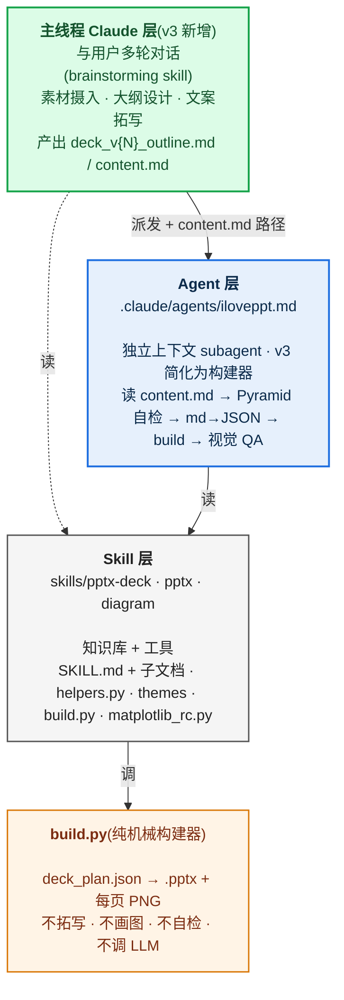
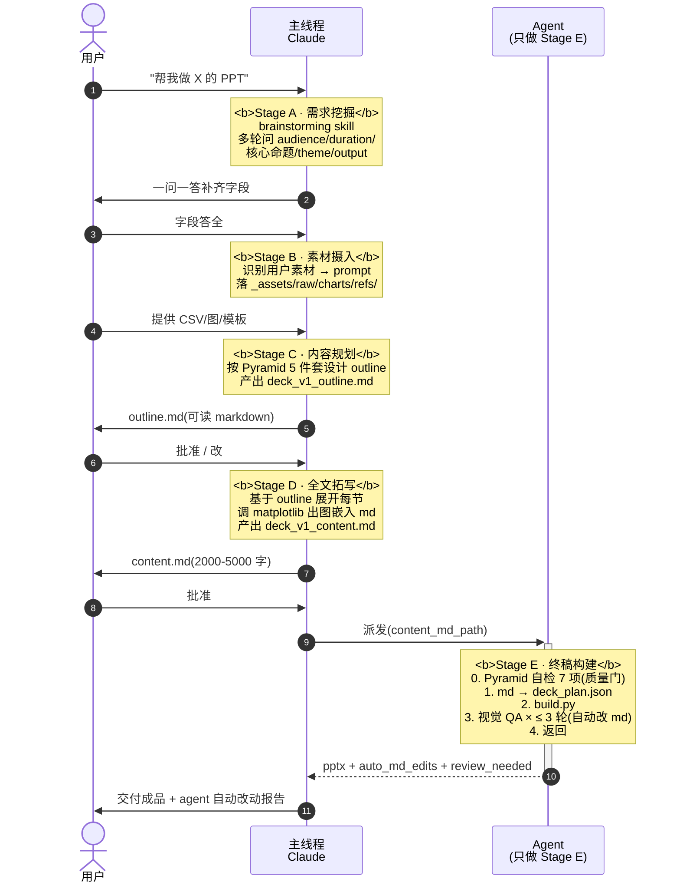
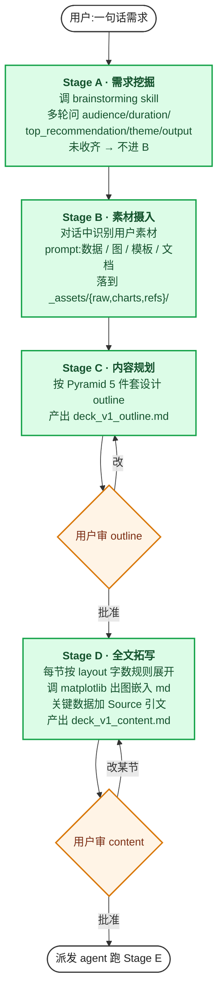
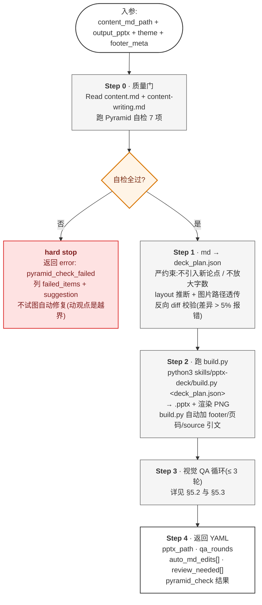
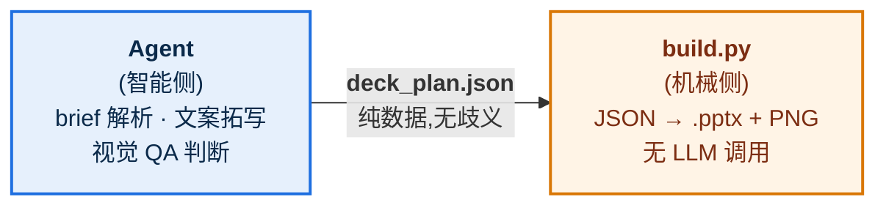
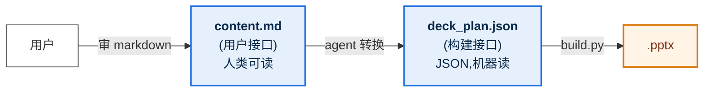

# iLovePPT Agent 工作原理(v3)

> 这份文档讲清楚 iLovePPT 系统**怎么工作的**——主线程 + agent 双层架构、5 阶段流程、关键设计决策。
> 适合想理解(或后续改造)系统的人;不是用户操作手册(那个看 [`MANUAL.zh.md`](MANUAL.zh.md))。
>
> **v3(2026-05-23)重大改动**:从"agent 端到端"变为"主线程对话 + agent build"。
> agent 不再做 brief 解析 / 大纲 / 文案拓写,只做 markdown → .pptx 的构建。
> 旧 v2 设计仍在 [v2 agent design](superpowers/specs/2026-05-23-iloveppt-agent-design.md)。
> v3 spec:[v3 markdown-first](superpowers/specs/2026-05-23-iloveppt-v3-markdown-first.md)。

---

## 目录

- [1. 四层架构:主线程 / agent / skill / build.py](#1-四层架构主线程--agent--skill--buildpy)
- [2. 入口:用户怎么发起一次任务](#2-入口用户怎么发起一次任务)
- [3. 5 阶段流程(Stage A-E)—— 主线程做前 4 个,agent 做最后 1 个](#3-5-阶段流程stage-a-e--主线程做前-4-个agent-做最后-1-个)
- [4. Stage A-D 详解:主线程怎么协同用户出 markdown](#4-stage-a-d-详解主线程怎么协同用户出-markdown)
- [5. Stage E 详解:agent 怎么把 markdown 变 .pptx](#5-stage-e-详解agent-怎么把-markdown-变-pptx)
- [6. 关键设计决策:为什么这么设计](#6-关键设计决策为什么这么设计)
- [7. 一次完整调用的 timeline 示例](#7-一次完整调用的-timeline-示例)
- [8. 这套设计避开了哪些常见坑](#8-这套设计避开了哪些常见坑)
- [9. 进一步阅读](#9-进一步阅读)
- [10. v2 → v3 变迁说明](#10-v2--v3-变迁说明)

---

## 1. 四层架构:主线程 / agent / skill / build.py

v3 把 v2 的 3 层扩展为 **4 层**——在 agent 之上新加 "主线程 Claude" 作为对话与协同设计层:



**关键认知**:
- **主线程** 是"和用户聊天的人"(对话 + 设计)
- **agent** 是"按图纸施工的工头"(读 md,调 build,视觉 QA)
- **build.py** 是"会按规格切料的木工"(JSON → .pptx)
- **skill** 是"工地上的施工手册 + 工具箱"

v2 → v3 的关键转变:**智能在主线程,agent 只做构建**。原因见 §6。

---

## 2. 入口:用户怎么发起一次任务

v3 的入口**不是** `@agent-iloveppt`,而是**直接对话主线程 Claude**:

```mermaid
flowchart TB
    U[用户:"帮我做个 X 的 PPT"] --> M["主线程 Claude<br/>触发 brainstorming skill<br/>开始 Stage A 对话"]
    M --> ABCD[Stage A-D · 多轮对话 · 出 markdown]
    ABCD --> Y{用户批准 content.md?}
    Y -->|是| DP[主线程派发 agent<br/>入参 = content_md_path + output_pptx + theme]
    Y -->|否,改| ABCD
    DP --> AG[Agent 实例启动<br/>独立上下文<br/>跑 Stage E build]
    classDef start fill:#FFF,stroke:#333,stroke-width:1.5px
    classDef main fill:#DCFCE7,stroke:#16A34A,stroke-width:2px,color:#14532D
    classDef agent fill:#0B2A4A,stroke:#1E6FE0,stroke-width:2px,color:#FFF
    class U,Y start
    class M,ABCD main
    class DP,AG agent
```

agent 的 frontmatter 限定它的窄角色:

```yaml
---
name: iloveppt
description: PPT 终稿构建 agent。接收主线程已和用户协同确认的
             deck_content.md(markdown 终稿)→ 跑 Pyramid 自检 →
             md→deck_plan.json 转换 → build.py 出 .pptx →
             视觉 QA 自动修复循环 → 交付。**不再做 brief 解析 /
             大纲设计 / 文案拓写**——那是主线程 Claude 的 Stage A-D 工作。
tools: Bash, Read, Write, Edit, Glob, Grep, Skill
model: opus
---
```

**关键变化**:
- 用户**不再直接 `@agent-iloveppt`**(那样会跳过 Stage A-D 协同设计)。主线程会先把用户带过 brainstorming
- agent 是 main 的"工具",不是用户的"对接者"
- 派发时,主线程已经手握用户审过的 content.md;agent 收到的是**接近终稿的输入**,不是原始 brief

---

## 3. 5 阶段流程(Stage A-E)—— 主线程做前 4 个,agent 做最后 1 个

v3 把 v2 的"agent 2 阶段"升级为"主线程 4 阶段 + agent 1 阶段",共 5 阶段。两个用户 checkpoint(outline.md 审 + content.md 审):



### 为什么把 4 阶段放主线程?

v2 把全部智能塞 agent,但 subagent **是单次派发,无法多轮对话**。结果 Stage A 的"挖需求"做不到——agent 一次性收到一句话 brief 就要硬出 outline。

v3 把对话密集的 Stage A-D 上挪到主线程:

| 任务 | v2 | v3 | 理由 |
|---|---|---|---|
| 多轮对话挖需求 | ❌ agent 做不了 | ✅ 主线程做 | 主线程天然支持多轮 |
| 收素材文件 | ❌ 没有这环 | ✅ 主线程对话中收 | 主线程能 Read 用户提供路径 |
| 大纲协同设计 | ⚠️ 单向输出 | ✅ 双向迭代 | 主线程能根据用户反馈反复改 outline.md |
| 文案审 | ❌ 无此 checkpoint | ✅ content.md 审 | 用户在 .pptx 出来前就知道每页写啥 |

### Agent 怎么判断该跑哪一段?

不用判断了——**agent 只做 Stage E**。收到入参检查 `content_md_path` 是否存在;不存在或主线程派老 v2 风格的入参 → 直接返回:

```yaml
error: missing_content_md
message: "v3 流程要求主线程先完成 Stage A-D 产出 content.md;agent 不接受裸 brief。"
```

---

## 4. Stage A-D 详解:主线程怎么协同用户出 markdown

主线程 Claude 在用户对话中跑 Stage A-D,产出两份用户可读的 markdown:



**关键产出**:
- `deck_v1_outline.md` —— 大纲 + Pyramid 自检 checkbox 列表
- `deck_v1_content.md` —— 完整文案(每页 h2 + 正文 + 嵌入图)
- `_assets/charts/*.png` —— 图表素材

详细 schema 见 [content-writing.md v3 markdown schema 章节](../skills/pptx-deck/content-writing.md#-v3-markdown-schema主线程--agent-接口契约)。

---

## 5. Stage E 详解:agent 怎么把 markdown 变 .pptx

agent 在独立上下文中跑 5 步。**Step 0 是质量门**(Pyramid 自检),不过则 hard stop 返回主线程,不允许"自动修复内容"。

### 5.1 Stage E 主流程



### 5.2 Step 3 视觉 QA 循环细节(v3:修 md 而非 JSON)

```mermaid
flowchart TB
    Start([每页渲染图 page-N.jpg]) --> Read[Read PNG<br/>对照 17 项 checklist<br/>基础 12 + 进阶 5]
    Read --> Q{发现 issues?}
    Q -->|无| Next[标记本页通过]
    Q -->|有| Cnt{该页修过<br/>&lt; 3 次?}
    Cnt -->|是| AE{允许的格式修复?<br/>(见 §5.3 边界表)}
    AE -->|是| Fix["改 content.md 该 slide<br/>记入 auto_md_edits[]"]
    AE -->|否| Deg
    Fix --> Re1[重跑 md → deck_plan.json] --> Re2[rerun build.py] --> Read
    Cnt -->|否| Deg["<b>降级</b><br/>加入 review_needed<br/>接受当前版本"]
    Deg --> Next
    Next --> Loop{还有页?}
    Loop -->|是| Start
    Loop -->|否| Done([QA 完成 → Step 4])
    classDef io fill:#FFF,stroke:#333,stroke-width:1.5px
    classDef act fill:#F5F5F5,stroke:#555
    classDef gate fill:#FFF4E6,stroke:#D97706,stroke-width:2px,color:#7C2D12
    classDef pass fill:#DCFCE7,stroke:#16A34A,stroke-width:1.5px,color:#14532D
    classDef fail fill:#FEE2E2,stroke:#DC2626,stroke-width:1.5px,color:#7F1D1D
    class Start,Done io
    class Read,Fix,Re1,Re2 act
    class Q,Cnt,AE,Loop gate
    class Next pass
    class Deg fail
```

**v2 vs v3 的关键差异**:v2 改 `deck_plan.json`(用户审过的源是 outline yaml,JSON 是 agent 自己写的,改它无所谓);v3 改 `content.md`(用户审过的源就是 md,**改 md 等于改用户审过的内容**——所以有严格边界,见 §5.3)。

### 5.3 Agent 自动改 content.md 的边界(决策 8a)

| ✅ 允许(纯格式修正) | ❌ 禁止(动观点 / 数据) |
|---|---|
| 缩短 action title(超 24 字) | 改 action title 立场 / 语义 |
| bullet 字数超限 → 截短 | 删整条 bullet |
| 合并连续 bullet(超数量) | 改 bullet 顺序(= 改论证) |
| layout 推断错改 layout 注释 | 加删整张 slide |
| 修 markdown 语法错(missing dash 等) | 改 source 引文 / 数据值 |
| 切换字号/颜色(通过 layout 注释) | 改 frontmatter(top_recommendation / SCQA 等) |

每次自动改都要:
- 记录到返回 yaml 的 `auto_md_edits[]`,含 `page / issue / before / after`
- 主线程展示给用户(可批量批准或回退某条)
- 用户可以"接受 + 继续"或"回退到 agent 改前的 md 版本重新介入"

### 5.4 Cross-cutting concerns:build.py 在 fn 调用后自动加的东西

`build.py` 调完 `theme.make_<layout>()` 后,**还会自动处理 3 类"横切关注点"** —— theme `make_*` 函数完全不感知,职责干净:

```mermaid
flowchart TB
    F[make_<layout>(prs, **fields) 返回] --> P1{slide 有 source 字段?}
    P1 -->|是| SC[H.source_citation<br/>渲染 'Source: ...' 在 footer 上方<br/>italic / GRAY_500 / 9pt]
    P1 -->|否| P2
    SC --> P2{layout 在 FOOTERED_LAYOUTS?<br/>(8 种内容页,排除 cover/divider/closing)}
    P2 -->|是| FT[H.footer<br/>分隔线 + 'N / TOTAL' 右对齐<br/>+ classification·project·version 左侧<br/>(从 plan.footer_meta 读)]
    P2 -->|否| END([本 slide 完成])
    FT --> END
    classDef io fill:#FFF,stroke:#333,stroke-width:1.5px
    classDef gate fill:#FFF4E6,stroke:#D97706,stroke-width:2px,color:#7C2D12
    classDef act fill:#E6F0FC,stroke:#1E6FE0,stroke-width:2px,color:#0B2A4A
    class F,END io
    class P1,P2 gate
    class SC,FT act
```

**为什么 build.py 集中做,而不是放进每个 `make_*`?**

- theme `make_*` 只关心**布局视觉**(把 title/items 摆好);footer 和 source 是**规范层关注**(每页都要有),不该让每个 layout 函数都重复处理
- 想新增一种 cross-cutting(比如水印 / classification 徽标),改 build.py 一处即可,11 个 layout 一起生效
- agent 写 `deck_plan.json` 时,这些字段是**通用 slot**(任何 layout 都可加 `source`),不需要为每种 layout 各想一遍

**v3 下这套机制依然成立**:agent 在 Step 1 (md→JSON) 把 md 里的 `> 数据:Source: ...` 写成 JSON 的 `source` 字段;`footer_meta` 从 frontmatter 透传到 plan 顶层。build.py 后续的渲染流程没变。

---

## 6. 关键设计决策:为什么这么设计

### 6.1 build.py 是"纯机械",智能全在 agent

**问的人最多的问题:为什么 build.py 不内嵌 LLM 调用?**

答:**因为接缝必须诚实。**



- **可重放**:agent 死了,你拿着 `deck_plan.json` 自己 `python3 build.py` 也能出一模一样的 .pptx
- **可调试**:出问题先看 `deck_plan.json` —— 是 agent 没拓写好,还是 build.py 渲染错?一目了然
- **可测试**:`evals/run_eval.sh` 跑固定 deck_plan,验证 build.py 没回归——不掺 LLM 不确定性

如果 build.py 内嵌 LLM 调用,这 3 条全废了。

### 6.1.1 v3 多了一个接缝:content.md(用户接口)vs deck_plan.json(构建接口)

v2 只有 1 个接缝:`deck_plan.json`(agent ↔ build.py)。

v3 有 **2 个接缝**:



**为什么不直接 content.md → .pptx,省一个接缝?**

- `deck_plan.json` 仍是 build.py 的契约,**已经测试 + 评估覆盖**(`evals/run_eval.sh` 跑固定 JSON)
- markdown → JSON 转换里有"严约束"(不引入新论点),正好用 JSON 做"用户审过的内容的事实快照"
- 未来若要支持其他源(如 Notion API / Confluence),只需写新的 `X → JSON` 转换,不动 build.py

### 6.2 deck_plan.json 这个"接缝"是设计核心

```json
{
  "theme": "tech_blue",
  "output": "./deck.pptx",
  "footer_meta": {
    "classification": "INTERNAL",
    "project": "Project Atlas",
    "version": "v2.0"
  },
  "slides": [
    {"layout": "cover", "title": "...", "subtitle": "...",
     "prepared_by": "...", "date": "...", "version": "...",
     "project_code": "...", "classification": "INTERNAL"},
    {"layout": "cards", "title": "...", "cards": [{"title":"...","body":"..."}]},
    {"layout": "table", "title": "...", "headers": [...], "rows": [...],
     "source": "Source: 公司财报 2025 Q4"},
    {"layout": "closing", "subtitle": "Q&A",
     "next_steps": [{"action":"...","owner":"Alice","due":"2026-06-15"}]}
  ]
}
```

每个 slide 对象的 schema 由 `layout` 字段决定——这就是 agent 和 build.py 之间的"接口契约"。

11 种 layout 的字段约束写在 `content-writing.md`,agent 拓写时必须遵守。

**两类字段**:

- **layout-specific**:`cards.cards[]` / `table.headers` 等 —— 进 `make_<layout>(**fields)`
- **cross-cutting**:`source`(数据 slide 引文)/ `footer_meta`(顶层,机密/项目/版本)/ cover 的 `prepared_by/date/version/...` / closing 的 `next_steps[]` —— build.py 或对应 make_* 单独处理(详见 §5.3)

### 6.3 Skill docs 是产品,不是文档

`.md` 文档不是"参考材料"——**它们是 agent 在运行时实时 Read 的"运行手册"**。

改 `content-writing.md` 的金字塔自检规则 → agent 下次跑 Phase 1 时就按新规则跑。这就是为什么这些 `.md` 写得像"操作指令"而不是"概念解释"。

### 6.4 视觉 QA 为什么是 Claude 做,不是脚本?

因为视觉问题(文字溢出、字体 fallback、留白失衡、颜色对比度)用 Python 规则识别极其脆弱,而 Claude 多模态读 PNG 直接判断又快又准。

**循环逻辑**:

```
fix → rebuild → recheck → if still bad after 3 rounds → review_needed
```

3 轮上限是**反死循环兜底**——3 轮还修不好,多半是 layout 选错(改字号 / 位置都救不了),降级让人审。

### 6.5 SSOT(单一权威源)防漂移

颜色 / 字体 / 尺寸有且只有一份定义,在 `skills/pptx/helpers.py`:

```python
BRAND_PRIMARY = RGBColor(0x0A, 0x52, 0xBF)   # AAA 7.00:1 对比度(投影必过)
ACCENT        = RGBColor(0x00, 0x7A, 0x6D)   # AA 5.2:1
FONT_CN       = "Microsoft YaHei"            # 系统兼容默认
FONT_CN_DESIGN= "Source Han Sans CN"         # 设计感更强(opt-in)
SLIDE_W       = Inches(13.333)
FOOTER_TOP    = Inches(7.0)
```

所有 theme / helper / build.py 都引用这些常量,不复制。改一处全 deck 生效。

**两条独立 SSOT 链**(2026-05-23 拆分):

- **`helpers.py`** —— `.pptx` 渲染域的字体 / 色 / 尺寸 / 几何常量
- **`skills/diagram/matplotlib_rc.py`** —— matplotlib 数据图域,从 `helpers.py` 抄录 hex 字符串供 matplotlib 用,保证 chart 与 slide 视觉一致(字体 / 配色 / 网格风格)

为什么拆?matplotlib 用 `font.sans-serif` 列表 / hex 字符串,跟 python-pptx 的 `RGBColor` / `<a:ea typeface>` 类型不兼容,无法直接共享对象。所以 matplotlib_rc 是"helpers.py 的派生镜像"——改 helpers 后需手动同步(改色值时 grep `_hex(H.` 找到所有 mirror 点)。

### 6.6.1 v3:为什么把"智能"从 agent 拆到主线程

最初(v1/v2)直觉:agent 跑端到端,用户只看 outline 一次。后来发现:

| 问题 | 原因 |
|---|---|
| 用户不会写 brief | 一句话扔进来,缺关键字段 |
| 用户审 outline 是盲批 | YAML 不可读 |
| 文案没 sign-off | 用户没在 .pptx 前看到文案 |
| 改 1 个字 = rebuild 全 deck | 用户介入的颗粒度太粗 |

根本原因:**subagent 是单次派发**,无法多轮对话。所以挖需求、收素材、协同设计这些**对话密集**的工作,塞 agent 里硬做必然失败。

v3 把对话密集任务上挪到主线程,agent 简化为"接收 markdown → 构建 .pptx"。这样:

| 任务 | v2 谁做 | v3 谁做 | 收益 |
|---|---|---|---|
| 多轮挖需求 | agent 硬做(失败) | 主线程 + brainstorming(顺) | 用户感受到被"问"而非被"猜" |
| 素材收集 | 无环节 | 主线程对话中收 | 数据 / 图能真正进 deck |
| 大纲设计 | agent 单方面输出 | 主线程协同迭代 | 用户参与 |
| 文案审 | 无环节 | content.md checkpoint | 错字 / tone / 数据准确性都在 .pptx 前定 |
| 视觉构建 | agent | agent(职责简化) | agent 不再分心,专注做好这一件 |

**代价**:主线程上下文会膨胀(对话历史 + outline + content)。但主线程有自带 compaction,且 markdown 本身比 v2 yaml schema 更紧凑。

### 6.7 字号 / 色 / 字段都对标 BCG/McKinsey

2026-05-23 全面对标行业最佳实践,17 项调整落地:

| 调整 | 旧 → 新 | 依据 |
|---|---|---|
| body 字号 | 14pt → 18pt | BCG/Beautiful.ai/BrightCarbon 最低投影标准 |
| 页标题 | 28pt → 32pt | MBB action title 标准 |
| BRAND_PRIMARY | `#1E6FE0`(AA) → `#0A52BF`(AAA 7:1) | WebAIM 投影建议 |
| Source 引文 | 无 → 自动加在 footer 上方 | MBB 数据 slide 硬要求 |
| Cover 元数据 | 无 → prepared_by/date/version/project_code/classification | 咨询稿标准 |
| Closing 结构 | "谢谢"+ subtitle → 可选 next_steps 列表 | closing = call to action |
| Footer 左侧 | 仅 page num → +classification·project·version | MBB 标准 footer |
| matplotlib 风格 | 用 default → matplotlib_rc SSOT(BRAND_*  配色 + YaHei) | 防 chart 与 deck 视觉割裂 |
| action title | 无字数上限 → ≤ 24 字硬约束 | 防换行破布局 |
| 12-col grid | 无 → `grid_columns()` 锚定 | 防跨页对不齐 |
| 视觉 QA | 12 项 → 17 项 | + 留白 / 热区 / 主色比例 / 跨页一致 |

完整对标过程见会话历史(执行前做了 web research + 18 项 gap audit)。

---

## 7. 一次完整调用的 timeline 示例(v3)

假设你说:`帮我做一份"评审办法 v1.0"的 PPT,15 分钟,技术受众`

```
=== Stage A · 需求挖掘(主线程对话) ===
T+0s     用户输入一句话
T+5s     主线程:"给谁看?有数据吗?有现成图吗?预期多长?"
T+30s    用户答 → 主线程接着问
T+2min   字段收齐(audience/duration/top_recommendation/theme)

=== Stage B · 素材摄入 ===
T+2.5m   主线程:"你提到 Q4 数据,可以粘贴或给文件路径吗?"
T+3min   用户给 ./q4_revenue.csv → 主线程 Read + 解析
T+3.5m   主线程:"5 阶段流程图,你想画还是用 draw.io 现画?"
T+4min   用户:"现画" → 主线程稍后调

=== Stage C · 内容规划 ===
T+4.5m   主线程跑 Pyramid 设计 outline
T+5min   写 deck_v1_outline.md(7 章节 + Pyramid 自检 checkbox)
T+5min   "Outline 在 deck_v1_outline.md,审一下"
─── 你审 outline,改第 3 节标题,回 "批准" ───
T+8min   

=== Stage D · 全文拓写 ===
T+8min   主线程基于 outline 展开每节文案
T+9min   调 matplotlib 出 Q4 revenue chart → _assets/charts/q4.png
T+10min  调 draw.io 出 5 阶段流程图 → _assets/charts/review_flow.png
T+11min  写 deck_v1_content.md(20 页 + 嵌入 2 张图 + Source 引文)
T+11min  "全文在 deck_v1_content.md,逐页审"
─── 你审 content,改第 5 页一个数字,回 "批准" ───
T+15min

=== Stage E · agent 派发构建 ===
T+15min  主线程派发 agent(content_md_path + theme + footer_meta)
T+15.5m  Agent 启动,Read content.md + Pyramid 自检 → 全过
T+16min  md → deck_plan.json(20 slide 字段)
T+17min  跑 build.py → .pptx + 20 张 PNG(~60s)
T+18min  视觉 QA 第 1 轮:Read 20 PNG,发现 page-5 action title 27 字超限
T+18.5m  auto_md_edit:改 content.md page 5 标题为 18 字 → 重 build
T+19.5m  视觉 QA 第 2 轮:全部通过
T+20min  返回 .pptx 路径 + auto_md_edits[1 条] + review_needed: []

=== 主线程交付 ===
T+20min  "成品 /tmp/deck_v1.pptx;agent 自动改了 content.md page 5
         标题从 'X' 改成 'Y'(超 24 字限制),已记录。如要回退说一声。"
```

**对比 v2**:v2 全程 ~5 分钟(纯 agent),但用户只在 outline 一次 sign-off。v3 全程 ~20 分钟,**用户在对话中投入 5-10 分钟**,但拿到的成品是真正"协同设计"出来的。

---

## 8. 这套设计避开了哪些常见坑

### 流程层

| 坑 | 这套设计的防御 |
|---|---|
| 一口气跑完,大纲跑偏要等成品才发现 | 两阶段 + checkpoint |
| LLM 出 .pptx 不可重放、不可调试 | `deck_plan.json` 接缝,build.py 纯机械 |
| 大纲是话题堆叠没论证 | 金字塔原理 5 件套 + Pyramid 自检表 7 项 |
| 全是文字 bullet 没图 | Phase 1 强制图层规划,4 类图决策表 |
| 视觉 fallback、字体错、留白歪 | Phase 2 视觉自检循环,最多 3 轮 |
| 无限循环改不动 | 3 轮上限 + review_needed 降级 |
| 改一处颜色要改 10 个文件 | SSOT in helpers.py + matplotlib_rc.py |
| agent 一直跑成本失控 | subagent 隔离上下文 + 自带 ~95% compaction 兜底 |

### 视觉规范层(2026-05-23 对标 BCG/McKinsey 后补)

| 坑 | 这套设计的防御 |
|---|---|
| body 11-14pt 在投影上看不清 | 默认 body 18pt(行业最低),字数上限同步收紧 30% |
| 主色对比度不过 AAA,投影泛白 | BRAND_PRIMARY 强制 `#0A52BF` (7:1),有单元测试守护 |
| 数据 slide 不标 source,违反咨询合规 | `source` 字段任何 layout 可加,build.py 自动渲染 |
| 内容页没页码 / 页脚,看不出"第几页" | build.py 自动加 footer + "N / TOTAL"(8 种 layout) |
| 机密文件分发缺 classification 徽标 | `footer_meta: {classification, project, version}` 每页 footer 显示 |
| 封面/封底缺咨询元素(准备方/日期/版本) | `make_cover` 加 5 个可选 meta 字段;`make_closing` 支持 next_steps |
| chart 风格与 slide 视觉割裂 | `matplotlib_rc.apply_iloveppt_style()` 单一 SSOT,BRAND_* 配色 + YaHei 字体 |
| action title 太长换行破布局 | ≤ 24 字硬约束(content-writing.md 写入 Pyramid 自检) |
| 跨页元素对不齐(cards 第一卡 x 坐标各页不同) | `grid_columns()` 12-col grid 锚定,跨页一致 |
| 视觉 QA 只看单页,deck-level 不一致漏检 | 17 项 checklist + Deck-level 一致性 3 项(配色比例 / 字号层级 / 同 layout 对齐) |
| 主色泛滥(单页 60% BRAND_PRIMARY) | 60-30-10 视觉 QA 项(主色面积 ≤ 30%) |

### 协同设计层(v3 新增)

| 坑 | 这套设计的防御 |
|---|---|
| 用户不会写 brief | Stage A 主线程 brainstorming 多轮问,直到收齐字段 |
| 用户审 YAML 看不懂(盲批) | 改成 markdown 双 checkpoint(outline.md + content.md) |
| 数据图 / 用户已有图没入口 | Stage B 显式素材摄入对话,落 `_assets/{raw,charts,refs}/` |
| 文案错字要等 .pptx 出来才发现 | content.md 阶段已审过文案 |
| 手改 .pptx 后 agent 重跑覆盖 | 用户改的是 content.md,不是 pptx;agent 永远从 md 派生 |
| 多版本管理乱(deck.pptx 覆盖) | `deck_v1.md` / `deck_v2.md` 显式版本号 |
| agent 改了 md 用户不知道 | `auto_md_edits[]` 返回 + 主线程展示 |
| agent 拓写引入用户没说的话 | md → JSON 严约束 + 反向 diff 校验(差异 > 5% 报错) |
| 用户绕过 Stage A 直接 @agent | agent 检查入参缺 content_md_path 直接 reject |

---

**一句话总结(v3)**:iLovePPT 把"写 PPT"拆成**"主线程多轮协同(Stage A-D,用户 + Claude 双方共写 markdown)→ agent 机械构建(Stage E,markdown 终稿 → .pptx)"**,用 `content.md`(用户接口)+ `deck_plan.json`(构建接口)两个接缝,把对话密集的"想清楚"和构建密集的"做出来"彻底分离。SSOT(helpers.py + matplotlib_rc.py)+ 17 项视觉规范 + Pyramid 自检 + md→JSON 严约束防各种漂移。

---

## 9. 进一步阅读

每一块都有更深入的权威文档:

| 想了解 | 看 |
|---|---|
| **v3 设计 spec(权威,8 决策 + 接口契约)** | `docs/superpowers/specs/2026-05-23-iloveppt-v3-markdown-first.md` |
| Agent 完整 system prompt(v3 简化为 builder-only) | `.claude/agents/iloveppt.md` |
| Agent 旧 v2 设计 rationale(供对比) | `docs/superpowers/specs/2026-05-23-iloveppt-agent-design.md` |
| 5 阶段主流程(Stage A-E) | `skills/pptx-deck/workflow.md` |
| markdown schema(outline.md + content.md)+ 11 layout 字段 | `skills/pptx-deck/content-writing.md` |
| 金字塔原理 5 件套 + 自检表 | `skills/pptx-deck/content-writing.md` |
| 图层规划 4 类决策表 | `skills/pptx-deck/diagram-planning.md` |
| 视觉自检 17 项 checklist + fix 循环 | `skills/pptx-deck/visual-qa.md` |
| 模板提取(主色 + 字体) | `skills/pptx-deck/template-extract.md` |
| draw.io / Mermaid / matplotlib 出图细节 | `skills/diagram/SKILL.md` |
| matplotlib 风格 SSOT | `skills/diagram/matplotlib_rc.py` + `skills/diagram/matplotlib.md` |
| 底层 .pptx 读写 + footer/source helper | `skills/pptx/SKILL.md` + `skills/pptx/helpers.py` |
| 12-col grid 原语 | `skills/pptx/layout.py: grid_columns()` |
| 设计 token(SSOT 源头) | `skills/pptx/helpers.py` |
| 仓库架构与代码约定 | `CLAUDE.md`(根目录) |
| 用户操作手册(v3 流程) | `docs/MANUAL.zh.md` |

---

## 10. v2 → v3 变迁说明

如果你熟悉 v2 设计,这是关键变化:

### 架构层

| | v2 | v3 |
|---|---|---|
| 智能放哪 | 全在 agent(Phase 1 + Phase 2) | 拆:主线程做 Stage A-D / agent 做 Stage E |
| 用户入口 | 直接 `@agent-iloveppt` | 直接对话主线程(主线程稍后派 agent) |
| Checkpoint 数 | 1(outline yaml 审) | 2(outline.md 审 + content.md 审) |
| 接缝介质 | `deck_plan.json` | `content.md` + `deck_plan.json` 两层 |
| agent 角色 | 端到端 brief → pptx | builder only:md → pptx |
| 素材摄入 | 无 | Stage B 显式对话收集 |
| 多版本管理 | 无 | `deck_v{N}_*.md` 显式 |

### 复用 v2 资产

下列 v2 资产**完全保留,不动**:
- `helpers.py` 设计 token / footer / source_citation
- `tech_blue.py` 11 个 make_* layout 函数
- `build.py` 接收 deck_plan.json 出 .pptx(接口完全不变)
- `matplotlib_rc.py` 数据图 SSOT
- `layout.py` grid_columns + 几何原语
- `visual-qa.md` 17 项 checklist
- 字号 / 色 / 字段对标 BCG 的全套规范

### 废弃 v2 字段

下列 v2 schema 字段不再使用:
- agent Phase 1 输出的 `top_recommendation` / `scqa` / `mece_check_passed` / `pyramid_check_passed` / `bypass_pyramid` 字段
  → 改成 markdown frontmatter + 自检 checkbox 列表(用户可读)
- `ghost_deck_test_passed` 独立字段
  → 合并进 Pyramid 自检 7 项的第 ⑤ 项

### 迁移路径

v2 现有 deck 不需迁移——`build.py` 接口不变,旧 `deck_plan.json` 仍能跑。
新 deck 默认走 v3 流程(主线程 brainstorming 入口)。
v2 `brief.yaml` 仍可作为主线程 Stage A 的输入(主线程会读 yaml 然后正常进入 Stage C 跳过 brainstorming)。

---

*文档版本:**3.0** · 2026-05-23 重大架构升级:主线程对话 + agent build · 替代 v2 端到端流程*
