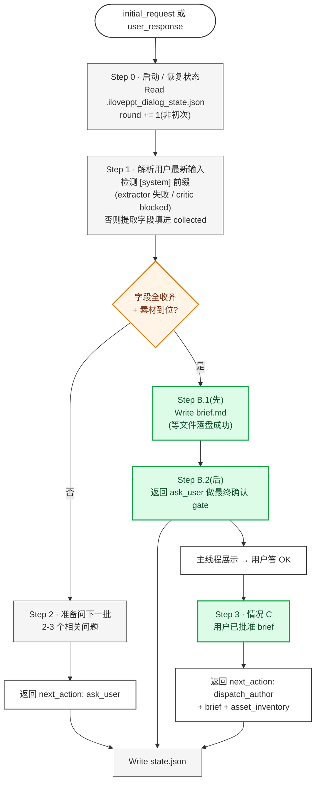
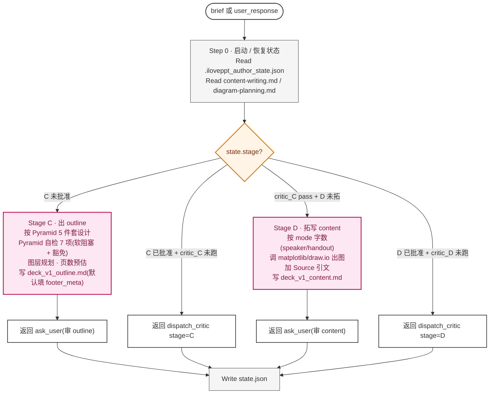
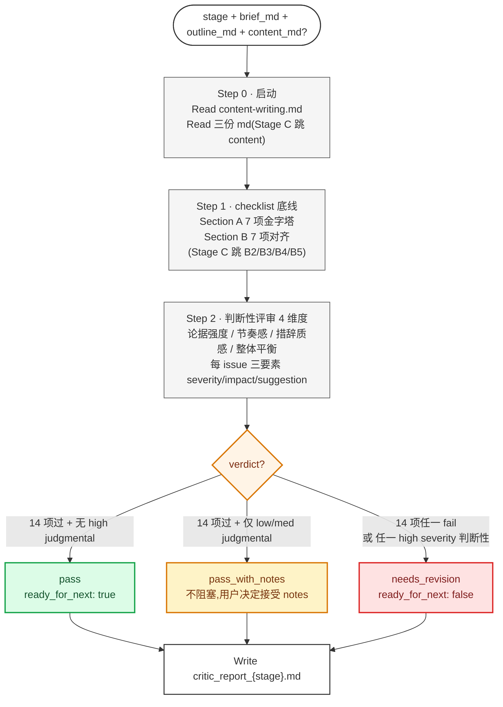
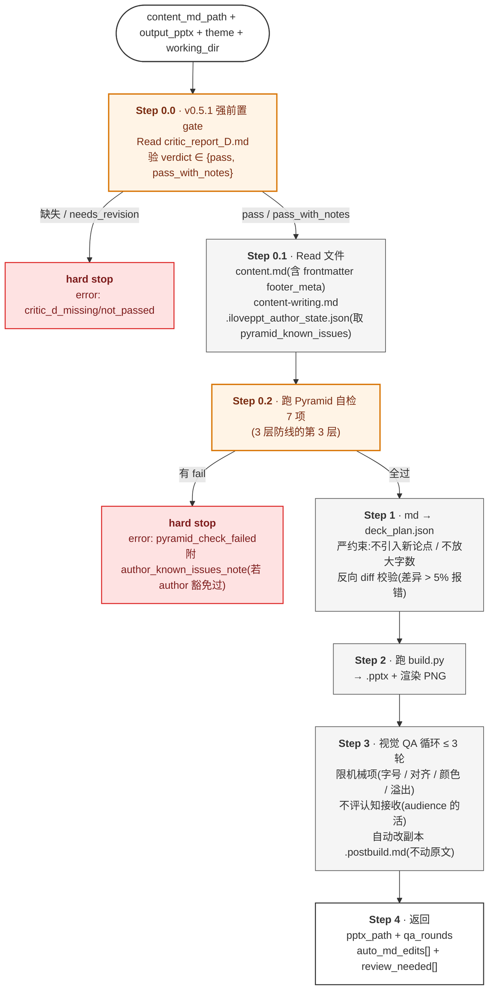
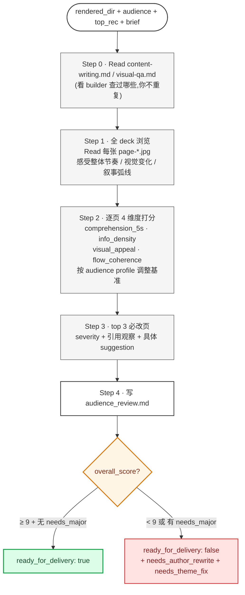
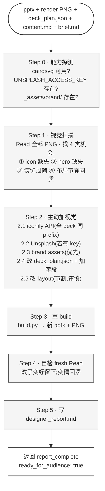
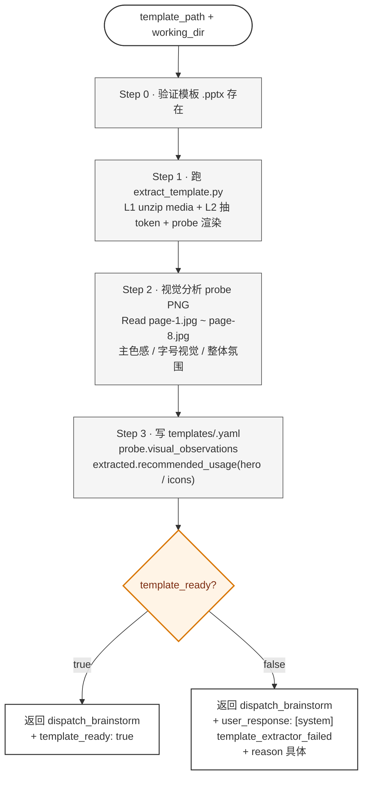
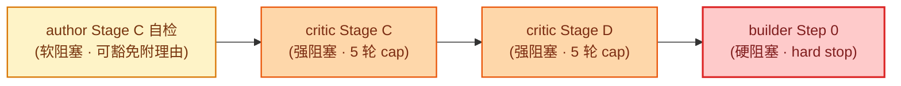
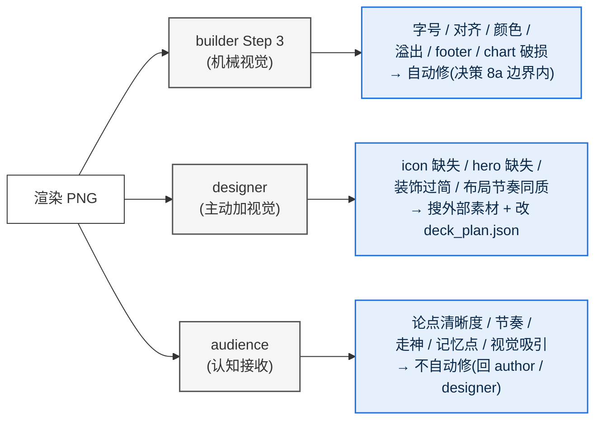

# iLovePPT Agent 工作原理(v0.5.2)

> 这份文档讲清楚 iLovePPT **怎么工作的** —— 系统架构、6 agent 流水线 + 1 旁路、多轮派发机制、关键设计决策。
> 适合想理解或改造系统的人;不是用户操作手册(那个看 [`MANUAL.zh.md`](MANUAL.zh.md))。
>
> *版本:v0.5.2 · 2026-05-24 · 加 designer 视觉优化 agent*
> *v0.5.1 → v0.5.2 演进:加 iloveppt-designer(builder 后自动跑 / 搜 iconify / 加 icon-hero-装饰)*
> *v3.1 spec 历史保留:[v3 markdown-first](superpowers/specs/2026-05-23-iloveppt-v3-markdown-first.md)*
> *v2 agent design 历史保留:[v2 agent design](superpowers/specs/2026-05-23-iloveppt-agent-design.md)*
> *运行时活协议(权威):[`.claude/pipeline-protocol.md`](../.claude/pipeline-protocol.md)*

**v0.5.1 → v0.5.2 主要演进**:
- 5 agent → 6 agent + 1 旁路(新增 `iloveppt-designer` 视觉设计师)
- builder 完成 .pptx 后**自动跑 designer**(audience 之前),填补"主动加视觉资产"的真空
- designer 能力:搜 iconify(icons)+ Unsplash(hero,需 key)+ 用户 brand assets;改 deck_plan.json 加 icon / 装饰 / 调布局
- audience 反馈分三类:`needs_author_rewrite`(文字)/ `needs_designer_revision`(视觉素材,v0.5.2 新)/ `needs_theme_fix`(theme 层)

**v3.1 → v0.5.1 主要演进**(继承):
- 3 agent → 5 agent + 1 旁路(新增 critic、audience、template-extractor)
- critic 在 Stage C/D 各跑一次的"双 gate"
- audience 9 分硬阈值 + 5 轮 cap
- brief.md gate + 主线程强制 `TeamCreate`

---

## 目录

- [1. 30 秒理解](#1-30-秒理解)
- [2. 核心架构:主线程 + 6 agent + 1 旁路 + skill + build.py](#2-核心架构主线程--6-agent--1-旁路--skill--buildpy)
- [3. 六个 agent + 旁路各自的角色](#3-六个-agent--旁路各自的角色)
  - [3.1 iloveppt-brainstorm(Stage A+B)](#31-iloveppt-brainstormstage-ab)
  - [3.2 iloveppt-author(Stage C+D)](#32-iloveppt-authorstage-cd)
  - [3.3 iloveppt-critic(Stage C/D 双 gate · v0.5.1 新)](#33-iloveppt-criticstage-cd-双-gate--v051-新)
  - [3.4 iloveppt(Stage E builder)](#34-iloveppt-stage-e-builder)
  - [3.5 iloveppt-audience(Stage F · v0.5.1 新)](#35-iloveppt-audiencestage-f--v051-新)
  - [3.6 iloveppt-designer(Stage E.5 · v0.5.2 新,流水线位置在 builder 与 audience 之间)](#36-iloveppt-designerstage-e5--v052-新)
  - [3.7 iloveppt-template-extractor(旁路)](#37-iloveppt-template-extractor旁路)
- [4. 关键机制](#4-关键机制)
  - [4.1 多次派发 + state file](#41-多次派发--state-file)
  - [4.2 next_action 路由协议](#42-next_action-路由协议)
  - [4.3 多重接缝:brief.md / outline.md / content.md / deck_plan.json](#43-多重接缝briefmd--outlinemd--contentmd--deck_planjson)
  - [4.4 critic 双 gate + 三档 verdict](#44-critic-双-gate--三档-verdict)
  - [4.5 audience 9 分硬阈值 + 5 轮 cap](#45-audience-9-分硬阈值--5-轮-cap)
  - [4.6 TeamCreate + 每 teammate 独立窗口](#46-teamcreate--每-teammate-独立窗口)
- [5. 接口契约](#5-接口契约)
- [6. 关键设计决策](#6-关键设计决策)
- [7. 一次完整调用的 timeline](#7-一次完整调用的-timeline)
- [8. 这套设计避开了哪些坑](#8-这套设计避开了哪些坑)
- [9. 进一步阅读](#9-进一步阅读)

---

## 1. 30 秒理解

iLovePPT 把"写 PPT"拆成 **6 个 Claude Code agent 接力 + 1 个旁路**:

| Agent | 阶段 | 干什么 |
|---|---|---|
| `iloveppt-brainstorm` | Stage A + B | 多轮挖需求 + 收素材 + 写 `brief.md` + 用户确认 gate |
| `iloveppt-author` | Stage C + D | 按金字塔原理出 `outline.md` → 用户审 → 拓写 `content.md`(含调 matplotlib 出图)→ 用户审 |
| `iloveppt-critic` | Stage C 和 Stage D 各一次 | **partner 评审员**:14 项 checklist 底线 + 4 维度判断性评审(论据强度 / 节奏 / 措辞 / 平衡)+ 三档 verdict |
| `iloveppt`(builder) | Stage E | 读 `content.md` → 验 critic Stage D pass → Pyramid 自检 → md→JSON → build.py 出 .pptx → **机械**视觉 QA(字号 / 对齐 / 颜色 / 溢出)循环 |
| **`iloveppt-designer`** | Stage E.5(v0.5.2 新) | **视觉设计师**:builder 完成后自动跑,搜 iconify / Unsplash / brand assets,改 deck_plan.json 加 icon / hero / 装饰 / 布局优化;cairosvg 转 SVG→PNG |
| `iloveppt-audience` | Stage F | 模拟目标受众读 deck,4 维度评分(认知接收),9 分硬阈值 + 5 轮 cap;反馈三类分流(author / designer / theme) |
| `iloveppt-template-extractor` | 旁路 | 用户给 .pptx 模板时,提取 4 级 token(媒体 / 主色 / 字体 / 视觉风格) |

**主线程 Claude 是 thin dispatcher**:不持有 PPT 业务逻辑,只 `TeamCreate` 建 team、按 agent 返回的 `next_action` 派发下一个 agent、转发消息给用户。每个 teammate 独立窗口,跨窗口用 `SendMessage` 传交付物路径。

**关键 checkpoint**(用户决定权):
1. brainstorm 收齐字段后的 `brief.md` 确认
2. author Stage C 出 outline.md 审
3. critic Stage C 报告 cherry-pick(若 needs_revision)
4. author Stage D 出 content.md 审
5. critic Stage D 报告 cherry-pick(若 needs_revision)
6. audience 报告 cherry-pick(若 < 9)
7. 最终交付确认(双闸门:质量底线 audience ≥ 9 + 用户最终 OK)

**关键接缝**(机器接口):brief.md → outline.md → content.md → deck_plan.json → .pptx

---

## 2. 核心架构:主线程 + 6 agent + 1 旁路 + skill + build.py

```mermaid
flowchart TB
    M["<b>主线程 Claude</b>(thin dispatcher)<br/>TeamCreate 建 team · SendMessage 路由<br/>不持有 PPT 业务逻辑"]
    BS["<b>iloveppt-brainstorm</b><br/>(Stage A+B · 多次派发)<br/>state: .iloveppt_dialog_state.json<br/>多轮对话 → brief.md + 用户确认 gate"]
    AU["<b>iloveppt-author</b><br/>(Stage C+D · 多次派发)<br/>state: .iloveppt_author_state.json<br/>outline.md → content.md + 出图"]
    CR["<b>iloveppt-critic</b><br/>(Stage C/D · 无状态,每轮新建)<br/>14 checklist + 4 维度判断性<br/>critic_report_{C,D}.md"]
    BD["<b>iloveppt</b>(builder)<br/>(Stage E · 单次派发)<br/>Read critic_report_D → Pyramid → md→JSON → build.py → 机械视觉 QA"]
    DS["<b>iloveppt-designer</b><br/>(Stage E.5 · v0.5.2 新 · 每轮新建)<br/>iconify / Unsplash / brand assets<br/>改 deck_plan.json 加 icon / hero / 装饰"]
    AD["<b>iloveppt-audience</b><br/>(Stage F · 每轮新建)<br/>读 PNG + 4 维度评分<br/>9 分硬阈值 + 三类反馈分流"]
    TE["<b>iloveppt-template-extractor</b><br/>(旁路 · 一次性)<br/>extract_template.py + 视觉分析"]
    SK["<b>Skill 层</b>(共享知识库)<br/>skills/pptx-deck · pptx · diagram<br/>content-writing.md · visual-qa.md · helpers.py · matplotlib_rc.py"]
    BP["<b>build.py</b>(纯机械)<br/>deck_plan.json → .pptx + PNG"]
    M -->|派发| BS
    BS -->|dispatch_author| M
    M -->|派发| AU
    AU -->|dispatch_critic stage=C| M
    M -->|派发| CR
    CR -->|verdict pass → 主线程派 author Stage D| M
    AU -->|dispatch_critic stage=D| M
    CR -->|verdict pass → 主线程派 builder| M
    M -->|派发| BD
    BD -->|done + pptx| M
    M -->|派发| DS
    DS -->|视觉优化完 + 重 build| M
    M -->|派发| AD
    AD -->|score < 9 → 用户 cherry-pick → 派 author / designer| M
    BS -.->|检测模板| TE
    TE -.->|回 brainstorm| BS
    BS -.->|读| SK
    AU -.->|读| SK
    CR -.->|读| SK
    BD -.->|读| SK
    DS -.->|读| SK
    BD -->|调| BP
    DS -->|调(重 build)| BP
    DS -->|搜| EX["<b>外部素材</b><br/>iconify.design / Unsplash / brand assets"]
    classDef main fill:#FFF,stroke:#888,stroke-width:1.5px,color:#444
    classDef stage1 fill:#DCFCE7,stroke:#16A34A,stroke-width:2px,color:#14532D
    classDef stage2 fill:#FCE7F3,stroke:#BE185D,stroke-width:2px,color:#831843
    classDef stage3 fill:#CFFAFE,stroke:#0891B2,stroke-width:2px,color:#0E4F62
    classDef stage4 fill:#E6F0FC,stroke:#1E6FE0,stroke-width:2px,color:#0B2A4A
    classDef stage45 fill:#FBCFE8,stroke:#C026D3,stroke-width:2px,color:#701A75
    classDef stage5 fill:#FED7AA,stroke:#EA580C,stroke-width:2px,color:#7C2D12
    classDef bypass fill:#FEF3C7,stroke:#D97706,stroke-width:1.5px,color:#78350F
    classDef skill fill:#F5F5F5,stroke:#555,stroke-width:1.5px,color:#222
    classDef tool fill:#FFF4E6,stroke:#D97706,stroke-width:1.5px,color:#7C2D12
    classDef external fill:#E0E7FF,stroke:#6366F1,stroke-width:1.5px,color:#3730A3
    class M main
    class BS stage1
    class AU stage2
    class CR stage3
    class BD stage4
    class DS stage45
    class AD stage5
    class TE bypass
    class SK skill
    class BP tool
    class EX external
```

**6 层比喻**:
- **主线程** = 前台 + 邮局(`TeamCreate` 建 team,`SendMessage` 转交付物路径)
- **brainstorm** = 资深咨询 senior consultant(需求经理)
- **author** = BCG/McKinsey senior associate(文案策划)
- **critic** = 资深合伙人 / partner reviewer(评审员,不只跑 checklist,会找弱点)
- **builder** = 排版工程师(机械精度)
- **audience** = 目标受众本人(executive / technical / general / sales)
- **extractor** = 视觉调研员(模板提取,可选)
- **skill** = 工种共享的施工手册 + 工具箱
- **build.py** = 按图纸切料的机械臂

---

## 3. 六个 agent + 旁路各自的角色

> **流水线顺序**:brainstorm → author(C)→ critic(C)→ author(D)→ critic(D)→ builder → **designer** → audience。下方章节按"复杂度递进"排序(builder § 在 audience § 之前,designer § 在 audience § 之后),不是按时间顺序;designer §3.6 实际跑在 audience §3.5 之**前**。

### 3.1 iloveppt-brainstorm(Stage A+B)

**职责**:跟用户多轮对话,收齐 brief + 素材清单 → 写 `brief.md` → 等用户确认 → 派 author。



**必收齐字段**:`audience` / `duration_min` / `top_recommendation` / `theme` / `output` / **`presentation_mode`**(speaker / handout)

**brief.md gate**(v0.5.1 新):收齐字段后**串行两步**(不并行):
1. `Write brief.md`(落盘)
2. 返回 `ask_user` 给用户最终确认

用户回 OK → 下次派发才 `dispatch_author`。理由:author 是流水线第一个昂贵动作(出图 + 大段拓写),brief 错了在这里改代价最低。

**软上限**:`round >= 10` 时主线程附加"叫停 / 继续"选项给用户,可用 `force_dispatch: true` 强制让 brainstorm 用默认值兜底。

**[system] 前缀响应**:
- `[system] template_extractor_failed` → 跟用户对话三选一(装依赖重试 / 降级 tech_blue / 终止)
- `[system] critic_blocked` → critic 5 轮卡死,跟用户对话调 brief

**素材摄入触发**(对话中识别):数据 / 报表 / 现有图 / 模板 / 参考报告。落到 `<working_dir>/_assets/{raw,refs}/`。

**详细 agent 文件**:`.claude/agents/iloveppt-brainstorm.md`

### 3.2 iloveppt-author(Stage C+D)

**职责**:基于 brief + 素材清单,按金字塔原理出 outline.md(Stage C)+ 拓写 content.md(Stage D),含调 matplotlib/draw.io 出图。**Stage C 和 Stage D 硬隔离**(分两次派发)。



**金字塔原理 5 件套**(Stage C 必跑自检 7 项):
- ① 单一顶端论点 / ② SCQA 开场 / ③ 答案在前(BLUF) / ④ 横向 MECE 3-5 / ⑤ 纵向疑问链 / ⑥ 字段完整 / ⑦ action title ≤ 24 字

**自检不过强制二选一**(v0.5.1):豁免附理由(写 `state.pyramid_known_issues`)或 改 outline。**不接受**"先放着" / "不管它"含糊回答。

**Stage 硬隔离**(v0.5.1):Stage C 批准 outline → **返回主线程派 critic stage=C** → critic pass → **主线程再派 author stage=D**。Stage D 批准 content → **返回主线程派 critic stage=D** → critic pass → 主线程派 builder。

**大改判断**(v0.5.1):用户改动涉及顶端论点变更 / 章节增删 / > 3 page 连锁 → author 主动问 "v{N} Edit 还是开 v{N+1} 平行?" 二选一。小改就地 Edit。

**md 文件是 SSOT**(v0.5.1):state 只记 `approvals + iteration + pyramid_known_issues`,不维护 md 的 hash。每次派发都重 Read md。

**接收 critic / audience 反馈**:主线程把用户筛过的反馈作为 `user_response` 自然语言指令传给 author。**不读** `critic_report_{C,D}.md` / `audience_review.md` 原文(那会被未筛建议干扰)。

**详细 agent 文件**:`.claude/agents/iloveppt-author.md`

### 3.3 iloveppt-critic(Stage C/D 双 gate · v0.5.1 新)

**职责**:**partner 评审员**(不是合规检查员)。除跑 14 项 checklist(底线)外,还跑 **4 维度判断性评审**(beyond checklist)。给三档 verdict。



**14 项 checklist**(底线):
- Section A · 金字塔结构(7 项,Stage C/D 都跑):A1 顶端论点 / A2 SCQA 完整 / A3 BLUF / A4 MECE / A5 纵向疑问链 / A6 横向逻辑同类 / A7 action title ≤ 24 字
- Section B · brief→content 对齐(Stage C/D 适用项不同):B1 top_recommendation 字面 / B2 SCQA 承接(仅 D) / B3 audience tone(仅 D) / B4 asset 交代(仅 D) / B5 无 brief 外新事实(仅 D) / B6 duration 估算 / B7 字数限制

**4 维度判断性评审**(核心价值,beyond checklist):
- 维度 1 论据强度:章节论据是否 sharp?有"合 MECE 但弱论据"吗?
- 维度 2 节奏感:章节顺序 / 过渡 / 篇幅分布
- 维度 3 措辞质感:action title 是结论句还是话题?数字 vs 形容词比?
- 维度 4 整体平衡:章节篇幅 / summary 收口 / BLUF

每个判断性 issue 强制三要素:`severity (high/med/low) + impact (读者会怎么感受) + suggestion (具体到页号/字段/layout)`

**三档 verdict**:
- `pass` —— checklist 全过 + 无 high severity → 主线程派下一步
- `pass_with_notes` —— checklist 全过 + 仅 low/med severity → 主线程展示给用户,不阻塞
- `needs_revision` —— 任一 checklist fail OR 任一 high severity → 用户 cherry-pick → 派 author 改 → 重派 critic(第 N 轮)

**5 轮上限**(Stage C / D 独立计数):同 stage 第 5 轮仍 needs_revision → 主线程问用户四选一:1) 继续改 2) 接受当前 3) 终止 4) 回 brainstorm 改 brief

**人设**:做过 50+ deck pitch + 30+ partner review 的资深合伙人。敢说狠话,evidence-based,不打圆场不油腻。

**详细 agent 文件**:`.claude/agents/iloveppt-critic.md`

### 3.4 iloveppt(Stage E builder)

**职责**:接 author 已和用户协同确认过且 critic Stage D pass 过的 `content.md`,构建 `.pptx`。**单次派发完成,内部含 ≤ 3 轮视觉 QA 循环**(机械项)。



**v0.5.1 关键变化**:
- **Step 0.0 必先 Read critic_report_D.md**:`needs_revision` 立即 hard stop,**不允许跳过 critic gate**
- **Step 3.4 改副本**:auto_md_edits 写到 `deck_v{N}_content.postbuild.md`,不动原文 `deck_v{N}_content.md`(原文是用户批准的 SSOT)
- **footer_meta 从 content.md frontmatter 读**:不再走 dispatch 入参
- **Read author state 仅限 pyramid_known_issues**:这是 builder 唯一允许跨 agent 读 state 的场景(handoff 隔离的例外)
- **视觉 QA 限机械项**:字号 / 对齐 / 颜色 / 溢出 / 留白 / footer / chart 破损;**不评**"读者认知接收"(那是 audience 的活)

**3 层 Pyramid 防线**:author Stage C 自检(软阻塞)→ critic(Stage C + Stage D 强阻塞)→ builder Step 0 硬阻塞。质量优先,接受冗余。

**详细 agent 文件**:`.claude/agents/iloveppt.md`

### 3.5 iloveppt-audience(Stage F · v0.5.1 新)

**职责**:模拟目标受众第一次读这份 PPT,从**读者视角**给评分 + 改进建议。每轮新建窗口,无状态。



**v0.5.1 关键设计**:
- **9 分硬阈值**:`ready_for_delivery: true` 硬条件 = `overall_score ≥ 9` 且无 `needs_major_revision` 页。9 分代表"真正打磨过",不是"合格"低标
- **严格分工**:audience 只评**认知接收**(论点清晰度 / 节奏 / 走神 / 记忆点),**不评**机械视觉(字号 / 对齐 / 颜色 —— builder Step 3 的活)
- **按 audience profile 具象化人设**:
  - `executive` = 50 岁高管,5 秒决定要不要读
  - `technical` = 资深工程师,跳到架构 / 数据
  - `general` = 普通职场人,术语过多就出戏
  - `sales` = BD / 销售,看卖点 + 对标 + CTA
- **5 轮上限**:audience-author-builder 循环第 5 轮仍 < 9 → 主线程问用户四选一(继续 / 接受 / 终止 / 回 brainstorm 改 brief)
- **窗口每轮新建**:无状态,所有 state 在 `audience_review.md`

**详细 agent 文件**:`.claude/agents/iloveppt-audience.md`

### 3.6 iloveppt-designer(Stage E.5 · v0.5.2 新)

**职责**:builder 完成 .pptx 后**自动跑一次**(audience 之前),给 deck 主动加视觉资产(icon / hero / 装饰)+ 优化布局节奏。



**4 类视觉提升机会**:
1. **icon 缺失** — cards body 短(< 12 字)+ 标题前无 icon → 搜 iconify
2. **hero image 缺失** — cover / pic_text 适合摄影但无图 → 搜 Unsplash(需 key)/ brand assets
3. **装饰过简** — section_divider 太空 → 加 background 大字 / accent 线
4. **布局节奏** — ≥ 3 张连续 cards-like 同质 → 中间 1 张改 `compare_pk` / `single_focus` 破型

**外部资源 + graceful degrade**:
- **iconify.design**(免费,首选):`api.iconify.design/<prefix>/<name>.svg?color=<hex>&height=<px>`,全 deck 同 prefix(`lucide` / `phosphor` / `heroicons` / `tabler` 选一)
- **cairosvg**(SVG→PNG):若 `import cairosvg` 失败 → 跳过 iconify 优化 + 在 report 标"需 `pip install cairosvg`"
- **Unsplash**(hero image,需 `UNSPLASH_ACCESS_KEY`):若 key 未设 → 跳过 + 在 report 标
- **用户 brand assets**(`<working_dir>/_assets/brand/`):**优先级最高**

**风格统一硬规则**:
- 全 deck icon 同一 prefix(开始用 `lucide` 就全 deck `lucide`,某 icon 没有就改用同套其他 name,**不换 prefix**)
- 染色限定 `BRAND_*` / `GRAY_*` 色板(`helpers.py` SSOT)
- 不混 flat + 写实(单 deck 选一)

**节制原则**:咨询稿是**文字驱动**,不是 marketing flyer。**没合适 icon 就不加**,比将就加更专业。

**自检**:改完跑新 PNG → fresh Read → 改了变好留下,变糟回滚。

**人设**:做过 100+ 咨询稿的 BCG/McKinsey 视觉团队 lead。信奉"好视觉服务于内容,不是炫技"。

**红线**:不改 content.md(只动 deck_plan.json);不混 icon 风格;不超出 theme 色板。

**详细 agent 文件**:`.claude/agents/iloveppt-designer.md`

### 3.7 iloveppt-template-extractor(旁路)

**职责**:当用户提供 `.pptx` 模板时,提取媒体 + 4 级 token + 跑 probe deck + 视觉分析,让 author 拓写时能用上模板视觉资产。**一次性任务,不多轮派发**。



**嵌套 handoff**(`brainstorm → extractor → brainstorm`):主线程当邮局中转两跳,agent 不允许嵌套派 agent。

**brainstorm 窗口在 extractor 跑期间保留 idle**(handoff 通则的唯一例外) —— extractor 耗时 1-3 分钟,跑完立刻回 brainstorm,关再开是无谓开销。

**失败处理**:`template_ready: false` 时用 `[system] template_extractor_failed` 前缀返回 brainstorm,brainstorm 跟用户对话三选一(装依赖重试 / 降级 tech_blue / 终止)。

**详细 agent 文件**:`.claude/agents/iloveppt-template-extractor.md`

---

## 4. 关键机制

### 4.1 多次派发 + state file

**问题**:subagent 是单次派发(派一次跑完返回),怎么实现多轮对话?

**答案**:**多次派发同一 agent**,每次启动时 Read 自己的 state file 恢复进度;返回前 Write state 把最新状态写盘。

```mermaid
sequenceDiagram
    actor U as 用户
    participant M as 主线程<br/>dispatcher
    participant A as agent<br/>(brainstorm)
    participant S as state.json

    M->>+A: dispatch(initial_request)
    A->>S: Read(不存在,初始化)
    Note over A: round=1<br/>解析 initial 提取部分字段
    A->>S: Write({round:1, collected:{...}})
    A-->>-M: ask_user(questions)
    M->>U: 转发问题
    U->>M: 答
    M->>+A: dispatch(user_response="...")
    A->>S: Read(载入 round 1 状态)<br/>round += 1
    Note over A: 解析答案补字段<br/>问下一批
    A->>S: Write({round:2, collected:{...更全}})
    A-->>-M: ask_user(questions)
    ...
    M->>+A: dispatch(user_response="...")
    A->>S: Read(全收齐)
    Note over A: 写 brief.md(B.1 先)<br/>返回 ask_user 确认(B.2 后)
    A-->>-M: ask_user(brief gate)
    M->>U: 转发(确认 brief.md?)
    U->>M: OK
    M->>+A: dispatch(user_response="OK")
    A->>S: Read(brief_approved=true)
    A-->>-M: dispatch_author(brief + assets)
```

**state file 位置**(在 `working_dir` 下):
- `.iloveppt_dialog_state.json` —— brainstorm 状态(含 round / collected / asset_inventory / brief_md_path / brief_approved)
- `.iloveppt_author_state.json` —— author 状态(stage / approvals / iteration / pyramid_known_issues)
- builder / critic / audience 无 state file(单次派发或无状态,所有 state 在产物 .md 里)

**为什么这套机制 work**:
- agent 在新 context 中启动时,state file 是它的全部记忆来源
- 主线程不需要"记得"对话历史 —— 那是 agent 自己的事
- 跨 session / 跨用户 / 重启 Claude Code 都能恢复

### 4.2 next_action 路由协议

所有 agent 返回都遵守统一 schema,主线程按 `next_action` 路由:

```yaml
next_action: ask_user
              | dispatch_brainstorm
              | dispatch_author
              | dispatch_critic         # v0.5.1
              | dispatch_builder
              | dispatch_designer       # v0.5.2
              | dispatch_audience       # v0.5.1
              | dispatch_template_extractor   # 旁路
              | stage_c_approved        # author 内部
              | report_complete         # critic / designer / audience
              | done                    # builder 最终
              | error

# next_action == ask_user 时:
message_to_user: "<给用户的话>"
questions: [...] | "<开放问题>"

# next_action == dispatch_* 时:
dispatch:
  agent: iloveppt-brainstorm | author | critic | iloveppt | designer | audience | template-extractor
  args: {...}

# next_action == report_complete (critic / designer / audience) 时:
report_path: ...
verdict: pass | pass_with_notes | needs_revision   # critic
overall_score: 9.2                                 # audience
visual_edits_count: 8                              # designer
rolled_back_count: 0                               # designer
ready_for_next / ready_for_audience / ready_for_delivery: true | false

# next_action == done 时(builder):
pptx_path: ...
auto_md_edits: [...]
review_needed: [...]
pyramid_check: {...}
visual_qa: {...}
```

主线程的伪代码:

```
loop:
  ret = dispatch(current_agent, current_args)
  switch ret.next_action:
    case "ask_user":
      show(ret.message_to_user + ret.questions)
      current_args.user_response = wait_for_user()
    case "dispatch_*":
      current_agent = ret.dispatch.agent
      current_args = ret.dispatch.args
    case "report_complete":
      if critic and (pass or pass_with_notes):
        派下一步(C → author Stage D;D → builder)
      elif designer and ready_for_audience:
        派 audience
      elif audience and overall_score >= 9:
        展示给用户做最终确认 → 交付
      else:
        展示 report 给用户 → cherry-pick → 派 author 或 designer
    case "done":
      builder 完成 → 派 designer(不直接派 audience,v0.5.2)
```

主线程**零业务逻辑** —— 只是状态机的转发者。

### 4.3 多重接缝:brief.md / outline.md / content.md / deck_plan.json


**为什么这么多接缝**:
- `brief.md` —— **用户对 brainstorm 输出的确认 gate**(防 brief 漂)
- `outline.md` —— **用户对结构的审 + critic Stage C 审**(防结构跑偏)
- `content.md` —— **用户对全文的审 + critic Stage D 审**(防文字漂)
- `deck_plan.json` —— **机械构建接口**(build.py 测试覆盖,evals 守护)
- builder 做 md → JSON 转换时**严约束**:不引入新论点 + 反向 diff 校验(差异 > 5% 报错)

每个接缝都是一个**修错代价低的窗口**。越早错越好修,越靠后越贵。

### 4.4 critic 双 gate + 三档 verdict

**3 层 Pyramid 防线**(质量优先,接受冗余):



3 层各跑 Pyramid 看似冗余,但角色清晰:author 自检不够独立、builder Step 0 不查 brief 对齐 —— 缺哪一层都有盲区。

**三档 verdict 设计**(允许 pass 有梯度,避免"差一项就 fail"刻板):
- `pass` —— 进下一步
- `pass_with_notes` —— **不阻塞**,主线程把 low/med 建议展示给用户决定是否先改
- `needs_revision` —— 用户 cherry-pick → 派 author 改

**5 轮独立计数**:Stage C / Stage D 各 5 轮,卡死时用户四选一(继续 / 接受 / 终止 / 回 brainstorm 改 brief)

### 4.5 audience 9 分硬阈值 + 5 轮 cap

**为什么 9 分**:
- 行业惯例"7-8 合格"会让 deck 永远卡在低分(差不多就过)
- 9 分代表"真正打磨过的 deck",audience 必须**敢区分** 7/8/9/10
- 即使 audience 给 9.5,用户仍是最终决策者(可以说"再调调"回 author)→ 这是**双闸门**:质量底线(硬)+ 用户确认(软)

**5 轮反馈环**(v0.5.2 扩展):`audience → {author / designer / theme_fix} → builder → designer → audience` 循环上限 5 轮。第 5 轮 < 9 时主线程问用户四选一。

**严格分工避免功能重叠**(v0.5.2 三方分工):
- audience = 认知接收(走神 / 论点清晰 / 记忆点 → 不自动修)
- builder Step 3 = 机械视觉(字号 / 对齐 / 颜色 / 溢出 → 自动修)
- **designer = 主动加视觉**(icon / hero / 装饰 / 布局节奏 → 搜外部素材 + 改 deck_plan.json)

三套各占一头,不允许功能重叠。audience 评分时若发现视觉问题 → 不自己 fix,通过 `needs_designer_revision` 分类反馈,由用户 cherry-pick 后派 designer 重跑。

### 4.6 TeamCreate + 每 teammate 独立窗口

**v0.5.1 强制规则**:主线程检测到 PPT 意图时,**必须** `TeamCreate` 建 team,每 agent 独立窗口,跨窗口用 `SendMessage` 传交付物路径(`brief.md` / `outline.md` / `content.md` / `deck_plan.json` / `.pptx`)。

**触发后启动序列**(一气呵成):
1. slug 推断(从 initial_request)
2. `mkdir <iLovePPT-root>/decks/<slug>/`
3. `TeamCreate team_name=iloveppt-<slug>`
4. `SendMessage` 给 brainstorm,载荷三字段(`working_dir + iloveppt_root + initial_request`)

**为什么强制 team**:
- 每 teammate 独立 context,各自清爽,不互相污染
- 跨窗口消息透明,用户可以同时看到所有 agent 状态
- 主线程 context 不被 PPT 任务污染(用户可同时跟主线程聊其他东西)

**例外**:用户明确说"不用 team / 你自己来"时尊重决定。

---

## 5. 接口契约

完整接口见 [`.claude/pipeline-protocol.md`](../.claude/pipeline-protocol.md)。摘要:

### 5.1 主线程 → agent 入参

```yaml
# 通用必填
working_dir: /abs/path/to/decks/<slug>/

# brainstorm 初次派发
iloveppt_root: /abs/path/to/<iLovePPT-root>/
initial_request: "<用户原话逐字粘贴>"

# brainstorm 续轮
user_response: "<用户答内容>"
# 或 force_dispatch: true(round ≥ 10 用户叫停后)
# 或 [system] template_extractor_failed / critic_blocked 前缀

# author 初次派发(C 阶段)
stage: C | D
brief: {audience, duration_min, top_recommendation, theme, output, presentation_mode}
asset_inventory: [...]

# critic 派发
stage: C | D
brief_md_path: <working_dir>/brief.md
outline_md_path: <working_dir>/deck_v{N}_outline.md
content_md_path: <working_dir>/deck_v{N}_content.md   # Stage D 必填
asset_inventory: [...]                                # Stage D 必填

# builder 派发(v0.5.1 入参精简)
content_md_path: /abs/path/to/deck_v{N}_content.md
output_pptx: /abs/path/to/deck_v{N}.pptx
theme: tech_blue | <.pptx 路径>
# 不再要 footer_meta(从 content.md frontmatter 读)

# designer 派发(v0.5.2)
pptx_path: /abs/path/to/deck_v{N}.pptx
deck_plan_json_path: /abs/path/to/deck_plan.json
rendered_dir: /abs/path/to/deck_v{N}_render/
content_md_path: /abs/path/to/deck_v{N}_content.md   # 只读
brief_md_path: /abs/path/to/brief.md                 # 取 theme / brand 信息
designer_iteration: 1                                # 主线程维护

# audience 派发
rendered_dir: /abs/path/to/deck_v{N}_render/
audience: technical | executive | general | sales
top_recommendation: ...
brief: {duration_min, scqa, presentation_mode}

# template-extractor 派发
template_path: /abs/path/to/<template>.pptx
```

### 5.2 state file schema

`.iloveppt_dialog_state.json` (brainstorm):
```json
{
  "agent": "iloveppt-brainstorm",
  "round": 3,
  "collected": { "audience": "...", "duration_min": 15, "top_recommendation": "...", ... },
  "asset_inventory": [{"type": "csv", "path": "...", "desc": "...", "summary": "..."}],
  "history": [{"q": "...", "a": "..."}],
  "brief_md_path": "<working_dir>/brief.md",
  "brief_approved": true,
  "status": "complete"
}
```

`.iloveppt_author_state.json` (author):
```json
{
  "agent": "iloveppt-author",
  "stage": "D",
  "outline_md_path": "deck_v1_outline.md",
  "content_md_path": "deck_v1_content.md",
  "approvals": {"outline": true, "content": false},
  "iteration": 2,
  "pyramid_known_issues": [
    {"item": 3, "reason": "数据下周才有", "approved_at": "2026-05-24"}
  ]
}
```

critic / designer / audience / builder / extractor —— **无 state file**(产物 .md 是所有状态)。designer 的产出是 `designer_report.md`,iteration 通过主线程入参传入,不靠 state。

### 5.3 markdown schema

完整 schema 在 [`content-writing.md` v3 markdown schema 章节](../skills/pptx-deck/content-writing.md#-v3-markdown-schema主线程--agent-接口契约)。

### 5.4 工作目录布局(v0.5.2)

```
<iLovePPT-root>/decks/<slug>/
├── brief.md                       # brainstorm 产出 + 用户审过的 SSOT
├── deck_v1_outline.md             # author Stage C 产出
├── deck_v1_content.md             # author Stage D 产出(用户批准版,SSOT)
├── deck_v1_content.postbuild.md   # builder 自动调整版(原文不动)
├── critic_report_C.md             # Stage C critic 评审(最后一轮)
├── critic_report_D.md             # Stage D critic 评审(最后一轮)
├── designer_report.md             # 最后一轮 designer 视觉优化报告(v0.5.2)
├── audience_review.md             # 最后一轮 audience 报告
├── deck_plan.json                 # builder 产出(可手改重 build)
├── deck_v1.pptx                   # 最终产物
├── deck_v1_render/                # 渲染图(QA 用)
├── STATUS.md                      # 主线程交付摘要(quality_grade A/B/C)
├── .iloveppt_dialog_state.json    # brainstorm 状态
├── .iloveppt_author_state.json    # author 状态
└── _assets/
    ├── raw/                       # 用户提供的原始素材
    ├── charts/                    # matplotlib / draw.io 生成的图(author)
    ├── icons/                     # iconify 下载的 icon(designer · v0.5.2)
    ├── hero/                      # Unsplash 下载的 hero 图(designer · v0.5.2)
    ├── brand/                     # 用户自带 brand assets(designer 优先用,v0.5.2)
    └── refs/                      # 用户直接给的参考图
```

---

## 6. 关键设计决策

### 6.1 build.py 是"纯机械",不调 LLM

**最重要的接缝约束。**

```
┌──────────┐   deck_plan.json   ┌──────────┐
│ builder  │ ─────────────────→ │ build.py │
│ (LLM 推) │   纯数据,无歧义     │ (机械)   │
└──────────┘                    └──────────┘
```

- **可重放**:任何人拿着 `deck_plan.json` 跑 `python3 build.py` 都出一模一样的 .pptx
- **可调试**:出问题先看 JSON —— 是 builder 转错,还是 build.py 渲染错?一目了然
- **可测试**:`evals/run_eval.sh` 跑固定 plan,验证 build.py 没回归,不掺 LLM 不确定性

### 6.2 markdown 是用户接口,而非 yaml

| 维度 | yaml | markdown |
|---|---|---|
| 用户可读性 | 差(技术语言) | 强(自然文档) |
| 编辑工具 | 文本编辑器 | 任何 markdown editor / VS Code / Obsidian |
| 版本对比 | git diff 难读 | git diff 易读 |
| 多人协作 | 容易冲突 | merge 友好 |

### 6.3 6 agent 拆分(从 v3.1 的 3 agent 逐步演进)

| 演进 | 理由 |
|---|---|
| v2 单端到端 → v3.1 3 agent 拆分 | 角色聚焦 / test 定位 / 复用性 / 上下文压力 |
| v3.1 3 agent → v0.5.1 5 agent + 1 旁路 | 加 critic(第三方评审 + 判断性)+ audience(读者视角他检)+ extractor(模板提取旁路);填补"author 自检 / builder 机械 QA"之外的盲区 |
| v0.5.1 5 agent → **v0.5.2 6 agent**(+ 1 旁路) | 加 **designer**(主动加 icon / hero / 装饰 / 布局优化);填补"builder 机械 QA / audience 认知评审"之间的真空 —— 没人**主动加视觉资产** |

### 6.4 主线程退化为 thin dispatcher

主线程**不持有任何 PPT 业务逻辑** —— 只是 next_action 状态机的转发者 + `TeamCreate` 建 team。

**为什么**:
- 主线程是用户的"通用 chat 伙伴",不应被 PPT 任务污染
- 业务逻辑放主线程 → 不可移植;放 agent → 可发现可移植(`@agent` 触发)
- 主线程上下文限额宝贵,不要塞 30K tokens 的 outline / content

### 6.5 SSOT —— 代码层一份定义

颜色 / 字体 / 尺寸只在 `skills/pptx/helpers.py`:

```python
BRAND_PRIMARY = RGBColor(0x0A, 0x52, 0xBF)   # AAA 7.00:1 对比度
FONT_CN       = "Microsoft YaHei"
SLIDE_W       = Inches(13.333)
FOOTER_TOP    = Inches(7.0)
```

所有 theme / build.py / 测试都引用这些常量,**不复制**。

### 6.6 视觉规范全面对标 BCG/McKinsey

body 18pt / 页标题 32pt / BRAND_PRIMARY AAA 7:1 / 自动 footer + source / closing 改 next_steps / matplotlib_rc SSOT / action title ≤ 24 字硬约束 / 12-col grid 锚定。详细规范见 `skills/pptx-deck/visual-qa.md`。

### 6.7 视觉 QA 三方严格分工 —— 机械 / 设计 / 认知(v0.5.2 升级)



**三方各占一头,不允许功能重叠**:
- builder Step 3 = 机械项,**可量化、可自动修**(字号偏小 14pt → 18pt)
- designer = 主动加视觉,**搜外部素材**(card 无 icon → iconify 找)
- audience = 认知评分,**给反馈不自己修**(用户 cherry-pick 后才派对应 agent)

判断归属的简单规则:
- "page 5 字号 14pt 偏小" → builder(机械可量化)
- "page 5 没 icon 找不到落点" → designer(可加视觉)
- "page 5 论点不清" → audience(认知,反馈给 author 改 content)

### 6.8 critic Stage C/D 双 gate · 三档 verdict(v0.5.1 新)

critic 是 partner 评审员而非合规检查员。除 14 项 checklist 底线外,跑 4 维度判断性评审(beyond checklist 的核心价值)。

**三档 verdict** 是关键设计:
- `pass` / `pass_with_notes` 都允许进下一步,但 `pass_with_notes` 把 low/med 建议展示给用户决定是否先改
- 避免"差一项就 fail"刻板,也避免"全过了但读着不顺"放过

### 6.9 audience 9 分硬阈值 + 5 轮 cap(v0.5.1 新)

9 分代表"真正打磨过";audience 必须**敢区分** 7/8/9/10。5 轮 cap 反死循环,用户最终决定权(四选一)。

**双闸门**:质量底线(audience ≥ 9 硬规则)+ 用户最终确认(软规则)。

### 6.10 cherry-pick 不强耦合(audience / critic 一致)

audience / critic 返回 needs_revision / < 9 时,主线程**不直接**把建议转发给 author。流程:
1. 主线程展示 report 给用户
2. 用户 cherry-pick("接受 page 5/13 建议,page 8 我不改")
3. 用户筛过的部分作为 `user_response` 自然语言指令派给 author / designer

**理由**:audience / critic 的反馈是给"作者 + 用户"两方看的建议,**用户是最终决策者**。不允许"audience/critic 命令 author/designer"的强耦合。

### 6.11 designer 自动视觉优化 + 风格统一 + 节制原则(v0.5.2 新)

designer 是**主动加视觉**的 agent,跟 builder 机械 QA(被动修)/ audience 认知评(只评不修)严格区分。三个关键设计点:

**1. 自动触发(不问用户)**:builder 完成后**自动**派 designer,audience 评的是优化后的版本。理由:每个 deck 都该被尝试优化一次,用户不需要每次都决定"要不要优化"。

**2. 风格统一硬规则**(避免视觉混乱):
- 全 deck icon 同一 prefix(`lucide` / `phosphor` / `heroicons` / `tabler` 选一,不混)
- 染色限定 `BRAND_*` / `GRAY_*` 色板(SSOT)
- 不混 flat + 写实摄影

**3. 节制原则**(咨询稿不是 marketing flyer):
- BCG/McKinsey deck 是**文字驱动**,icon 起点缀作用
- **没合适 icon 就不加**,比将就加更专业
- 改完跑新 PNG **自检**,改了变好留下,变糟回滚

**外部资源 graceful degrade**:
- cairosvg 未装 → 跳过 iconify SVG 优化
- UNSPLASH_ACCESS_KEY 未设 → 跳过 hero image
- 用户 brand assets(`_assets/brand/`)优先级最高,有就先用

**不动 content.md(SSOT)**:designer 只改 `deck_plan.json`(可选地用 builder 的 `.postbuild.md` 副本)。原文是用户批准的不可变源。

---

## 7. 一次完整调用的 timeline

假设你说:`帮我做一份"评审办法 v1.0"的 PPT,15 分钟,技术受众`

```
T+0s     主线程检测 PPT 意图 → slug=审办法-v1
         mkdir decks/审办法-v1/
         TeamCreate team_name=iloveppt-审办法-v1
         SendMessage brainstorm(working_dir + initial_request)

=== Stage A · brainstorm 派发 #1 ===
T+5s     brainstorm: Read state(初始化)
         解析"15 分钟 / 技术受众" → collected 部分
         缺 top_recommendation / theme / 素材 / presentation_mode
T+10s    返回 ask_user(顶端论点?用 tech_blue?有数据吗?演讲 or 阅读?)

─── 用户答:"本季度落地办法 5 阶段 ≤3 天 / tech_blue / 有 q4.csv / speaker" ───

=== Stage A · brainstorm 派发 #2 ===
T+1min   brainstorm: Read state(round=1)
         解析答案 → collected 全收齐
         Read q4.csv 验证 → asset_inventory
T+1.5m   Step B.1: Write brief.md(落盘)
         Step B.2: 返回 ask_user(brief gate · 确认 brief.md?)

─── 用户审 brief.md,回 OK ───

=== Stage A · brainstorm 派发 #3(brief 已批准)===
T+2m     brainstorm: Read state(brief_approved=true)
         返回 dispatch_author(stage=C, brief, assets)
T+2m     主线程关闭 brainstorm 窗口

=== Stage C · author 派发 #1(出 outline)===
T+2m     主线程派发 iloveppt-author(stage=C, brief)
T+2.5m   author 按 Pyramid 设计 outline + 自检 7 项
         写 deck_v1_outline.md(默认填 footer_meta)
T+3m     返回 ask_user(审 outline)

─── 用户改了第 3 节标题,回 "批准" ───

=== Stage C · author 派发 #2(批准 outline)===
T+4m     author: approvals.outline=true
         返回 dispatch_critic(stage=C)

=== critic Stage C ===
T+4.2m   critic: Read brief + outline + content-writing.md
         跑 Section A(7 项)+ B1/B6/B7 + 4 维度判断性
T+5m     verdict: pass_with_notes
         (维度 3 措辞 med · page 5 action title "重视" → 数据驱动)
         写 critic_report_C.md
T+5m     主线程展示 notes 给用户

─── 用户答 "接受 notes 进 Stage D" ───

=== Stage D · author 派发 #3(拓 content)===
T+6m     主线程派发 author(stage=D)
         调 matplotlib 出 Q4 chart → _assets/charts/q4.png
T+8m     写 deck_v1_content.md(20 页 + 嵌入图)
T+8m     返回 ask_user(审 content)

─── 用户审,直接 edit content.md 第 5 页一个数字,回 "批准" ───

=== Stage D · author 派发 #4(批准 content)===
T+10m    author: approvals.content=true
         返回 dispatch_critic(stage=D)

=== critic Stage D ===
T+10.2m  critic: Read 全套 + 跑 14 项 + 4 维度判断性
T+11m    verdict: pass
         写 critic_report_D.md

=== Stage E · builder 派发 ===
T+11m    主线程派发 iloveppt(content_md_path)
T+11.1m  Step 0.0: Read critic_report_D.md → verdict=pass ✓
T+11.5m  Step 0.2: Pyramid 自检 → 全过
T+12m    md → deck_plan.json
T+13m    跑 build.py → .pptx + 20 PNG(~60s)
T+14m    Step 3 视觉 QA 第 1 轮:发现 page 7 字号偏小
T+14.5m  改副本 content.postbuild.md → rebuild
T+15.5m  第 2 轮:全过
T+16m    返回 done(pptx + auto_md_edits[1 条])

=== Stage E.5 · designer 派发 #1(v0.5.2 自动跑)===
T+16m    主线程派发 iloveppt-designer(pptx + render + deck_plan)
T+16.2m  Step 0: 探测 cairosvg ✓ / UNSPLASH_ACCESS_KEY 未设(跳过 hero)
T+16.5m  Step 1: Read 20 PNG · 扫 4 类机会
         发现:5 张 cards 无 icon(page 5)/ section_divider 太空(page 8)
T+17m    Step 2.1: iconify 搜 lucide 5 个 icon → 下载 SVG → cairosvg → PNG
T+17.5m  Step 2.4: 改 deck_plan.json 加 icon path
T+18m    Step 3: 重 build → 新 pptx + 新 render
T+18.5m  Step 4: fresh Read 新 PNG · 自检 → 全部改了变好,留下
T+19m    Step 5: 写 designer_report.md → ready_for_audience: true

=== Stage F · audience 派发 #1 ===
T+19m    主线程派发 iloveppt-audience(新 rendered_dir, audience=technical)
T+19.5m  Read 20 PNG · 按 technical profile 评分
T+21m    overall_score=9.1 · 写 audience_review.md
         (有了 icon 后 visual_appeal 分大幅提升)
T+21m    ≥ 9 ✓,主线程展示给用户做最终确认(双闸门)

─── 用户答 "OK 交付" ───

T+22m    主线程写 STATUS.md(quality_grade: A)
         关闭 team · 展示路径清单给用户
```

**总耗时**:~22 分钟。用户实际投入对话 ~5-8 分钟,其余是 agent 工作时间(critic / designer / audience / builder 各分钟级)。

跟 v3.1 timeline(~15 分钟)相比,v0.5.2 多了 ~7 分钟,买的是:
- critic 双 gate(避免 outline 错跑完 content 才发现)
- **designer 视觉优化**(audience 评分从 8.6 → 9.1,本例直接达交付门槛)
- audience 读者视角他检 + 双闸门质量底线

注:本例 designer 一次到位让 audience 9 分通过。若 designer 跑完 audience 仍 < 9,主线程按反馈分流:`needs_designer_revision` 派 designer 再跑;`needs_author_rewrite` 派 author 改 content 后重新过 critic D / builder / designer / audience。最坏情况 audience 5 轮 cap 后用户四选一。

---

## 8. 这套设计避开了哪些坑

### 流程层

| 坑 | 防御 |
|---|---|
| 一口气跑完,大纲跑偏要等成品才发现 | 多 checkpoint(brief gate / outline 审 / content 审 / audience 评)|
| brief 漂(brainstorm 跑偏) | **brief.md gate**(v0.5.1):写文件 + 用户确认串行两步 |
| LLM 出 .pptx 不可重放、不可调试 | `deck_plan.json` 接缝,build.py 纯机械 |
| 大纲是话题堆叠没论证 | Pyramid 自检 3 层防线(author 自检 + critic Stage C/D + builder Step 0)|
| outline 结构错跑完 content 才发现(代价大) | **critic Stage C gate**(v0.5.1):outline 阶段提早 catch |
| author 自检不够独立,出问题在 content 之后 | **critic Stage D 第三方评审 + 4 维度判断性** |
| 视觉 fallback / 字体错 / 留白歪 | builder Step 3 视觉 QA × 3 轮(机械项) |
| **deck 缺 icon / hero / 装饰,显得朴素无品味** | **designer 自动视觉优化**(v0.5.2):iconify / Unsplash / brand assets |
| 视觉对但读者认知差(论点不清 / 走神 / 记不住) | **audience 9 分硬阈值 + 5 轮 cap**(认知接收) |
| 无限循环改不动 | critic 5 轮 cap / audience 5 轮 cap / builder 3 轮 cap + review_needed 降级 |
| 改一处颜色要改 10 个文件 | SSOT in `helpers.py` + `matplotlib_rc.py` |
| 主线程被 PPT 任务污染 | **TeamCreate + 每 teammate 独立窗口**(v0.5.1) |
| builder 自动改 md 用户不知道 | builder 改副本 `.postbuild.md`,原文不动(v0.5.1) |

### Critic 评审层

| 坑 | 防御 |
|---|---|
| 评审员只跑 checklist 没"判断" | **4 维度判断性评审**(论据强度 / 节奏 / 措辞 / 平衡) |
| issue 没具体程度区分 | **三要素强制**(severity / impact / suggestion) |
| pass / fail 二档过于刻板 | **三档 verdict**(pass / pass_with_notes / needs_revision) |
| critic 命令 author 改 | **用户 cherry-pick**(不强耦合) |
| critic 5 轮卡死 | 用户四选一(继续 / 接受 / 终止 / 回 brainstorm 改 brief) |
| Stage C / D 计数混 | Stage C / D **独立 5 轮计数** |

### Designer 视觉优化层(v0.5.2 新)

| 坑 | 防御 |
|---|---|
| 没人主动加 icon / hero / 装饰 | **designer 自动跑**(builder 完后无须用户触发) |
| icon 风格混乱(flat + 写实) | **风格统一硬规则**:全 deck 同一 prefix,染色限定 `BRAND_*` / `GRAY_*` |
| 每页堆 icon 像 marketing flyer | **节制原则**:咨询稿是文字驱动,没合适 icon 就不加 |
| 改了反而更糟 | **自检**:改完跑新 PNG fresh Read,变糟回滚 |
| cairosvg / Unsplash 未装就报错挂掉 | **graceful degrade**:在 report 标"需配 X",其他继续 |
| 改了 content.md 破坏用户 SSOT | **不动 content.md**,只改 `deck_plan.json` 或副本 `.postbuild.md` |
| 跟 builder / audience 功能重叠 | **三方分工**:builder 机械修 / designer 主动加 / audience 评不修 |

### Audience 读者视角层

| 坑 | 防御 |
|---|---|
| 用同一标准评所有受众 | **按 audience profile 具象化 4 类人设**(executive / technical / general / sales) |
| 评审给所有页 8 分讨好 | **9 分硬阈值** + 敢区分 7/8/9/10 |
| audience 评机械视觉(跟 builder 重叠) | **严格分工**:认知接收归 audience,机械视觉归 builder,**主动视觉归 designer** |
| audience 命令 author / designer 改 | **用户 cherry-pick**(同 critic);**反馈三类分流**(needs_author_rewrite / needs_designer_revision / needs_theme_fix) |
| 反复改不收敛(评审无穷尽) | **5 轮 cap** + 用户四选一 |

### 视觉规范层(对标 BCG/McKinsey)

| 坑 | 防御 |
|---|---|
| body 11-14pt 在投影上看不清 | 默认 18pt |
| 主色对比度不过 AAA | `BRAND_PRIMARY = #0A52BF` (7:1) |
| 数据 slide 不标 source | `source` 字段 + build.py 自动渲染 |
| 内容页没页码 / 页脚 | build.py 自动加 footer + N/TOTAL |
| 机密文件缺 classification 徽标 | `footer_meta` 每页 footer(author 默认填) |
| action title 太长换行破布局 | ≤ 24 字硬约束(author + critic + builder 三层 check)|

### 协同设计层

| 坑 | 防御 |
|---|---|
| 用户不会写 brief | brainstorm 多轮派发问到收齐 + brief.md gate |
| 用户审 YAML 看不懂(盲批) | markdown 多 checkpoint |
| 数据图 / 用户已有图没入口 | brainstorm Stage B 显式引导,落 `_assets/` |
| 文案错字要等 .pptx 出来才发现 | content.md 审过 + critic Stage D 才进 builder |
| 用户手改 .pptx 后 agent 重跑覆盖 | 用户改 content.md,builder 永远从 md 派生 |
| 用户绕过流程直接 `@iloveppt` | builder 检查 critic_report_D.md 不 pass 直接 reject |

---

**一句话总结**:iLovePPT v0.5.2 把"写 PPT"拆成 **6 agent + 1 旁路**(brainstorm / author / critic / builder / **designer** / audience + extractor),**主线程退化为 thin dispatcher**(`TeamCreate` 建 team + 路由 next_action)。多轮交互通过"多次派发 + state file"实现;多重接缝(brief.md / outline.md / content.md / deck_plan.json)+ critic 双 gate(Stage C/D + 三档 verdict + 4 维度判断性)+ **designer 自动视觉优化**(iconify / Unsplash / brand assets + 风格统一 + 节制)+ audience 9 分硬阈值 + 双闸门最终交付,共同把质量底线托起来。

---

## 9. 进一步阅读

| 想了解 | 看 |
|---|---|
| **v0.5.1 运行时活协议(权威)** | [`.claude/pipeline-protocol.md`](../.claude/pipeline-protocol.md) |
| v3.1 markdown-first 设计 spec(决策记录)| `docs/superpowers/specs/2026-05-23-iloveppt-v3-markdown-first.md` |
| v2 端到端 agent 历史设计(供对比) | `docs/superpowers/specs/2026-05-23-iloveppt-agent-design.md` |
| **iloveppt-brainstorm 完整 prompt** | `.claude/agents/iloveppt-brainstorm.md` |
| **iloveppt-author 完整 prompt** | `.claude/agents/iloveppt-author.md` |
| **iloveppt-critic 完整 prompt(v0.5.1 新)** | `.claude/agents/iloveppt-critic.md` |
| **iloveppt(builder)完整 prompt** | `.claude/agents/iloveppt.md` |
| **iloveppt-designer 完整 prompt(v0.5.2 新)** | `.claude/agents/iloveppt-designer.md` |
| **iloveppt-audience 完整 prompt(v0.5.1 新)** | `.claude/agents/iloveppt-audience.md` |
| iloveppt-template-extractor 完整 prompt | `.claude/agents/iloveppt-template-extractor.md` |
| markdown schema(outline.md + content.md) | `skills/pptx-deck/content-writing.md` |
| 双模式字数表(speaker / handout) | `skills/pptx-deck/content-writing.md` "双模式字数表" 章节 |
| 金字塔原理 5 件套 + 自检 7 项 + 豁免路径 | `skills/pptx-deck/content-writing.md` |
| 视觉自检 17 项 checklist(机械项分工) | `skills/pptx-deck/visual-qa.md` |
| 图层规划 4 类决策表 | `skills/pptx-deck/diagram-planning.md` |
| 模板提取(主色 + 字体) | `skills/pptx-deck/template-extract.md` |
| draw.io / Mermaid / matplotlib 出图 | `skills/diagram/SKILL.md` |
| matplotlib 风格 SSOT | `skills/diagram/matplotlib_rc.py` + `matplotlib.md` |
| 底层 .pptx 读写 + footer/source helper | `skills/pptx/SKILL.md` + `skills/pptx/helpers.py` |
| 12-col grid 原语 | `skills/pptx/layout.py: grid_columns()` |
| 设计 token(SSOT 源头) | `skills/pptx/helpers.py` |
| 仓库架构 / 三层职责区分(.claude / skills / docs) | `CLAUDE.md`(根目录,导航) |
| 用户操作手册(v0.5.1 流程) | `docs/MANUAL.zh.md` |
| **Agent eval 框架(量化 prompt 改动效果)** | `evals/agents/README.md` |
| Agent eval 5 维评分标准 | `evals/agents/score_rubric.md` |
| Agent eval 手动 runner | `evals/agents/runners/manual_runner.md` |
| Agent eval 5 个 fixture | `evals/agents/fixtures/` |

---

*文档版本:v0.5.1 · 2026-05-24 重写 · 反映 5 agent + 1 旁路流水线 + critic 双 gate + audience 9 分阈值*
