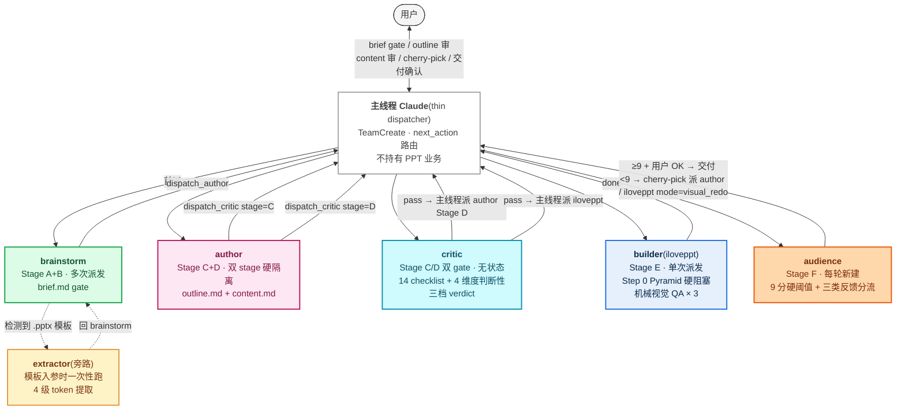
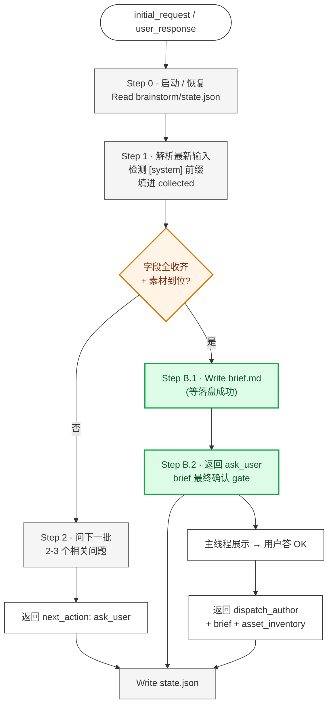
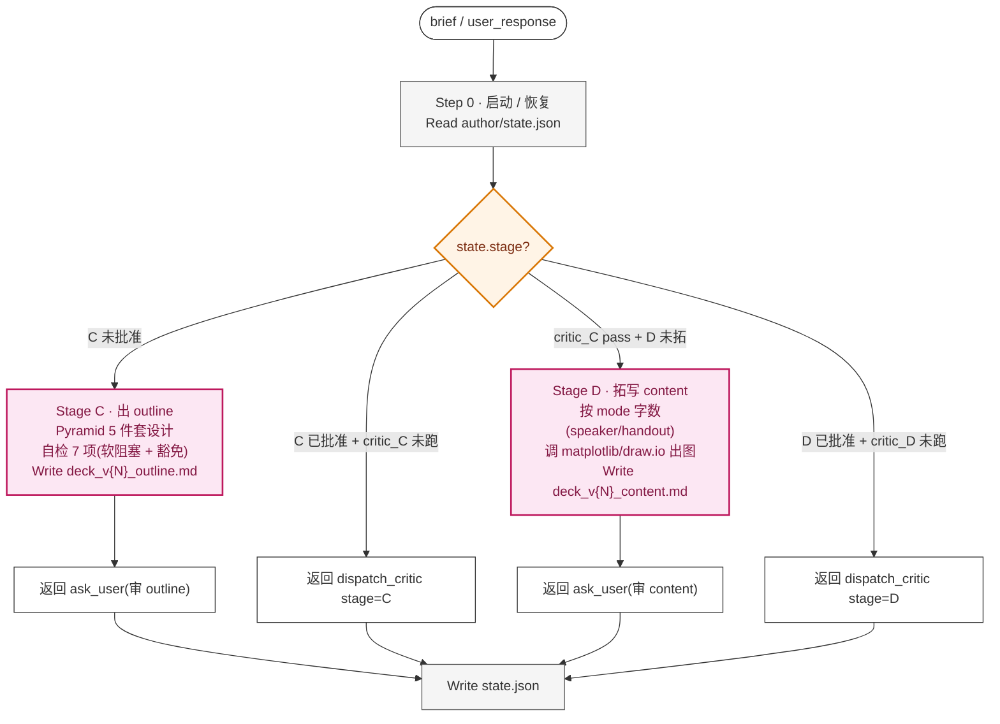
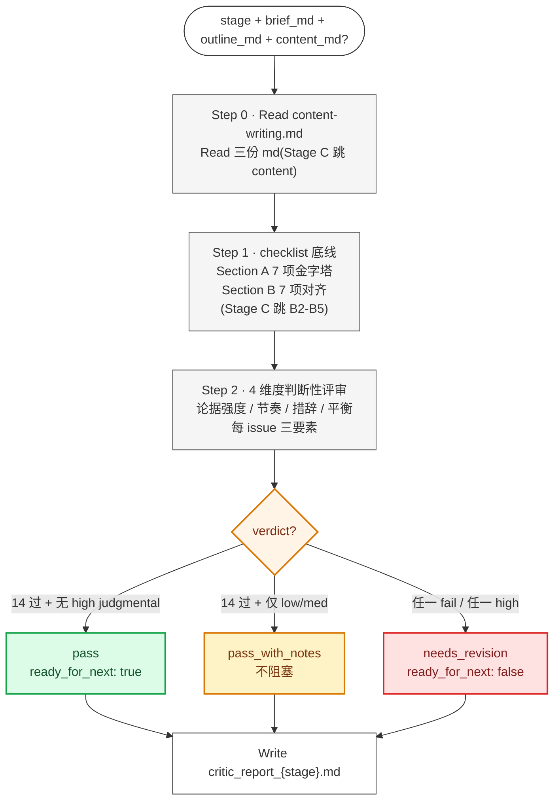
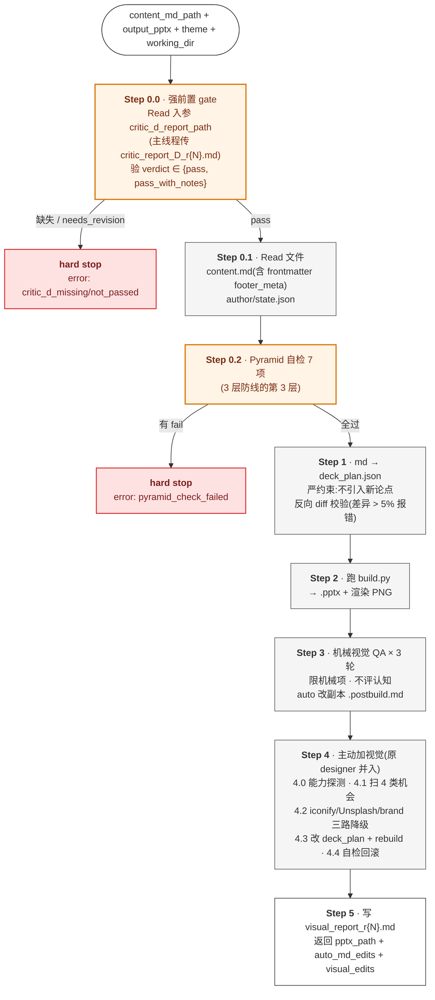
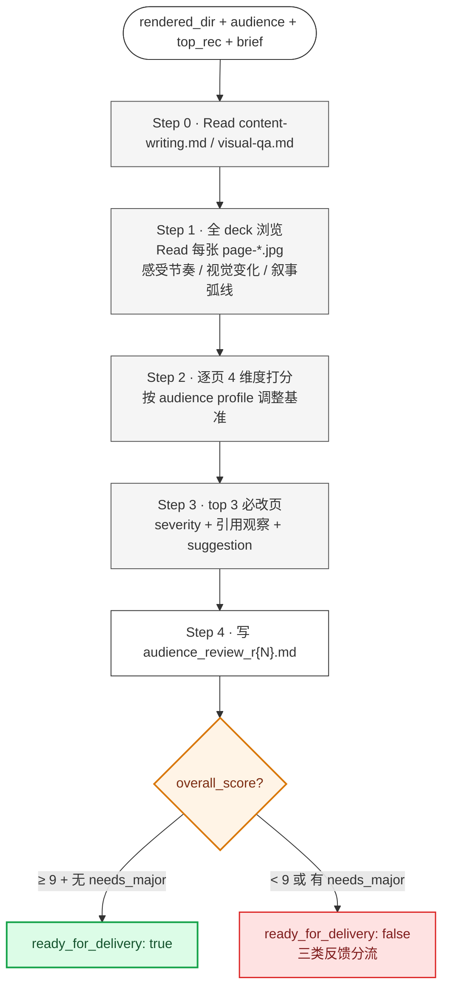
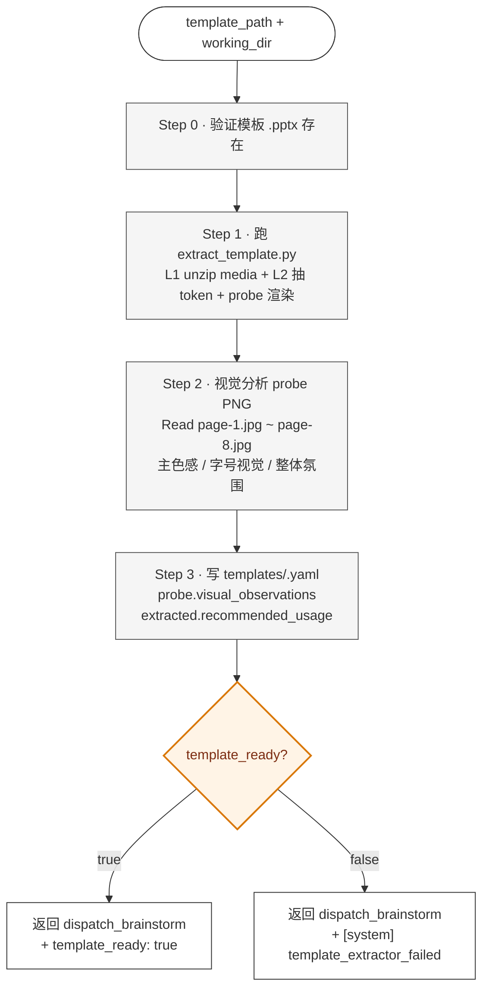
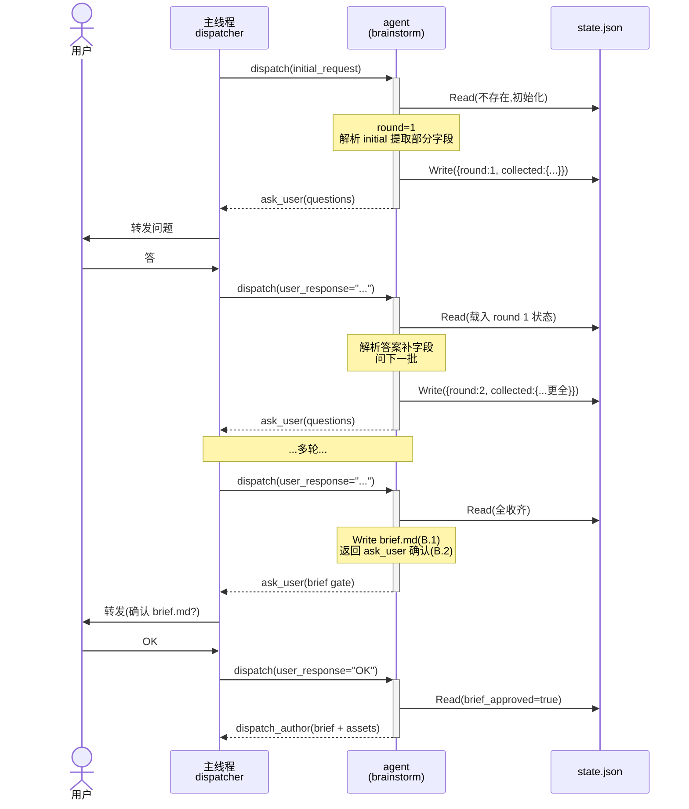
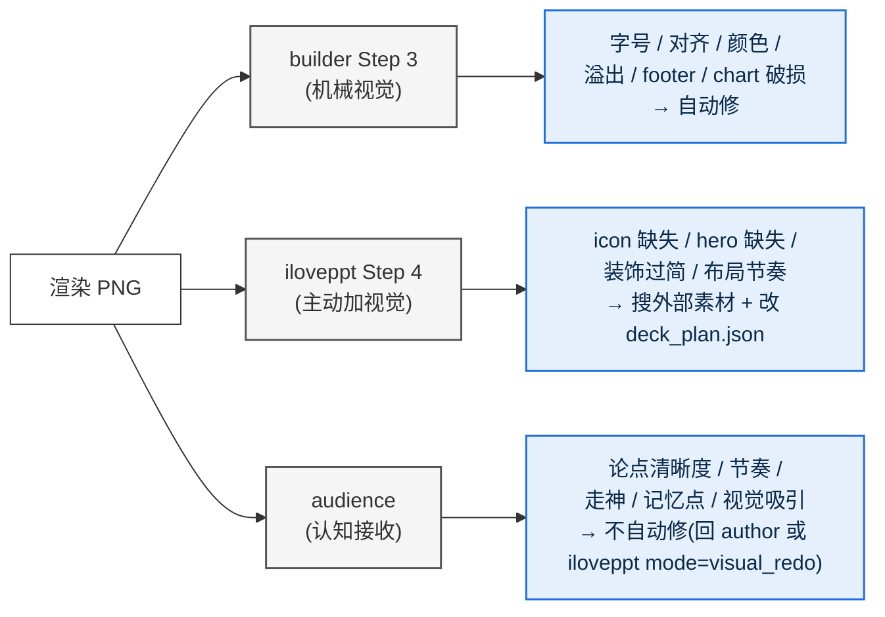

# iLovePPT Agent 工作原理

> 这份文档讲清楚 iLovePPT **怎么工作的** —— 流水线架构、5 agent + 1 旁路职责、协作机制、关键设计决策、接口契约。适合想理解或改造系统的人;不是用户操作手册(那个看 [`${CLAUDE_PROJECT_DIR}/docs/MANUAL.zh.md`](${CLAUDE_PROJECT_DIR}/docs/MANUAL.zh.md))。
>
> *运行时活协议(权威):[`${CLAUDE_PROJECT_DIR}/.claude/pipeline-protocol.md`](${CLAUDE_PROJECT_DIR}/.claude/pipeline-protocol.md)*

---

让 LLM 一次性生成完整 PowerPoint deck,通常是"看着像但读起来空、视觉糙、论据弱" —— 单 agent 既要拓写又要自检,有结构盲区(自己写的自己评不出来)、有窗口污染(对话上下文挤掉细节)、有质量门含糊(没有"何时该 fail")。

**iLovePPT 把"写 PPT"拆成 thin dispatcher 协调下的 5 专业 agent + 1 旁路接力流水线**:每个 agent 独立窗口、单一职责;通过 `next_action` 路由 + state file + brief.md / outline.md / content.md / deck_plan.json 四重接缝协作;critic 双 gate + audience 9 分硬阈值 + 用户最终确认共同把质量底线托起来。

---

## 目录

- [§ 1. 流水线是 5 agent 接力 + 1 旁路](#-1-流水线是-5-agent-接力--1-旁路)
- [§ 2. 每 agent 职责不重叠](#-2-每-agent-职责不重叠)
- [§ 3. 4 机制串成流水线](#-3-4-机制串成流水线)
- [§ 4. 6 决策撑起架构](#-4-6-决策撑起架构)
- [§ 5. 速查参考](#-5-速查参考)

---

## § 1. 流水线是 5 agent 接力 + 1 旁路

主线程 Claude 检测到 PPT 意图后,**必须** `TeamCreate` 建 team,然后按 `next_action` 路由把任务派给 5 个专业 agent + 1 个模板旁路。主线程**不持有任何 PPT 业务逻辑**,只做派单 + 跨窗口转发。

### 1.1 thin dispatcher 只路由不持业务

主线程的职责严格限定为 4 件:

1. 检测 PPT 意图(关键词命中 / 用户给 .pptx 模板 / `working_dir` 已有产物要续接)
2. `TeamCreate team_name=iloveppt-<slug>` 建 team
3. 按 agent 返回的 `next_action` 派下一个 agent / 转发问题给用户
4. 把交付物路径(`brief.md` / `outline.md` / `content.md` / `deck_plan.json` / `.pptx`)跨窗口 `SendMessage`

主线程**不**写 brief、**不**写 content、**不**自己跑视觉 QA。**反例**:主线程"为了快"自己重写整份 deck content + 自己跑 visual check —— 这是常见越权,会让 PPT 任务污染主线程 context、丢可移植性。正确做法是派 author + 派 audience。

### 1.2 5 agent + 1 旁路按 5 段接力

| 段 | agent | 干什么 |
|---|---|---|
| **内容生产** | `iloveppt-brainstorm` | Stage A-B:多轮对话收 brief + 素材,出 `brief.md` 让用户确认 |
| ↓ | `iloveppt-author` | Stage C-D:出 `outline.md`(章节骨架)+ 拓写 `content.md`(全文) |
| **评审** | `iloveppt-critic` | Stage C 和 Stage D 各跑一次:14 项 checklist + 4 维度判断性 + 三档 verdict |
| **构建 + 视觉** | `iloveppt` | Stage E:Pyramid Step 0 自检 → md→JSON → `build.py` → 机械视觉 QA(Step 0-3)→ **Step 4 主动加视觉**(iconify / Unsplash / brand 三路降级) · 一气呵成 |
| **受众评分** | `iloveppt-audience` | Stage F:模拟目标受众读 deck,9 分硬阈值 + 三类反馈分流 |
| 旁路 | `iloveppt-template-extractor` | 用户给 .pptx 模板时一次性跑:提取 4 级 token(媒体 / 主色 / 字体 / 视觉风格) |

**关键 checkpoint**(用户决定权):brief.md 确认 → outline.md 审 → critic Stage C 报告 cherry-pick → content.md 审 → critic Stage D 报告 cherry-pick → audience 报告 cherry-pick → 最终交付确认。

**关键接缝**(机器接口):`brief.md` → `outline.md` → `content.md` → `deck_plan.json` → `.pptx`。每个接缝都是修错代价低的窗口。

### 1.3 流水线总图



---

## § 2. 每 agent 职责不重叠

5 个 agent + 1 旁路的职责严格分离 —— author 不评审、critic 不重写、iloveppt Step 3 不评认知、iloveppt 不动 content.md、audience 不自动修。**功能不重叠是设计原则,不是巧合**:任何两个 agent 职责重叠都会导致"该谁负责"歧义,系统性下降。

### 2.1 brainstorm:收 brief + 素材 + brief.md gate

**职责**:跟用户多轮对话挖需求 + 收素材清单 → 写 `brief.md` → 等用户确认 → 派 author。

**必收齐字段**:`audience` / `duration_min` / `top_recommendation` / `theme` / `output` / **`presentation_mode`**(speaker / handout)。

**brief.md gate**:字段收齐后**串行两步**(不并行):
1. `Write brief.md`(落盘成功)
2. 返回 `ask_user` 给用户做最终确认

用户回 OK 才 `dispatch_author`。**理由**:author 是流水线第一个昂贵动作(出图 + 大段拓写),brief 错了在这里改代价最低。增量复述只能 catch 字段粒度问题,这道 gate 是**组合粒度** —— catches "字段单独对、组合起来论点不成立"。

**[system] 前缀响应**:
- `[system] template_extractor_failed` → 跟用户对话三选一(装依赖重试 / 降级 tech_blue / 终止)
- `[system] critic_blocked` → critic 5 轮卡死,跟用户对话调 brief

**软上限**:`round >= 10` 时主线程附"叫停 / 继续"选项给用户,可用 `force_dispatch: true` 强制 brainstorm 用默认值兜底。



**反例**:brainstorm 一次性问完 6 字段 → 用户回答又乱又长 → brainstorm 解析错 → 后续 author 跑偏。正确做法是每轮问 2-3 个相关问题,collected 字段持续累积。

详细 agent 文件:[`${CLAUDE_PROJECT_DIR}/.claude/agents/iloveppt-brainstorm.md`](${CLAUDE_PROJECT_DIR}/.claude/agents/iloveppt-brainstorm.md)

### 2.2 author:Stage C/D 硬隔离出 outline + content

**职责**:基于 brief + 素材清单,**按金字塔原理** 出 outline.md(Stage C)+ 拓写 content.md(Stage D)。两个 stage **分两次派发**,不在同一次派发里连续跑。

**金字塔原理 5 件套**(Stage C 必跑自检 7 项):
- ① 单一顶端论点
- ② SCQA 开场
- ③ 答案在前(BLUF)
- ④ 横向 MECE 3-5
- ⑤ 纵向疑问链
- ⑥ 字段完整
- ⑦ action title ≤ 24 字

**自检不过强制二选一**:豁免附理由(写 `state.pyramid_known_issues`)或 改 outline。**不接受**"先放着" / "不管它"含糊回答。

**Stage 硬隔离**:Stage C 批准 outline → 返回主线程派 critic stage=C → critic pass → 主线程**再派一次** author(stage=D)才开始 Stage D。**理由**:Stage D 出图 + 拓 content 是分钟级动作,每个昂贵动作独立派发,主线程可见性 + 用户可中途叫停。

**md 文件是 SSOT,state 只记 approval**:author 不维护 md 的 hash/mtime,每次派发都 `Read deck_v{N}_outline.md / content.md` 当唯一真相源。用户在 md 里直接改了 → 下次派发 Read md 自然加载新内容,询问"批准当前版本?"。

**接收 critic / audience 反馈**:主线程把**用户筛过**的反馈作为 `user_response` 自然语言指令传给 author。author **不读** `critic/critic_report_{C,D}_r{N}.md` / `audience/audience_review_r{N}.md` 原文(避免被未筛建议干扰)。



**反例**:Stage C 批准 outline 后 author 在同一次派发里继续拓 content → 主线程看不到中间状态、用户无法中途叫停 → content 出完发现结构问题、整个 Stage D 浪费。

详细 agent 文件:[`${CLAUDE_PROJECT_DIR}/.claude/agents/iloveppt-author.md`](${CLAUDE_PROJECT_DIR}/.claude/agents/iloveppt-author.md)

### 2.3 critic:14 checklist + 4 维度判断 + 三档 verdict

**职责**:**partner 评审员**(不是合规检查员)。除跑 14 项 checklist 底线外,还跑 **4 维度判断性评审**(beyond checklist 的核心价值)。Stage C(用户批准 outline 后)和 Stage D(用户批准 content 后)各跑一次。

**14 项 checklist 底线**:

- **Section A · 金字塔结构(7 项,Stage C/D 都跑)**:A1 单一顶端论点 / A2 SCQA 完整 / A3 BLUF / A4 MECE 3-5 / A5 纵向疑问链 / A6 横向逻辑同类 / A7 action title ≤ 24 字
- **Section B · brief→content 对齐(Stage C/D 适用项不同)**:B1 top_recommendation 字面一致(C/D 都跑)/ B2 SCQA 承接(仅 D)/ B3 audience tone(仅 D)/ B4 asset 交代(仅 D)/ B5 无 brief 外新事实(仅 D)/ B6 duration 估算(C/D 都跑)/ B7 字数限制

**4 维度判断性评审**(核心价值):

- **维度 1 论据强度**:章节论据是否 sharp?有"合 MECE 但弱论据"吗?
- **维度 2 节奏感**:章节顺序 / 过渡 / 篇幅分布
- **维度 3 措辞质感**:action title 是结论句还是话题?数字 vs 形容词比?
- **维度 4 整体平衡**:章节篇幅 / summary 收口 / BLUF

每个判断性 issue 强制三要素:`severity (high/med/low) + impact (读者会怎么感受) + suggestion (具体到页号/字段/layout)`。

**三档 verdict**:

| verdict | 触发 | 主线程怎么处理 |
|---|---|---|
| `pass` | checklist 全过 + 无 high severity 判断性 | 派下一步(C→author Stage D;D→builder) |
| `pass_with_notes` | checklist 全过 + 仅 low/med severity | 展示 notes 给用户,**不阻塞**,用户选"接受 notes 进下一步"或"先改一遍" |
| `needs_revision` | 任一 checklist fail **或** 任一 high severity | 展示 report,用户 cherry-pick,派 author 改 |

**5 轮上限**:Stage C / Stage D 独立计数,同 stage 第 5 轮仍 `needs_revision` → 主线程问用户四选一(继续改 / 接受当前 / 终止 / 回 brainstorm 改 brief)。选"回 brainstorm" 时主线程把 report 路径作为 `[system] critic_blocked` 标记 SendMessage 给 brainstorm,brainstorm 重开窗口跟用户对话调 brief。



**人设**:做过 50+ deck pitch + 30+ partner review 的资深合伙人。敢说狠话,evidence-based,不打圆场不油腻。

**反例**:critic 只跑 14 checklist 不做判断性评审 → "字段都对、跑通了、但读起来不顺" 类问题溜过 → audience 阶段才发现 → 反复 5 轮回不来。判断性评审是 critic 不可替代的价值。

详细 agent 文件:[`${CLAUDE_PROJECT_DIR}/.claude/agents/iloveppt-critic.md`](${CLAUDE_PROJECT_DIR}/.claude/agents/iloveppt-critic.md)

### 2.4 iloveppt:机械 build + Step 4 主动加视觉

**职责**:接 author 和 critic 双 pass 的 `content.md`,做两件事一气呵成:**(1) 机械构建 `.pptx`**(Step 0-3:critic gate + Pyramid + md→JSON + build.py + 机械视觉 QA × ≤ 3 轮)+ **(2) 主动加视觉**(Step 4:iconify / Unsplash / brand assets 三路降级,改 deck_plan.json + rebuild + 自检回滚)。**单次派发完成**,主线程直接派 audience(无 designer 中间层)。

**v0.5.6 合并历史**:原 `iloveppt`(builder)+ `iloveppt-designer` 是两个独立 agent,跨 dispatch 接力。v0.5.6 物理合并为单 `iloveppt` agent,Step 4 内嵌"主动加视觉",dispatch 效率翻倍。

**Step 0 强前置 gate**:
- `Read 入参 critic_d_report_path`(主线程传具体 `critic_report_D_r{N}.md`)→ verdict ∈ {`pass`, `pass_with_notes`}
- 缺失 / `needs_revision` 立即 **hard stop**,返回 `error: critic_d_missing/not_passed`
- **不允许跳过 critic gate**

**Step 0.2 Pyramid 自检 7 项**(3 层防线的第 3 层):基于当前 md 文件状态(含用户手改后版本)独立跑,不信任 author 自检结果。检出 fail 时 hard stop,附 `author_known_issues_note`(若 author 已豁免)。

**视觉 QA 限机械项**:字号 / 对齐 / 颜色 / 溢出 / 留白 / footer / chart 破损。**不评**"读者认知接收"(那是 audience 的活)。

**Step 3.4 改副本**:auto_md_edits 写到 `deck_v{N}_content.postbuild.md`,**不动原文** `deck_v{N}_content.md`(原文是用户批准的 SSOT)。



**3 层 Pyramid 防线**(质量优先,接受冗余):author Stage C 自检(软阻塞)→ critic(Stage C + Stage D 强阻塞)→ builder Step 0 硬阻塞。3 层各跑 Pyramid 看似冗余,但角色清晰:author 自检不够独立、builder Step 0 不查 brief 对齐 —— 缺哪一层都有盲区。

**反例**:builder 把 auto_md_edits 写回原文 `content.md` → 用户后续看不出"我批准的是哪个版本" → 信任链断。改副本 `.postbuild.md` 保留原文不可变。

详细 agent 文件:[`${CLAUDE_PROJECT_DIR}/.claude/agents/iloveppt.md`](${CLAUDE_PROJECT_DIR}/.claude/agents/iloveppt.md)

### 2.5 audience:9 分硬阈值 + 三类反馈分流

**职责**:模拟目标受众第一次读 PPT,从**读者视角**给评分 + 改进建议。每轮新建窗口,无状态。

**4 维度评分**(认知接收):`comprehension_5s` / `info_density` / `visual_appeal` / `flow_coherence`。按 audience profile 具象化人设:

- `executive` = 50 岁高管,5 秒决定要不要读
- `technical` = 资深工程师,跳到架构 / 数据
- `general` = 普通职场人,术语过多就出戏
- `sales` = BD / 销售,看卖点 + 对标 + CTA

**9 分硬阈值**:`ready_for_delivery: true` 硬条件 = `overall_score ≥ 9` 且无 `needs_major_revision` 页。**理由**:行业惯例"7-8 合格"会让 deck 永远卡在低分(差不多就过)。9 分代表"真正打磨过",audience 必须**敢区分** 7/8/9/10。

**严格分工**:audience 只评**认知接收**(论点清晰度 / 节奏 / 走神 / 记忆点),**不评**机械视觉(字号 / 对齐 / 颜色 —— builder Step 3 的活),**不主动改**(发现视觉问题通过 `needs_visual_redo` 分类反馈,用户 cherry-pick 后派 iloveppt mode=visual_redo 重跑)。

**三类反馈分流**:

- `needs_author_rewrite: [pages]` → **文字 / 论点 / 结构问题** → 派 author 改 content
- `needs_visual_redo: [pages]` → **视觉素材 / icon 选错 / 装饰过头** → 派 iloveppt mode=visual_redo
- `needs_theme_fix: [pages]` → **theme 层视觉**(主线程改 `themes/tech_blue.py`)

**修复顺序**:author rewrite 先(若 content 改)→ theme fix(若 theme 改)→ 重派 iloveppt mode=full;visual_redo 只时(无 content/theme 改)→ 派 iloveppt mode=visual_redo。理由:content 改后 iloveppt Step 4 要重新加 icon;theme 改完所有都要重 build。

**5 轮上限**:audience-author-iloveppt 循环上限 5 轮,第 5 轮 < 9 时主线程问用户四选一(继续 / 接受 / 终止 / 回 brainstorm 改 brief)。



**反例**:audience 给所有页打 8 分讨好用户 → "差不多就过"的低标 → ship 的 deck 远没达到"打磨过"水准 → 9 分硬阈值就是治这个。

详细 agent 文件:[`${CLAUDE_PROJECT_DIR}/.claude/agents/iloveppt-audience.md`](${CLAUDE_PROJECT_DIR}/.claude/agents/iloveppt-audience.md)

### 2.6 extractor(旁路):提取 .pptx 模板 4 级 token

**职责**:当用户提供 `.pptx` 模板时,提取媒体 + 4 级 token + 跑 probe deck + 视觉分析,让 author 拓写时能用上模板视觉资产。**一次性任务,不多轮派发**。

**嵌套 handoff**(`brainstorm → extractor → brainstorm`):主线程当邮局中转两跳,agent 不允许嵌套派 agent。**brainstorm 窗口在 extractor 跑期间保留 idle**(handoff 通则的唯一例外) —— extractor 耗时 1-3 分钟,跑完立刻回 brainstorm,关再开是无谓开销。

**失败处理**:`template_ready: false` 时用 `[system] template_extractor_failed` 前缀返回 brainstorm,brainstorm 跟用户对话三选一(装依赖重试 / 降级 tech_blue / 终止)。



详细 agent 文件:[`${CLAUDE_PROJECT_DIR}/.claude/agents/iloveppt-template-extractor.md`](${CLAUDE_PROJECT_DIR}/.claude/agents/iloveppt-template-extractor.md)

---

## § 3. 4 机制串成流水线

7 个 agent 不直接互相调用 —— 全靠 4 个机制让主线程把它们串成流水线:状态恢复(state file)、路由协议(next_action)、产物接缝(brief / outline / content / deck_plan)、质量门(critic + audience + 用户)。这 4 个机制各管一头,MECE 互不替代。

### 3.1 多次派发 + state file 实现多轮对话

**问题**:subagent 是单次派发(派一次跑完返回),怎么实现多轮对话?

**答案**:**多次派发同一 agent**,每次启动时 Read 自己的 state file 恢复进度;返回前 Write state 把最新状态写盘。



**state file 位置**(在 `working_dir` 下):

- `brainstorm/state.json` —— brainstorm(round / collected / asset_inventory / brief_md_path / brief_approved)
- `author/state.json` —— author(stage / approvals / iteration / pyramid_known_issues)
- iloveppt / critic / audience / extractor —— **无 state file**(单次派发或无状态,所有 state 在产物 .md 里)

**为什么这套机制 work**:

- agent 在新 context 中启动时,state file 是它的全部记忆来源
- 主线程不需要"记得"对话历史 —— 那是 agent 自己的事
- 跨 session / 跨用户 / 重启 Claude Code 都能恢复

**反例**:主线程自己维护对话历史 → 主线程 context 爆 → context 限额浪费在 PPT 对话上。state file 让记忆下沉到 agent + 持久化到磁盘。

### 3.2 next_action 是统一路由协议(7 种动作)

所有 agent 返回都遵守统一 schema,主线程按 `next_action` 路由:

```yaml
next_action: ask_user
              | dispatch_brainstorm
              | dispatch_author
              | dispatch_critic
              | dispatch_iloveppt
              | dispatch_audience
              | dispatch_template_extractor
              | report_complete         # critic / iloveppt visual / audience
              | done                    # builder 最终
              | error

# next_action == ask_user 时:
message_to_user: "<给用户的话>"
questions: [...] | "<开放问题>"

# next_action == dispatch_* 时:
dispatch:
  agent: <agent-name>
  args: {...}

# next_action == report_complete (critic / iloveppt visual / audience) 时:
report_path: ...
verdict: pass | pass_with_notes | needs_revision   # critic
overall_score: 9.2                                 # audience
visual_edits_count: 8                              # iloveppt Step 4
ready_for_next / ready_for_audience / ready_for_delivery: true | false

# next_action == done 时(builder):
pptx_path: ...
auto_md_edits: [...]
review_needed: [...]
```

主线程的伪代码:

```
loop:
  ret = dispatch(current_agent, current_args)
  switch ret.next_action:
    case "ask_user":
      show(ret.message_to_user + ret.questions)
      current_args.user_response = wait_for_user()
    case "dispatch_*":
      current_agent = ret.dispatch.agent
      current_args = ret.dispatch.args
    case "report_complete":
      if critic and (pass or pass_with_notes):
        派下一步(C → author Stage D;D → builder)
      elif audience and overall_score >= 9:
        展示给用户做最终确认 → 交付
      else:
        展示 report 给用户 → cherry-pick → 派 author 或 iloveppt mode=visual_redo
    case "done":
      iloveppt 完成 → 派 audience(无 designer 中间层)
```

主线程**零业务逻辑** —— 只是状态机的转发者。

**反例**:每个 agent 自己定义返回格式 → 主线程要写 7 套解析逻辑 → 加新 agent 要改主线程。统一 `next_action` schema 让主线程跟具体 agent 解耦。

### 3.3 多重接缝让错误在低代价窗口修


**为什么这么多接缝**:

- `brief.md` —— **用户对 brainstorm 输出的确认 gate**(防 brief 漂)
- `outline.md` —— **用户对结构的审 + critic Stage C 审**(防结构跑偏)
- `content.md` —— **用户对全文的审 + critic Stage D 审**(防文字漂)
- `deck_plan.json` —— **机械构建接口**(build.py 测试覆盖,evals 守护)
- builder 做 md → JSON 转换时**严约束**:不引入新论点 + 反向 diff 校验(差异 > 5% 报错)

每个接缝都是一个**修错代价低的窗口**。越早错越好修,越靠后越贵:brief 错改成本 1 单位 / outline 错改成本 5 / content 错改成本 50 / pptx 错改成本 500。

**反例**:LLM 直接出 .pptx 不留 markdown 接缝 → 用户审不了 / 改不了 / 跑不了回归测试 → 出问题只能整 deck 重生。markdown-first 设计就是治这个。

### 3.4 三层质量门托起底线

iLovePPT 不靠单一 gate,而是三层质量门交替过滤,质量优先接受冗余:


**三层质量门各管什么**:

| 层 | 阻塞性 | 角色 |
|---|---|---|
| **author 自检 + critic 双 gate + builder Step 0** | 软 + 强 + 硬阻塞 | **Pyramid 结构 + brief 对齐**(3 层都跑结构自检) |
| **audience 9 分硬阈值** | 5 轮 cap 内强阻塞 | **读者认知接收**(论点清晰 / 走神 / 记忆点) |
| **用户最终确认** | 软规则 | **最终决策权**(即使 audience 9.5 用户也可"再调调") |

**3 层 Pyramid 防线看似冗余,但角色清晰**:author 自检不够独立(自己写的自己评不出来)、builder Step 0 不查 brief 对齐 —— 缺哪一层都有盲区。

**critic 5 轮上限 + audience 5 轮上限独立计数**:某 gate 卡死(第 5 轮还没过)时主线程问用户四选一(继续改 / 接受当前 / 终止 / 回 brainstorm 改 brief),不无限循环。

**双闸门最终交付**:`audience ≥ 9` 是质量底线(硬) + `用户确认` 是最终决策(软)。即使 audience 给 9.5,用户仍可以说"再调调",回 author。

**反例**:只靠"用户最终确认"一道门 → 用户既无 evidence 又有 friction → "差不多就过" → ship 质量参差。Critic + audience 提供 evidence,用户在 informed 状态下决策。

---

## § 4. 6 决策撑起架构

上面 3 章描述 WHAT 和 HOW,这章解释 WHY —— 6 条决策是这套架构能 work 的前提,改任何一条都会改变流水线性质。

### 4.1 build.py 纯机械不调 LLM

最重要的接缝约束:

```
┌──────────┐   deck_plan.json   ┌──────────┐
│ builder  │ ─────────────────→ │ build.py │
│ (LLM 推) │   纯数据,无歧义     │ (机械)   │
└──────────┘                    └──────────┘
```

- **可重放**:任何人拿着 `deck_plan.json` 跑 `python3 build.py` 都出一模一样的 .pptx
- **可调试**:出问题先看 JSON —— 是 builder 转错,还是 build.py 渲染错?一目了然
- **可测试**:`${CLAUDE_PROJECT_DIR}/evals/run_eval.sh` 跑固定 plan 验证 build.py 没回归,不掺 LLM 不确定性

**LLM 不确定性被严格隔离在 builder 步骤**(Step 1 md→JSON 转换)。一旦 JSON 落盘,后续 build.py / 渲染 / 测试全是确定性流程。

**提升生成质量改 prompt 文档**(`content-writing.md` / `visual-qa.md`),**不要**改 `build.py`。

### 4.2 主线程退化为 thin dispatcher

主线程**不持有任何 PPT 业务逻辑** —— 只是 next_action 状态机的转发者 + `TeamCreate` 建 team。

**为什么**:

- 主线程是用户的"通用 chat 伙伴",不应被 PPT 任务污染 —— 用户可以同时跟主线程聊代码 / debug / 别的事
- 业务逻辑放主线程 → 不可移植;放 agent → 可发现可移植(`@agent` 触发)
- 主线程上下文限额宝贵,不要塞 30K tokens 的 outline / content

每个 teammate 独立 context,各自清爽,不互相污染。跨窗口消息透明,用户可以同时看到所有 agent 状态。

### 4.3 critic 是 partner 评审员而非合规检查员

如果 critic 只跑 14 项 checklist 不做判断性评审,会出现"字段都对、跑通了、但读起来不顺"的问题 —— 这种问题 checklist catch 不到,要靠 partner 视角的 4 维度判断(论据强度 / 节奏 / 措辞 / 平衡)。

**三档 verdict** 是关键设计:

- `pass` / `pass_with_notes` 都允许进下一步,但 `pass_with_notes` 把 low/med 建议展示给用户决定
- 避免"差一项就 fail"刻板,也避免"全过了但读着不顺"放过

**人设具象化**(资深合伙人)让 critic 敢说狠话,evidence-based,不油腻打圆场。

### 4.4 视觉 QA 三方严格分工



**三方各占一头,不允许功能重叠**:

- builder Step 3 = 机械项,**可量化、可自动修**(字号偏小 14pt → 18pt)
- designer = 主动加视觉,**搜外部素材**(card 无 icon → iconify 找)
- audience = 认知评分,**给反馈不自己修**(用户 cherry-pick 后才派对应 agent)

**判断归属的简单规则**:

- "page 5 字号 14pt 偏小" → builder(机械可量化)
- "page 5 没 icon 找不到落点" → designer(可加视觉)
- "page 5 论点不清" → audience(认知,反馈给 author 改 content)

### 4.5 cherry-pick 不强耦合,用户决策

audience / critic 返回 `needs_revision` / `< 9` 时,主线程**不直接**把建议转发给 author。流程:

1. 主线程展示 report 给用户
2. 用户 cherry-pick("接受 page 5/13 建议,page 8 我不改")
3. 用户筛过的部分作为 `user_response` 自然语言指令派给 author / designer

**理由**:audience / critic 的反馈是给"作者 + 用户"两方看的建议,**用户是最终决策者**。不允许"audience/critic 命令 author/designer"的强耦合。

**反例**:audience top_3_must_fix 直接转 author → 用户没机会过滤 → audience 哪怕误判一条 author 也照改 → 无限改不收敛。cherry-pick 让用户当 gate。

### 4.6 SSOT 在 helpers.py

颜色 / 字体 / 尺寸只在 `${CLAUDE_PROJECT_DIR}/.claude/skills/pptx/helpers.py`:

```python
BRAND_PRIMARY = RGBColor(0x0A, 0x52, 0xBF)   # AAA 7.00:1 对比度
FONT_CN       = "Microsoft YaHei"
SLIDE_W       = Inches(13.333)
FOOTER_TOP    = Inches(7.0)
```

所有 theme / build.py / 测试都引用这些常量,**不复制**。markdown 文档不能 import,所以 `design-system.md` / `diagram/*.md` 里的 hex 值是**标注过的拷贝**,引用 `helpers.py` 为权威,色板变了要手动同步。

**改色或改字体 = 只改 `helpers.py` 一处**,会传到 theme 和所有 helper 默认值。

**反例**:每个 theme 文件重新定义自己的色板 → 改 BRAND_PRIMARY 要改 8 处 → 漏改导致 deck 颜色不一致。SSOT 让"一处改全仓生效"。

---

## § 5. 速查参考

前 4 章讲了"是什么 / 干什么 / 怎么协作 / 为什么这么设计"。这章给出"具体怎么读懂一次调用 + 怎么改 agent 输入 + 怎么找更深资料"的速查参考。

### 5.1 一次典型调用 timeline(22 分钟 case)

假设你说:`帮我做一份"评审办法 v1.0"的 PPT,15 分钟,技术受众`

```
T+0s     主线程检测 PPT 意图 → slug=审办法-v1
         mkdir decks/审办法-v1/
         TeamCreate team_name=iloveppt-审办法-v1
         SendMessage brainstorm

=== Stage A · brainstorm 派发 #1 ===
T+10s    返回 ask_user(顶端论点?theme?素材?presentation_mode?)

─── 用户答 ───

=== Stage A · brainstorm 派发 #2 ===
T+1.5m   Step B.1: Write brief.md(落盘)
         Step B.2: 返回 ask_user(brief gate)

─── 用户审 brief.md,回 OK ───

=== Stage A · brainstorm 派发 #3 ===
T+2m     返回 dispatch_author(stage=C)
         主线程关闭 brainstorm 窗口

=== Stage C · author 派发 #1 ===
T+3m     按 Pyramid 设计 outline + 自检 7 项
         Write deck_v1_outline.md
         返回 ask_user(审 outline)

─── 用户改了第 3 节标题,回 "批准" ───

=== Stage C · author 派发 #2 ===
T+4m     返回 dispatch_critic(stage=C)

=== critic Stage C ===
T+5m     verdict: pass_with_notes
         (维度 3 措辞 med · page 5 action title 改数字驱动)

─── 用户答 "接受 notes 进 Stage D" ───

=== Stage D · author 派发 #3 ===
T+8m     调 matplotlib 出 Q4 chart
         Write deck_v1_content.md(20 页 + 嵌图)
         返回 ask_user(审 content)

─── 用户审,直接 edit content.md 第 5 页一个数字,回 "批准" ───

=== Stage D · author 派发 #4 ===
T+10m    返回 dispatch_critic(stage=D)

=== critic Stage D ===
T+11m    verdict: pass

=== Stage E · builder 派发 ===
T+11.1m  Step 0.0: Read 入参 critic_d_report_path (critic_report_D_r1.md) → verdict=pass ✓
T+11.5m  Step 0.2: Pyramid 自检 → 全过
T+13m    跑 build.py → .pptx + 20 PNG
T+14m    Step 3 视觉 QA 第 1 轮:发现 page 7 字号偏小
T+14.5m  改副本 content.postbuild.md → rebuild
T+15.5m  第 2 轮:全过
T+16m    返回 done(pptx + auto_md_edits[1 条])

=== Stage E.5 · designer 自动派发 ===
T+16.2m  Step 0: cairosvg ✓ / UNSPLASH_KEY 未设(跳过 hero)
T+17m    Step 2: iconify 搜 lucide 5 个 icon → 下载 SVG → cairosvg → PNG
T+18m    Step 3: 重 build → 新 pptx + 新 render
T+19m    Step 5: ready_for_audience: true

=== Stage F · audience 派发 ===
T+19.5m  按 technical profile 读 20 PNG 评分
T+21m    overall_score=9.1 · 写 audience_review_r1.md
         (有了 icon 后 visual_appeal 大幅提升)
         ≥ 9 ✓,主线程展示给用户做最终确认

─── 用户答 "OK 交付" ───

T+22m    主线程写 STATUS.md(quality_grade: A)
         关闭 team · 展示路径清单给用户
```

**总耗时**:~22 分钟。用户实际投入对话 ~5-8 分钟,其余是 agent 工作时间。

额外耗时换来的质量保证:critic 双 gate(避免 outline 错跑完 content 才发现)+ designer 视觉优化(audience 评分从 8.6 → 9.1)+ audience 9 分硬阈值 + 双闸门。

### 5.2 主线程 → agent 入参契约

```yaml
# 通用必填
working_dir: /abs/path/to/decks/<slug>/

# brainstorm 初次派发
initial_request: "<用户原话逐字粘贴>"
# 注:iloveppt_root 已于 2026-05-25 废弃(cwd = iLovePPT 仓库根 = ${CLAUDE_PROJECT_DIR})

# brainstorm 续轮
user_response: "<用户答内容>"
# 或 force_dispatch: true(round ≥ 10 用户叫停后)
# 或 [system] template_extractor_failed / critic_blocked 前缀

# author 初次派发
stage: C | D
brief: {audience, duration_min, top_recommendation, theme, output, presentation_mode}
asset_inventory: [...]

# critic 派发
stage: C | D
brief_md_path: <working_dir>/brainstorm/brief.md
outline_md_path: <working_dir>/author/deck_v{N}_outline.md
content_md_path: <working_dir>/author/deck_v{N}_content.md   # Stage D 必填
asset_inventory: [...]                                # Stage D 必填

# builder 派发
content_md_path: /abs/path/to/deck_v{N}_content.md
output_pptx: /abs/path/to/deck_v{N}.pptx
theme: tech_blue | <.pptx 路径>
# footer_meta 从 content.md frontmatter 读,不再走入参

# designer 派发
pptx_path: /abs/path/to/deck_v{N}.pptx
deck_plan_json_path: /abs/path/to/deck_plan.json
rendered_dir: /abs/path/to/deck_v{N}_render/
content_md_path: /abs/path/to/deck_v{N}_content.md   # 只读
brief_md_path: /abs/path/to/brief.md
designer_iteration: 1

# audience 派发
rendered_dir: /abs/path/to/deck_v{N}_render/
audience: technical | executive | general | sales
top_recommendation: ...
brief: {duration_min, scqa, presentation_mode}

# template-extractor 派发
template_path: /abs/path/to/<template>.pptx
```

完整 schema 见 [`${CLAUDE_PROJECT_DIR}/.claude/pipeline-protocol.md`](${CLAUDE_PROJECT_DIR}/.claude/pipeline-protocol.md)。

### 5.3 state file schema + 工作目录布局

**`brainstorm/state.json`** (brainstorm):

```json
{
  "agent": "iloveppt-brainstorm",
  "round": 3,
  "collected": { "audience": "...", "duration_min": 15, "top_recommendation": "...", ... },
  "asset_inventory": [{"type": "csv", "path": "...", "desc": "...", "summary": "..."}],
  "history": [{"q": "...", "a": "..."}],
  "brief_md_path": "<working_dir>/brainstorm/brief.md",
  "brief_approved": true,
  "status": "complete"
}
```

**`author/state.json`** (author):

```json
{
  "agent": "iloveppt-author",
  "stage": "D",
  "outline_md_path": "deck_v1_outline.md",
  "content_md_path": "deck_v1_content.md",
  "approvals": {"outline": true, "content": false},
  "iteration": 2,
  "pyramid_known_issues": [
    {"item": 3, "reason": "数据下周才有", "approved_at": "2026-05-24"}
  ]
}
```

critic / designer / audience / builder / extractor —— **无 state file**(产物 .md 是所有状态)。

**工作目录布局**:

```
${CLAUDE_PROJECT_DIR}/decks/<slug>/
├── STATUS.md                          ← 主线程产物(交付摘要)
│
├── brainstorm/                        ← Stage A-B
│   ├── state.json                       (round / collected / brief_approved)
│   └── brief.md                         (用户审过的 SSOT)
├── author/                            ← Stage C-D
│   ├── state.json                       (stage / approvals / pyramid_known_issues)
│   ├── deck_v1_outline.md
│   ├── deck_v1_content.md               (用户批准版,SSOT)
│   └── charts/                          (matplotlib / draw.io 出图)
├── critic/                            ← Stage C/D 双 gate · 多轮 _r{N} 累积
│   ├── critic_report_C_r1.md            (Stage C 第 1 轮)
│   ├── critic_report_C_r2.md            (若 r1 needs_revision)
│   ├── critic_report_D_r1.md
│   └── critic_report_D_r2.md
├── builder/                           ← Stage E
│   ├── deck_v1_content.postbuild.md     (builder 自动调整版,原文不动)
│   ├── deck_plan.json                   (机械接缝,可手改重 build)
│   ├── deck_v1.pptx                     (最终产物)
│   └── deck_v1_render/                  (QA 用 PNG)
├── designer/                          ← Stage E.5 · 多轮 _r{N} 累积
│   ├── designer_report_r1.md
│   ├── designer_report_r2.md            (若 audience 反馈 needs_visual_redo)
│   ├── icons/                           (iconify 下载)
│   └── hero/                            (Unsplash 下载)
├── audience/                          ← Stage F · 多轮 _r{N} 累积
│   ├── audience_review_r1.md            (第 1 轮)
│   ├── audience_review_r2.md            (若 r1 overall_score < 9)
│   └── audience_review_r{N}.md          (5 轮 cap)
├── extractor/                         ← 旁路(用户给模板时才有)
│   └── template_<name>/                 (extractor 提取的媒体)
└── _assets/                           ← 用户提供,跨 agent 共享
    ├── raw/                             (用户给的原始素材)
    ├── brand/                           (用户自带 brand assets,designer 优先用)
    └── refs/                            (用户给的参考图)
```

### 5.4 进一步阅读

| 想了解 | 看 |
|---|---|
| **运行时活协议(权威)** | [`${CLAUDE_PROJECT_DIR}/.claude/pipeline-protocol.md`](${CLAUDE_PROJECT_DIR}/.claude/pipeline-protocol.md) |
| markdown-first 设计 spec(历史决策) | `${CLAUDE_PROJECT_DIR}/docs/archive/2026-05-23-iloveppt-v3-markdown-first.md` |
| **iloveppt-brainstorm 完整 prompt** | `${CLAUDE_PROJECT_DIR}/.claude/agents/iloveppt-brainstorm.md` |
| **iloveppt-author 完整 prompt** | `${CLAUDE_PROJECT_DIR}/.claude/agents/iloveppt-author.md` |
| **iloveppt-critic 完整 prompt** | `${CLAUDE_PROJECT_DIR}/.claude/agents/iloveppt-critic.md` |
| **iloveppt(builder)完整 prompt** | `${CLAUDE_PROJECT_DIR}/.claude/agents/iloveppt.md` |
| **iloveppt(Step 4 visual) 完整 prompt** | `${CLAUDE_PROJECT_DIR}/.claude/agents/iloveppt(Step 4 visual).md` |
| **iloveppt-audience 完整 prompt** | `${CLAUDE_PROJECT_DIR}/.claude/agents/iloveppt-audience.md` |
| iloveppt-template-extractor 完整 prompt | `${CLAUDE_PROJECT_DIR}/.claude/agents/iloveppt-template-extractor.md` |
| markdown schema(outline.md + content.md) | `${CLAUDE_PROJECT_DIR}/.claude/skills/pptx-deck/content-writing.md` |
| 双模式字数表(speaker / handout) | `${CLAUDE_PROJECT_DIR}/.claude/skills/pptx-deck/content-writing.md` "双模式字数表" 章节 |
| 金字塔原理 5 件套 + 自检 7 项 + 豁免路径 | `${CLAUDE_PROJECT_DIR}/.claude/skills/pptx-deck/content-writing.md` |
| 视觉自检 17 项 checklist(机械项分工) | `${CLAUDE_PROJECT_DIR}/.claude/skills/pptx-deck/visual-qa.md` |
| 图层规划 4 类决策表 | `${CLAUDE_PROJECT_DIR}/.claude/skills/pptx-deck/diagram-planning.md` |
| draw.io / Mermaid / matplotlib 出图 | `${CLAUDE_PROJECT_DIR}/.claude/skills/diagram/SKILL.md` |
| 底层 .pptx 读写 + footer/source helper | `${CLAUDE_PROJECT_DIR}/.claude/skills/pptx/SKILL.md` + `${CLAUDE_PROJECT_DIR}/.claude/skills/pptx/helpers.py` |
| 设计 token(SSOT 源头) | `${CLAUDE_PROJECT_DIR}/.claude/skills/pptx/helpers.py` |
| 仓库架构 / 三层职责区分 | `${CLAUDE_PROJECT_DIR}/CLAUDE.md`(根目录,导航) |
| 用户操作手册 | `${CLAUDE_PROJECT_DIR}/docs/MANUAL.zh.md` |
| **Agent eval 框架** | `${CLAUDE_PROJECT_DIR}/evals/agents/README.md` |
| **Visual Patterns 知识库**(当前空库,基础设施 ready) | `${CLAUDE_PROJECT_DIR}/library/visual-patterns/README.md` |
| Visual Patterns INDEX(LLM 友好索引) | `${CLAUDE_PROJECT_DIR}/library/visual-patterns/INDEX.md` |
| Visual Patterns RAG 检索 CLI(text/image/hybrid) | `${CLAUDE_PROJECT_DIR}/library/visual-patterns/search.sh` |

---

*权威活协议:[`${CLAUDE_PROJECT_DIR}/.claude/pipeline-protocol.md`](${CLAUDE_PROJECT_DIR}/.claude/pipeline-protocol.md)*
