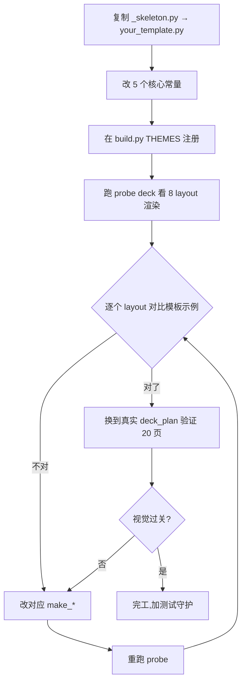

# 写自定义 theme module(Tier 2 · L3 复刻模板)

> 当你需要 PPT 视觉**完全跟着模板走**(封面 hero 图、章节扉页特殊布局、卡片精致圆角阴影、品牌装饰元素)—— Tier 1 的"提取色 + 字 + 素材"不够,你需要写 `themes/<your_template>.py`。

⚠️ **这是 1-3 天人工投入**。先看 Tier 1 [`library/pptx-templates/ingest_workflow.md`](../library/pptx-templates/ingest_workflow.md) 够不够,真不够再走 Tier 2。

## 工作量预估

| 模板复杂度 | 写 theme 工时 |
|---|---|
| 简洁(只是色+字+少量装饰) | 1 天 |
| 中等(章节扉页 + 卡片特殊样式 + icon 集成) | 2 天 |
| 重(hero 图 + 装饰元素 + 自定义 layout + 复杂背景) | 3 + 天 |

## 起点:`themes/_skeleton.py`

`themes/_skeleton.py` 是 `tech_blue.py` 的副本,加了 docstring 教你怎么改。

```bash
# 复制为你的模板名(去掉 _ 前缀,这样 import 系统会识别)
cp .claude/skills/pptx-deck/themes/_skeleton.py .claude/skills/pptx-deck/themes/company_a.py

# 在 build.py 的 THEMES 字典注册
# 当前:THEMES = {"tech_blue": _tech_blue, "template_training": _template_training}
# 加一行:THEMES = {..., "company_a": _company_a}
# 同时在 build.py 顶部加:from themes import company_a as _company_a
```

然后在 brief 里 `theme: company_a` 就走你的自定义 theme。

## 改造路线(13 个 make_* 函数 · `_skeleton.py` 覆盖 11 个,2 个新 layout 需从 `tech_blue.py` 抄)

按"视觉冲击力"从大到小排,优先改前几个:

| layout | 在 `_skeleton.py` | 模板里通常对应 | 改造重点 |
|---|---|---|---|
| `make_cover` | ✓ | 第 1 页 | 加 hero 图(用 Tier 1 提取的 cover_hero.png)/ 装饰元素 / logo |
| `make_section_divider` | ✓ | 全屏色块 + 大数字 | 跟着模板的章节扉页布局,可能要加品牌带 / 副标 |
| `make_closing` | ✓ | 谢谢页 | 加联系方式块 / 公司 logo 装饰 |
| `make_toc` | ✓ | 目录页 | 跟模板的圆点 / 编号 / 装饰条样式 |
| `make_cards` | ✓ | 内容页常用 | 圆角 / 阴影 / icon 位 / 卡片间距 |
| `make_pic_text` | ✓ | 图文混排 | 图位置 / 比例 / 卡片样式 |
| `make_compare` | ✓ | 对比页 | 分隔条 / 标题对齐 |
| **`make_compare_pk`** | ✗ 缺(从 tech_blue.py 抄) | 对决式两选一 | 中间 VS 圆样式 / 双栏对称布局 |
| **`make_matrix_2x2`** | ✗ 缺(从 tech_blue.py 抄) | BCG 矩阵 | 轴标签 / 四象限 highlight 风格 |
| `make_single_focus` | ✓ | 大数字页 | 数字字体 / 解释字位置 |
| `make_bullet_list` | ✓ | 要点页 | bullet 样式 / 缩进 / 行距 |
| `make_table` | ✓ | 表格页 | header 色 / banding 风格 |
| `make_summary` | ✓ | 结论页 | 编号块 / 列表样式 |

## 关键工程实践

### 1. 复用 helpers.py SSOT

**不要**自己写颜色 / 字体 / 几何常量。统一从 `helpers.py` 引用:

```python
import helpers as H

# ✓ 引用 SSOT
H.fix_textbox_margins(tf)
H.set_font(r, name=FONT_HEADER, size=24, color=H.GRAY_700)
H.card(s, x, y, w, h, fill=H.WHITE, border=H.GRAY_300, accent=PRIMARY)

# ✗ 不要自己复制
tf.margin_left = 0  # 别这样,用 H.fix_textbox_margins
```

### 2. 主题级常量在文件顶部

```python
# 你的模板的 5 个核心常量(从 Tier 1 enriched yaml 抄)
PRIMARY_DEEP = RGBColor(0x0B, 0x2A, 0x4A)
PRIMARY      = RGBColor(0x0B, 0x5B, 0xCC)
PRIMARY_TINT = RGBColor(0xE6, 0xF0, 0xFC)
ACCENT       = RGBColor(0xFF, 0x6B, 0x35)
FONT_HEADER  = "Source Han Sans CN"
FONT_BODY    = "Source Han Sans CN"
FONT_NUM     = "Helvetica Neue"
```

### 3. 用 layout.py 做几何

```python
import layout as L

region = L.content_region()
left, right = L.split(region, 0.42)
cards = L.columns(row, 3)
```

不要硬编码 `Inches(...)` 坐标(那是 tech_blue 的做法,容易乱)。

### 4. 嵌入模板素材

Tier 1 已经把模板的 PNG 解压到 `<working_dir>/_assets/template_<name>/`。你的 `make_cover` 直接用:

```python
def make_cover(prs, title, subtitle, *, prepared_by="", date="", ...):
    s = _blank_slide(prs)
    H.rect(s, 0, 0, H.SLIDE_W, H.SLIDE_H, PRIMARY_DEEP)

    # 嵌入模板 hero 图
    hero_path = Path(__file__).parent.parent.parent.parent / "_assets" / "template_company_a" / "cover_hero.png"
    if hero_path.exists():
        H.embed_picture(s, str(hero_path),
                        Inches(7.0), Inches(0.5),
                        height=Inches(7.0))

    # ... 标题副标在左侧
```

⚠️ **路径处理**:Tier 1 提取到的 _assets/ 在 user 的 working_dir,不在 iLovePPT repo。需要从 deck_plan.json 的 `_plan_dir` 推导,或在 brief 里显式传 working_dir。建议在 theme module 顶部加 helper:

```python
def _asset_path(rel: str) -> Path:
    """从 deck_plan.json 的 working_dir 解析 _assets/ 相对路径"""
    # ...(从 import 上下文拿 working_dir)
```

## 迭代节奏



## 测试守护

每个自定义 theme 加 `${CLAUDE_PROJECT_DIR}/tests/pptx_deck/test_<theme>.py`,至少:

```python
def test_make_cover_uses_template_hero_image():
    """验证 hero 图被嵌入"""
    prs = _new()
    T.make_cover(prs, "T", "S")
    # 应该有至少 1 个 picture shape(hero 图)
    pic_count = sum(1 for sh in prs.slides[0].shapes if sh.shape_type == 13)  # PICTURE
    assert pic_count >= 1

def test_make_cards_uses_template_icons():
    prs = _new()
    T.make_cards(prs, "T", cards=[{"title":"A","body":"B"}])
    # 卡片应有 icon 嵌入(若 recommended_usage.icons 配了)
    # ...
```

参考 `${CLAUDE_PROJECT_DIR}/tests/pptx_deck/test_tech_blue.py` 写法。

## 何时停止 Tier 2

如果你发现自己:

- ≥ 3 天还没改完 → 评估是否值得(可能用 Keynote / PowerPoint 手做更快)
- 模板用 SmartArt / 复杂动画 / 嵌入视频 → iLovePPT 本不支持,停手
- 改完只为这一个 deck 服务,以后不会再用 → 别投入,直接手做这一份 deck

## 反过来:agent 帮你写多少?

**agent 能做的**:
- 看你模板的示例 slide PNG,给你描述"应该改 make_cover 的哪几行"
- 改完一版后跑 probe,给视觉对比反馈
- 帮你 generate 字段 + 常量的初始值(从 Tier 1 enriched yaml 抄过来)

**agent 做不好的**:
- 直接写完整 800 行 Python(出错率 > 30%)
- 处理复杂几何 / 装饰元素的 EMU 坐标计算
- 判断"这个细节模板真要有还是我看错了"

**最佳模式**:agent 做"看图建议 + 起草初稿",**你审 + 改 + 测试**。

## 完工后

1. `themes/your_template.py` 提交 git(此为代码,不是模板文件,可入库)
2. `${CLAUDE_PROJECT_DIR}/library/pptx-templates/_source/your_template.pptx` 仍 .gitignore(模板本体保密)
3. `${CLAUDE_PROJECT_DIR}/library/pptx-templates/items/your_template/{meta.yaml, pages/}` 进 git(产品资产)
4. 文档:在仓库 `themes/` 加个 README 列已有 themes(若团队多人写)

至此你拥有"放进去就跟模板长一样"的能力 —— 但是这一个特定模板。
